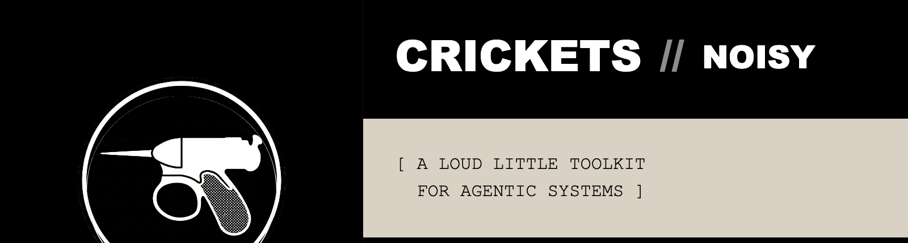
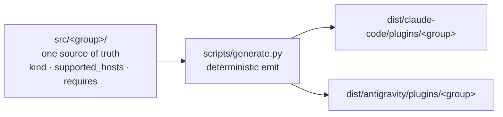

<p align="center">
  
</p>

<p align="center"><em>Inspired by the <a href="https://en.wikipedia.org/wiki/Men_in_Black_(1997_film)">Noisy Cricket</a> — compact, composable agent primitives.</em></p>

<!--
  Badge convention (plan #15 task 7) — mirrors the harness side (task 6 v2):
    labelColor = 0a0a0a (ink, brand)
    color      = auto (semantic green/red on CI; semver-colored on release)
                 OR f4efe6 (paper) for state-less metadata (e.g. LICENSE)
    style      = for-the-badge (brutalist, ALL CAPS, sharp corners — matches banner motif)
    logo       = github (logoColor f4efe6) on CI + release badges
  CI badge points at the dedicated `ci-all.yml` aggregator workflow which waits
  for the 3 per-OS workflows on the same commit and reports a combined status —
  insulates the badge from any other apps' check suites.
  Compatibility (hosts that run Crickets) lives at wiki/reference/Compatibility.md.
-->

<p align="center">
  <a href="https://github.com/alexherrero/crickets/actions/workflows/ci-all.yml"></a>
  <a href="https://github.com/alexherrero/crickets/releases/latest"></a>
  <a href="LICENSE"></a>
</p>

<p align="center"><sub>Works with Claude Code + Antigravity — <a href="https://github.com/alexherrero/crickets/wiki/Compatibility">see compatibility</a></sub></p>

**Crickets** is a set of agent primitives — skills, sub-agents, hooks, commands — grouped into **native plugins** for Claude Code and Antigravity, generated from a single source of truth. These are the primitives **you** carry into any project: the phase-gated dev loop, safety controls, code review, docs upkeep.

It pairs with [**Agent M**](https://github.com/alexherrero/agentm), the memory — auto-recall and on-disk state that follow you across every project.

What's new lives in the [CHANGELOG](CHANGELOG.md).

## What's inside

Six plugins, generated from one source. Together they cover the working day with an agent:

- **Run a phase-gated dev process** — plan → work → review → release, working the plan autonomously with a per-task safety check.
- **Stay in control of a running agent** — an emergency stop, mid-run redirection, and crash recovery that never touches your branch.
- **Review any diff or PR adversarially** — a reviewer primed to find bugs, not to agree.
- **Fix Dependabot PRs automatically** — reads the failing CI and the changelog, patches, never merges.
- **Keep personal information out of public commits** — scan and redact before anything ships.
- **Keep a wiki current, in your voice** — authoring, repair, and a watcher that opens doc PRs.

Each capability is its own plugin; install only what you want. What each one ships, and how they compose, is in the [plugin pages](wiki/plugins/Plugins.md) (the **Plugins** section of the wiki sidebar).

## How it works



Author a primitive once under its group. The generator emits a native Claude Code plugin **and** a native Antigravity plugin per group, plus each host's marketplace manifest. The committed `dist/` is what ships, and a CI gate (`generate.py check`) fails the build if `dist/` drifts from `src/`. Where the two hosts diverge — hook events, dependency handling, the snippet→`rules/` gap — is spelled out in [Per-Host-Paths](wiki/reference/Per-Host-Paths.md) and [Compatibility](wiki/reference/Compatibility.md).

## Get started

Install the recommended set on whichever host(s) you have:

```bash
curl -fsSL https://raw.githubusercontent.com/alexherrero/crickets/main/bootstrap.sh | bash
```

Prefer the marketplace? One word from GitHub on Claude Code:

```bash
claude plugin marketplace add alexherrero/crickets
claude plugin install developer-workflows@crickets   # + developer-safety, code-review, github-ci, pii, wiki-maintenance
```

All three install modes (one-liner / marketplace / manual `--plugin-dir`) per host: **[Install crickets plugins](wiki/get-started/Install-Into-Project.md)**. Hacking on a plugin? **[Modify a crickets plugin](wiki/reference/Modify-A-Plugin.md)**.

## Adding + developing customizations

- [Tutorial 1 — Your first code review](wiki/get-started/01-First-Code-Review.md) — use a plugin end-to-end.
- [Plugin anatomy](wiki/reference/Plugin-Anatomy.md) — what a crickets plugin *is*, before you change one.
- [Repo layout](wiki/reference/Repo-Layout.md) — what lives where.
- [Modify a crickets plugin](wiki/reference/Modify-A-Plugin.md) — the `src/` → generate → dogfood loop.
- [Add a skill](wiki/reference/Add-A-Skill.md) · [Add a plugin](wiki/reference/Add-A-Plugin.md)
- [Manifest Schema](wiki/reference/Manifest-Schema.md) — primitive frontmatter + `group.yaml`.
- [Troubleshooting](wiki/reference/Troubleshooting.md) — symptom-first lookup when something stops working.

## License

MIT — [LICENSE](LICENSE).
