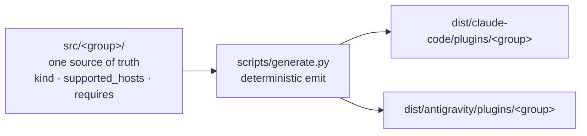

<p align="center">
  
</p>

<p align="center"><em>Inspired by the Noisy Cricket — agent primitives that punch far above their weight.</em></p>

<!--
  Badge convention (plan #15 task 7) — mirrors the harness side (task 6 v2):
    labelColor = 0a0a0a (ink, brand)
    color      = auto (semantic green/red on CI; semver-colored on release)
                 OR f4efe6 (paper) for state-less metadata (e.g. LICENSE)
    style      = for-the-badge (brutalist, ALL CAPS, sharp corners — matches banner motif)
    logo       = github (logoColor f4efe6) on CI + release badges
  CI badge points at the dedicated `ci-all.yml` aggregator workflow which waits
  for the 3 per-OS workflows on the same commit and reports a combined status —
  insulates the badge from any other apps' check suites.
  Compatibility (hosts that run Crickets) lives at wiki/reference/Compatibility.md.
-->

<p align="center">
  <a href="https://github.com/alexherrero/crickets/actions/workflows/ci-all.yml"></a>
  <a href="https://github.com/alexherrero/crickets/releases/latest"></a>
  <a href="LICENSE"></a>
</p>

<p align="center"><sub>Works with Claude Code + Antigravity — <a href="https://github.com/alexherrero/crickets/wiki/Compatibility">see compatibility</a></sub></p>

Inspired by the iconic noisy cricket from Men in Black, **Crickets** is a tactical suite of agent primitives engineered to punch far above their weight. Skills, sub-agents, hooks — grouped into **native plugins** for Claude Code and Antigravity, generated from a single source of truth. The execution engine behind [**Agent M**](https://github.com/alexherrero/agentm) — the primitives **you** carry into any project to make the system work.

[**Agent M**](https://github.com/alexherrero/agentm) holds the phase-gated workflow, auto-recall, and on-disk state — the structural backend. Crickets holds everything that rides on top.

> **Latest:** v3.0 — **Native host plugins from a single source of truth** ([#40](https://github.com/alexherrero/crickets/issues/40)). The bespoke `install.sh` dispatcher is gone: customizations are authored once under `src/<group>/`, and `scripts/generate.py` emits committed native plugins under `dist/` for both hosts, served via each host's marketplace. Install with one line, the marketplace, or a manual `--plugin-dir` — see [the install how-to](wiki/how-to/Install-Into-Project.md). The architecture + decisions live in [ADR 0013](wiki/explanation/decisions/0013-bundles-native-plugins.md) / [0014](wiki/explanation/decisions/0014-install-decoupling.md) / [0015](wiki/explanation/decisions/0015-partial-revision-36.md).
> [Release notes](https://github.com/alexherrero/crickets/releases/latest) · [Native-plugins HLD](wiki/explanation/designs/crickets-v3-native-plugins.md) · [CHANGELOG](CHANGELOG.md)

## What's inside

Four functional **plugins** (groups), seven primitives — each authored once in `src/<group>/` and emitted as a native plugin per host.

| Plugin | Primitives |
|---|---|
| **developer** (base) | [`kill-switch`](src/developer/hooks/kill-switch/hook.md) + [`steer`](src/developer/hooks/steer/hook.md) + [`commit-on-stop`](src/developer/hooks/commit-on-stop/hook.md) hooks · [`evaluator`](src/developer/agents/evaluator.md) sub-agent |
| **github-ci** | [`dependabot-fixer`](src/github-ci/skills/dependabot-fixer/SKILL.md) skill |
| **pii** | [`pii-scrubber`](src/pii/skills/pii-scrubber/SKILL.md) skill |
| **wiki** | [`diataxis-evaluator`](src/wiki/agents/diataxis-evaluator.md) sub-agent |

- **`kill-switch`** — operator emergency halt: `touch .harness/STOP` → next `PreToolUse` halts the tool call (Claude Code; advisory-only on Antigravity — see [Compatibility](wiki/reference/Compatibility.md)).
- **`steer`** — mid-run redirect: write `.harness/STEER.md` → injected into context, then archived.
- **`commit-on-stop`** — safety snapshot of a dirty tree to a side ref on `Stop`; never touches your branch.
- **`evaluator`** / **`diataxis-evaluator`** — read-only fresh-context graders (PASS / NEEDS_WORK).
- **`pii-scrubber`** / **`dependabot-fixer`** — the PII guardrail skill + the Dependabot-PR repair skill.

## How it works



Author a primitive once under its group; the generator emits a native Claude Code plugin **and** a native Antigravity plugin per group, plus each host's marketplace manifest. The committed `dist/` is the distribution surface, and a CI gate (`generate.py check`) fails if it drifts from `src/`. Per-host divergences (hook events, dependency handling, the snippet→`rules/` gap) live in [Per-Host-Paths](wiki/reference/Per-Host-Paths.md) + [Compatibility](wiki/reference/Compatibility.md).

## Get started

Install the recommended set on whichever host(s) you have:

```bash
curl -fsSL https://raw.githubusercontent.com/alexherrero/crickets/main/bootstrap.sh | bash
```

Prefer the marketplace? One word from GitHub on Claude Code:

```bash
claude plugin marketplace add alexherrero/crickets
claude plugin install developer@crickets   # + github-ci@crickets, pii@crickets, wiki@crickets
```

All three install modes (one-liner / marketplace / manual `--plugin-dir`) per host: **[Install crickets plugins](wiki/how-to/Install-Into-Project.md)**. Hacking on a plugin? **[Develop a crickets plugin locally](wiki/how-to/Develop-A-Plugin-Locally.md)**.

## PII guardrails (foundational)

This repo is **public** and holds personal customizations. Three enforcement layers protect against personal information leaking into commits:

1. **Pre-push git hook** (`templates/hooks/pre-push`) — copy it into a repo's `.git/hooks/pre-push` (`cp templates/hooks/pre-push .git/hooks/ && chmod +x .git/hooks/pre-push`). Runs `check-no-pii.sh` against every push; blocks non-zero. **Mandatory enforcer** for the crickets repo itself.
2. **`pii-scrubber` plugin** — agent-facing interactive layer. Scans the current diff, presents findings, offers redactions.
3. **CI gate** — `check-no-pii.sh --all` + the official `gitleaks-action` run on every push.

See [CONTRIBUTING.md](CONTRIBUTING.md) for the override protocol.

## Repo structure

<details>
<summary>Top-level layout</summary>

```text
crickets/
├── src/                # SOURCE OF TRUTH — src/<group>/ (group.yaml + skills/ agents/ hooks/ …)
├── dist/               # GENERATED native plugins (committed) — dist/<host>/plugins/<group>/
│   ├── claude-code/    #   + .claude-plugin/marketplace.json
│   └── antigravity/    #   + .agents/plugins/marketplace.json
├── .claude-plugin/     # repo-root marketplace pointer (one-word `marketplace add alexherrero/crickets`)
├── .agents/plugins/    # repo-root Antigravity marketplace pointer
├── scripts/            # generate.py (+ emit_*), lint_src.py, src_model.py, check-* gates, tests
├── bootstrap.sh        # one-line installer (curl | bash)
├── templates/          # scaffolding (e.g. hooks/pre-push)
├── wiki/               # Diátaxis docs (tutorials/ how-to/ reference/ explanation/)
├── AGENTS.md           # universal instructions for any AGENTS.md-aware host
└── CLAUDE.md           # Claude Code entry point — points back at AGENTS.md
```

</details>

## Adding + developing customizations

- [Tutorial 1 — Your first customization](wiki/tutorials/01-First-Customization.md)
- [Develop a crickets plugin locally](wiki/how-to/Develop-A-Plugin-Locally.md) — the `src/` → generate → dogfood loop
- [Add a skill](wiki/how-to/Add-A-Skill.md)
- [Use the evaluator](wiki/how-to/Use-The-Evaluator.md) · [Use the base hooks](wiki/how-to/Use-The-Base-Hooks.md)
- [Manifest Schema](wiki/reference/Manifest-Schema.md) — primitive frontmatter + `group.yaml`

## Status

Shipping **v3.0** — native host plugins from a single source of truth (#40, [launched](wiki/explanation/designs/crickets-v3-native-plugins.md)). Four plugins / seven primitives prove the model on both hosts. The #36 skill relocations (`design`, `diataxis-author`, `ship-release`) + the full Developer-base composition + new bundles (Testing, Releasing, knowledge) are deferred to the v3.x catalog work ([ADR 0015](wiki/explanation/decisions/0015-partial-revision-36.md)). One known host limitation: Antigravity runs plugin hooks observe/side-effect-only, so `kill-switch`/`steer` are Claude-only-effective there ([ADR 0013](wiki/explanation/decisions/0013-bundles-native-plugins.md)). Ships in lockstep with Agent M. See [CHANGELOG.md](CHANGELOG.md).

## Contributing

Self-tested on every push by three per-OS workflows (Linux, Mac, Windows). Run the gates locally:

```bash
python3 scripts/lint_src.py                                 # validate src/ (group.yaml + frontmatter)
python3 scripts/generate.py check                           # committed dist/ in sync with src/
( cd scripts && python3 -m unittest discover -p 'test_*.py' )
bash scripts/check-syntax.sh
bash scripts/check-no-pii.sh --all
python3 scripts/check-wiki.py --strict
```

Full guidance in [CONTRIBUTING.md](CONTRIBUTING.md).

## License

MIT. See [LICENSE](LICENSE).
