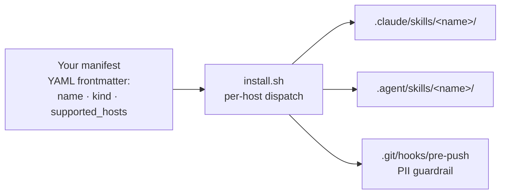

# agent-toolkit

[](https://github.com/alexherrero/agent-toolkit/actions/workflows/tests-linux.yml)
[](https://github.com/alexherrero/agent-toolkit/actions/workflows/tests-mac.yml)
[](https://github.com/alexherrero/agent-toolkit/actions/workflows/tests-windows.yml)
[](LICENSE)

Personal collection of agent customizations — skills, sub-agents, hooks, MCP servers, slash commands, bundles, and more — across Claude Code, Antigravity, and Gemini CLI. Sibling repo to [`agentic-harness`](https://github.com/alexherrero/agentic-harness): the harness owns phase-gated workflow, this toolkit owns the customizations that ride on top.

[](#)
[](#)
[](#)

## What's inside (v0.9.0)

Four skills + one agent + three hooks + one reference bundle:

| Customization | Kind | What it does |
|---|---|---|
| [`pii-scrubber`](skills/pii-scrubber/SKILL.md) | skill | Agent-facing PII guardrail — scans the current git diff before commit/push, presents findings, offers redactions. Companion to the pre-push hook. |
| [`dependabot-fixer`](skills/dependabot-fixer/SKILL.md) | skill | Fix breakage on a Dependabot PR. Reads failing CI logs, applies a bounded fix loop, pushes commits to the Dependabot branch, comments residual risks. Never merges. (Migrated from agentic-harness v1.x.) |
| [`ship-release`](skills/ship-release/SKILL.md) | skill | Cut a tagged GitHub release with semver-driven version bumps from conventional commits. Writes CHANGELOG, tags, pushes, creates the release. (Migrated from agentic-harness v1.x.) |
| [`evaluator`](agents/evaluator.md) | agent | Read-only fresh-context grader. Caller supplies ARTIFACT + RUBRIC; evaluator returns PASS / NEEDS_WORK + per-rubric-item reasoning. Augments the harness's `adversarial-reviewer` at `/review`; consumed by the future design skill + quality-gates bundle. (New in v0.6.0.) |
| [`kill-switch`](hooks/kill-switch/hook.md) | hook | Operator emergency halt for long-running Claude Code sessions. `touch .harness/STOP` → next `PreToolUse` halts the tool call with a stderr message; `rm` to resume. (New in v0.7.0.) |
| [`steer`](hooks/steer/hook.md) | hook | Mid-run redirect without restart. Write `.harness/STEER.md` with a "do it this way instead" instruction → next `PreToolUse` injects the contents into agent context + renames to `STEER.consumed-<iso-ts>.md` for audit trail. (New in v0.7.0.) |
| [`commit-on-stop`](hooks/commit-on-stop/hook.md) | hook | Safety-branch commit at session end. Fires on `Stop` event; dirty tree → `auto-save/<iso-ts>` branch with commit. Recovery via `git checkout auto-save/<ts>`. Never modifies the current branch; never pushes. (New in v0.7.0.) |
| [`design`](skills/design/SKILL.md) | skill | Human-facing design pipeline → agent execution handoff. `/design author` walks a locked 10-section template (gating on review approval), `/design translate` splits the approved design into structural parts, `/design sequence` generates one PLAN.md per part for the harness's `/work` + `/review` flow. Published designs surface in `wiki/Home.md` as the canonical "Why we built X" entry point. (New in v0.8.0.) |
| [`example-bundle`](bundles/example-bundle/bundle.md) | bundle | Reference skeleton showing how to package a multi-primitive customization. Safe to delete in your fork. |

## How it works



One manifest, two host destinations (`claude-code` + `antigravity`). The installer reads each customization's `supported_hosts` and dispatches to the right paths per kind (see [wiki/reference/Per-Host-Paths](wiki/reference/Per-Host-Paths.md)). (v0.9.0 removed standalone Gemini CLI host per [ROADMAP item #15](https://github.com/alexherrero/agentic-harness/blob/main/.harness/ROADMAP.md); see [ADR 0006](wiki/explanation/decisions/0006-gemini-cli-host-removal.md).)

## Install

```bash
# Clone as a sibling of agentic-harness (recommended layout)
cd ~/Antigravity
git clone https://github.com/alexherrero/agent-toolkit.git

# Drop all customizations into a target project (default — installs everything + pre-push hook)
bash ~/Antigravity/agent-toolkit/install.sh /path/to/your-project

# Or install only one bundle / skill:
bash ~/Antigravity/agent-toolkit/install.sh --bundle example-bundle /path/to/your-project
bash ~/Antigravity/agent-toolkit/install.sh --skill pii-scrubber /path/to/your-project

# Refresh (true-sync — wipe + recreate managed dirs):
bash ~/Antigravity/agent-toolkit/install.sh --update /path/to/your-project
```

On Windows / PowerShell 7+:

```powershell
pwsh -NoProfile -File C:\path\to\agent-toolkit\install.ps1 C:\path\to\your-project
```

Full details: [wiki/how-to/Install-Into-Project.md](wiki/how-to/Install-Into-Project.md). Flag reference: [wiki/reference/Installer-CLI.md](wiki/reference/Installer-CLI.md).

## PII guardrails (foundational)

This repo is **public** and holds personal customizations. Three enforcement layers protect against personal information leaking into commits:

1. **Pre-push git hook** (`templates/hooks/pre-push`) — installed by the toolkit's installer into target projects' `.git/hooks/pre-push`. Runs `check-no-pii.sh` against every push; blocks non-zero. **Mandatory enforcer.**
2. **`pii-scrubber` skill** — agent-facing interactive layer. Scans the current diff, presents findings, offers redactions interactively.
3. **CI gate** — `check-no-pii.sh --all` + the official `gitleaks-action` run on every push to GitHub.

See [CONTRIBUTING.md](CONTRIBUTING.md) for the override protocol.

## Adding your own customizations

- [Tutorial 1 — Your first customization](wiki/tutorials/01-First-Customization.md) (10-minute walkthrough)
- [How to add a skill](wiki/how-to/Add-A-Skill.md)
- [How to add a bundle](wiki/how-to/Add-A-Bundle.md)
- [How to use the evaluator](wiki/how-to/Use-The-Evaluator.md) — dispatch the `evaluator` sub-agent for PASS / NEEDS_WORK grading.
- [How to use the base hooks](wiki/how-to/Use-The-Base-Hooks.md) — kill-switch / steer / commit-on-stop for long-running Claude Code sessions.
- [How to use the design skill](wiki/how-to/Use-The-Design-Skill.md) — `/design author` → `/design translate` → `/design sequence` for design-first projects with structural parts.

## Status

Actively evolving. Releases and release notes are the source of truth — see [CHANGELOG.md](CHANGELOG.md) and the [latest release](https://github.com/alexherrero/agent-toolkit/releases/latest).

## Contributing

Self-tested on every push by three per-OS workflows (Linux, Mac, Windows). Run the same gates locally:

```bash
bash scripts/smoke-install-bash.sh
python3 scripts/validate-manifests.py
bash scripts/check-syntax.sh
bash scripts/check-lib-parity.sh
bash scripts/check-no-pii.sh --all
```

Full guidance in [CONTRIBUTING.md](CONTRIBUTING.md).

## License

MIT. See [LICENSE](LICENSE).
