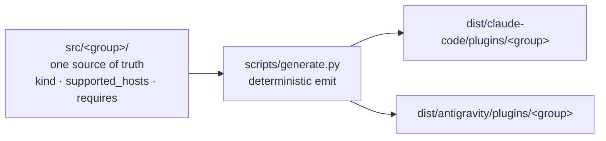

<p align="center">
  
</p>

<p align="center"><em>Inspired by the <a href="https://en.wikipedia.org/wiki/Men_in_Black_(1997_film)">Noisy Cricket</a> — compact, composable agent primitives.</em></p>

<!--
  Badge convention (plan #15 task 7) — mirrors the harness side (task 6 v2):
    labelColor = 0a0a0a (ink, brand)
    color      = auto (semantic green/red on CI; semver-colored on release)
                 OR f4efe6 (paper) for state-less metadata (e.g. LICENSE)
    style      = for-the-badge (brutalist, ALL CAPS, sharp corners — matches banner motif)
    logo       = github (logoColor f4efe6) on CI + release badges
  CI badge points at the dedicated `ci-all.yml` aggregator workflow which waits
  for the 3 per-OS workflows on the same commit and reports a combined status —
  insulates the badge from any other apps' check suites.
  Compatibility (hosts that run Crickets) lives at wiki/reference/Compatibility.md.
-->

<p align="center">
  <a href="https://github.com/alexherrero/crickets/actions/workflows/ci-all.yml"></a>
  <a href="https://github.com/alexherrero/crickets/releases/latest"></a>
  <a href="LICENSE"></a>
</p>

<p align="center"><sub>Works with Claude Code + Antigravity — <a href="https://github.com/alexherrero/crickets/wiki/Compatibility">see compatibility</a></sub></p>

**Crickets** is a set of agent primitives — skills, sub-agents, hooks, commands — grouped into **native plugins** for Claude Code and Antigravity, generated from a single source of truth. It's the execution layer behind [**Agent M**](https://github.com/alexherrero/agentm): the primitives **you** carry into any project.

[**Agent M**](https://github.com/alexherrero/agentm) holds the phase-gated workflow, auto-recall, and on-disk state — the structural backend. Crickets holds everything that rides on top.

> **Latest:** v3.1 — **the developer-plugin suite**. The old `developer` seed split into `developer-workflows` (the phase loop), `developer-safety` (control hooks), and `code-review` (adversarial review), composed through `enhances:`. Native plugins still emit from one source: author under `src/<group>/`, and `scripts/generate.py` writes committed plugins under `dist/` for both hosts. Install with one line, the marketplace, or a manual `--plugin-dir` — see [the install how-to](wiki/how-to/Install-Into-Project.md).
> [Release notes](https://github.com/alexherrero/crickets/releases/latest) · [Native-plugins HLD](wiki/explanation/designs/crickets-v3-native-plugins.md) · [CHANGELOG](CHANGELOG.md)

## What's inside

Six **plugins** (groups), 28 primitives — each authored once in `src/<group>/` and emitted as a native plugin per host.

| Plugin | What it adds |
|---|---|
| **developer-workflows** (base) | The six phase commands — `/setup` `/plan` `/work` `/review` `/release` `/bugfix` — plus the `explorer` and `evaluator` sub-agents and a `harness-context` SessionStart hook (Claude Code). |
| **developer-safety** | The `kill-switch`, `steer`, and `commit-on-stop` hooks, plus the `commit-no-coauthor` and `worktrees-never-auto` conventions. |
| **code-review** | The `adversarial-reviewer` and cross-model `adversarial-reviewer-cross` agents, an `evidence-tracker` hook, and a standalone `/code-review` command. |
| **github-ci** | CI workflows plus the `dependabot-fixer` skill. |
| **pii** | The PII guardrail — a `pii-scrubber` skill and a pre-push detector. |
| **wiki-maintenance** | Diátaxis authoring and upkeep — the `diataxis-author`, `wiki-author`, and `wiki-watch` skills; the `documenter`, `style-scope-evaluator`, and `diataxis-evaluator` agents; and the `recent-wiki-changes` and `wiki-watch` commands. |

`developer-workflows` is the base. `developer-safety` and `code-review` enhance it; `github-ci` and `wiki-maintenance` require it; `pii` stands alone. The three you reach for most:

- **`kill-switch`** — stop the agent now: `touch .harness/STOP`, and the next tool call halts (Claude Code; advisory-only on Antigravity — see [Compatibility](wiki/reference/Compatibility.md)).
- **`steer`** — redirect mid-run: write `.harness/STEER.md`, and it lands in context, then gets archived.
- **`commit-on-stop`** — snapshot a dirty tree to a side ref when the agent stops. Your branch is never touched.

## How it works



Author a primitive once under its group. The generator emits a native Claude Code plugin **and** a native Antigravity plugin per group, plus each host's marketplace manifest. The committed `dist/` is what ships, and a CI gate (`generate.py check`) fails the build if `dist/` drifts from `src/`. Where the two hosts diverge — hook events, dependency handling, the snippet→`rules/` gap — is spelled out in [Per-Host-Paths](wiki/reference/Per-Host-Paths.md) and [Compatibility](wiki/reference/Compatibility.md).

## Get started

Install the recommended set on whichever host(s) you have:

```bash
curl -fsSL https://raw.githubusercontent.com/alexherrero/crickets/main/bootstrap.sh | bash
```

Prefer the marketplace? One word from GitHub on Claude Code:

```bash
claude plugin marketplace add alexherrero/crickets
claude plugin install developer-workflows@crickets   # + developer-safety, code-review, github-ci, pii, wiki-maintenance
```

All three install modes (one-liner / marketplace / manual `--plugin-dir`) per host: **[Install crickets plugins](wiki/how-to/Install-Into-Project.md)**. Hacking on a plugin? **[Modify a crickets plugin](wiki/how-to/Modify-A-Plugin.md)**.

## PII guardrails

This repo is **public** and holds personal customizations. Three layers keep personal information out of commits:

1. **Pre-push git hook** (`templates/hooks/pre-push`) — copy it into a repo's `.git/hooks/pre-push` (`cp templates/hooks/pre-push .git/hooks/ && chmod +x .git/hooks/pre-push`). It runs `check-no-pii.sh` on every push and blocks a non-zero result. This is the **mandatory enforcer** for crickets itself.
2. **`pii-scrubber` plugin** — the agent-facing layer. It scans the current diff, shows you what it found, and offers redactions.
3. **CI gate** — `check-no-pii.sh --all` plus `gitleaks-action`, on every push.

The override protocol is in [CONTRIBUTING.md](CONTRIBUTING.md).

## Repo structure

<details>
<summary>Top-level layout</summary>

```text
crickets/
├── src/                # SOURCE OF TRUTH — src/<group>/ (group.yaml + skills/ agents/ hooks/ …)
├── dist/               # GENERATED native plugins (committed) — dist/<host>/plugins/<group>/
│   ├── claude-code/    #   + .claude-plugin/marketplace.json
│   └── antigravity/    #   + .agents/plugins/marketplace.json
├── .claude-plugin/     # repo-root marketplace pointer (one-word `marketplace add alexherrero/crickets`)
├── .agents/plugins/    # repo-root Antigravity marketplace pointer
├── scripts/            # generate.py (+ emit_*), lint_src.py, src_model.py, check-* gates, tests
├── bootstrap.sh        # one-line installer (curl | bash)
├── templates/          # scaffolding (e.g. hooks/pre-push)
├── wiki/               # Diátaxis docs (tutorials/ how-to/ reference/ explanation/)
├── AGENTS.md           # universal instructions for any AGENTS.md-aware host
└── CLAUDE.md           # Claude Code entry point — points back at AGENTS.md
```

</details>

## Adding + developing customizations

- [Tutorial 1 — Your first code review](wiki/tutorials/01-First-Code-Review.md)
- [Modify a crickets plugin](wiki/how-to/Modify-A-Plugin.md) — the `src/` → generate → dogfood loop
- [Add a skill](wiki/how-to/Add-A-Skill.md)
- [Use the evaluator](wiki/how-to/Use-The-Evaluator.md) · [Operator-control hooks](wiki/reference/Operator-Control-Hooks.md)
- [Manifest Schema](wiki/reference/Manifest-Schema.md) — primitive frontmatter + `group.yaml`

## Status

Six plugins, 28 primitives, live on both hosts. The v3.x line split the old `developer` seed into `developer-workflows`, `developer-safety`, and `code-review`, and is filling out the catalog — `wiki-maintenance` (Diátaxis authoring plus the wiki-watcher) is the current build. One host limit: Antigravity runs plugin hooks observe-only, so `kill-switch` and `steer` are advisory there ([Compatibility](wiki/reference/Compatibility.md)). Ships in lockstep with Agent M. See [CHANGELOG.md](CHANGELOG.md).

## Contributing

Three per-OS workflows (Linux, Mac, Windows) test every push. Run the gates locally:

```bash
python3 scripts/lint_src.py                                 # validate src/ (group.yaml + frontmatter)
python3 scripts/generate.py check                           # committed dist/ in sync with src/
( cd scripts && python3 -m unittest discover -p 'test_*.py' )
bash scripts/check-syntax.sh
bash scripts/check-no-pii.sh --all
python3 scripts/check-wiki.py --strict
```

Full guidance in [CONTRIBUTING.md](CONTRIBUTING.md).

## License

MIT. See [LICENSE](LICENSE).
