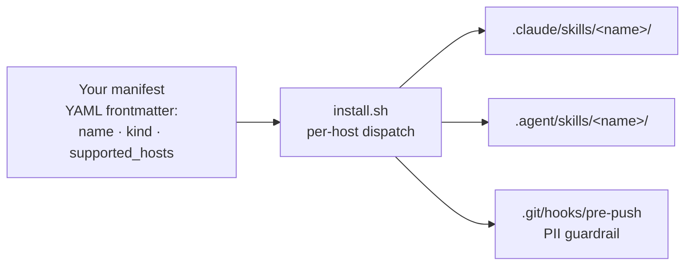

<p align="center">
  
</p>

<h1 align="center">Crickets</h1>

<p align="center"><em>Inspired by the noisy cricket from Men in Black — agent primitives that punch far above their weight.</em></p>

<p align="center">
  <a href="https://github.com/alexherrero/agent-toolkit/actions/workflows/tests-linux.yml"></a>
  <a href="https://github.com/alexherrero/agent-toolkit/actions/workflows/tests-mac.yml"></a>
  <a href="https://github.com/alexherrero/agent-toolkit/actions/workflows/tests-windows.yml"></a>
  <a href="https://github.com/alexherrero/agent-toolkit/releases/latest"></a>
  <a href="LICENSE"></a>
</p>

<p align="center">
  <a href="#"></a>
  <a href="#"></a>
</p>

Inspired by the iconic noisy cricket from Men in Black, **Crickets** is a tactical suite of agent primitives engineered to punch far above their weight. Skills, hooks, sub-agents, bundles, MCP servers, slash commands, status lines, output styles, workflows, rules, snippets, settings-fragments. The execution engine behind [**Agent M**](https://github.com/alexherrero/agentic-harness) — the primitives **you** carry into any project to make the system work.

[**Agent M**](https://github.com/alexherrero/agentic-harness) holds the phase-gated workflow, auto-recall, and on-disk state — the structural backend. Crickets holds everything that rides on top.

## What's inside

The current shipped catalog (see [wiki/Customization-Types.md](wiki/reference/Customization-Types.md) for what each kind is):

| Customization | Kind | What it does |
|---|---|---|
| [`pii-scrubber`](skills/pii-scrubber/SKILL.md) | skill | Agent-facing PII guardrail — scans the current git diff before commit/push, presents findings, offers redactions. Companion to the pre-push hook. |
| [`dependabot-fixer`](skills/dependabot-fixer/SKILL.md) | skill | Fix breakage on a Dependabot PR. Reads failing CI logs, applies a bounded fix loop, pushes commits to the Dependabot branch, comments residual risks. Never merges. |
| [`ship-release`](skills/ship-release/SKILL.md) | skill | Cut a tagged GitHub release with semver-driven version bumps from conventional commits. Writes CHANGELOG, tags, pushes, creates the release. |
| [`design`](skills/design/SKILL.md) | skill | Human-facing design pipeline → agent execution handoff. `/design author` walks a locked 10-section template; `/design translate` splits the approved design into structural parts; `/design sequence` generates a `PLAN.md` per part for Agent M's `/work` + `/review` flow. |
| [`memory`](skills/memory/SKILL.md) | skill | The Agent M memory skill itself. `/memory save` / `evolve` / `reflect` / `search` / `index-skills` / `discover-skills` / `adapt-skills` / `watchlist` / `promote`. Permeable A3 write boundary; collision-checked; supersession-not-deletion. |
| [`diataxis-author`](skills/diataxis-author/SKILL.md) | skill | Author + maintain a Diátaxis-style wiki for any repo. `/diataxis author` / `check` / `repair` / `migrate` / `classify`. Subsumes the harness's `migrate-to-diataxis` predecessor. |
| [`evaluator`](agents/evaluator.md) | agent | Read-only fresh-context grader. Caller supplies ARTIFACT + RUBRIC; evaluator returns PASS / NEEDS_WORK + per-rubric-item reasoning. Augments Agent M's `adversarial-reviewer` at `/review`. |
| [`kill-switch`](hooks/kill-switch/hook.md) | hook | Operator emergency halt for long-running Claude Code sessions. `touch .harness/STOP` → next `PreToolUse` halts the tool call; `rm` to resume. |
| [`steer`](hooks/steer/hook.md) | hook | Mid-run redirect without restart. Write `.harness/STEER.md` with a "do it this way instead" instruction → next `PreToolUse` injects the contents into agent context + renames to `STEER.consumed-<iso-ts>.md` for audit trail. |
| [`commit-on-stop`](hooks/commit-on-stop/hook.md) | hook | Safety-branch commit at session end. Fires on `Stop` event; dirty tree → `auto-save/<iso-ts>` branch with commit. Recovery via `git checkout auto-save/<ts>`. Never modifies the current branch; never pushes. |
| [`evidence-tracker`](hooks/evidence-tracker/hook.md) | hook | Default-FAIL evidence enforcement on `/work` task closeouts. Blocks `[ ]` → `[x]` flips in `PLAN.md` unless the agent demonstrably `Read` the spec/test files first. Hybrid resolver (heuristic + per-task override + explicit opt-out with mandatory rationale). |
| [`quality-gates`](bundles/quality-gates/bundle.md) | bundle | One-shot install of `evaluator` + the four base hooks (kill-switch, steer, commit-on-stop, evidence-tracker). What most Agent M `/work` sessions want. Sibling-reference dispatch — primitives stay single-source-of-truth in their standalone locations. |
| [`example-bundle`](bundles/example-bundle/bundle.md) | bundle | Reference skeleton showing how to package a multi-primitive customization. Safe to delete in your fork. |

## How it works



One manifest, two host destinations (`claude-code` + `antigravity`). The installer reads each customization's `supported_hosts` and dispatches to the right paths per kind — see [wiki/reference/Per-Host-Paths](wiki/reference/Per-Host-Paths.md). Bundles use sibling-reference dispatch: a bundle is a manifest pointing at standalone primitives, not a copy of them.

## Get started

Crickets is one half of [Agent M](https://github.com/alexherrero/agentic-harness). Install the harness alongside for the full system; Crickets also works standalone if you only want the customizations.

```bash
# Clone as a sibling of agentic-harness (recommended layout)
cd ~/Antigravity
git clone https://github.com/alexherrero/agent-toolkit.git
git clone https://github.com/alexherrero/agentic-harness.git   # the harness

# Drop everything Crickets ships into a target project
bash ~/Antigravity/agent-toolkit/install.sh /path/to/your-project

# Or pull just one bundle / skill / hook
bash ~/Antigravity/agent-toolkit/install.sh /path/to/your-project --bundle quality-gates
bash ~/Antigravity/agent-toolkit/install.sh /path/to/your-project --skill memory
bash ~/Antigravity/agent-toolkit/install.sh /path/to/your-project --hook kill-switch

# Refresh (true-sync — wipe + recreate managed dirs)
bash ~/Antigravity/agent-toolkit/install.sh --update /path/to/your-project
```

On Windows / PowerShell 7+:

```powershell
pwsh -NoProfile -File C:\path\to\agent-toolkit\install.ps1 C:\path\to\your-project
```

Full install detail: [wiki/how-to/Install-Into-Project.md](wiki/how-to/Install-Into-Project.md). Flag reference: [wiki/reference/Installer-CLI.md](wiki/reference/Installer-CLI.md).

## PII guardrails (foundational)

This repo is **public** and holds personal customizations. Three enforcement layers protect against personal information leaking into commits:

1. **Pre-push git hook** (`templates/hooks/pre-push`) — installed by Crickets' installer into target projects' `.git/hooks/pre-push`. Runs `check-no-pii.sh` against every push; blocks non-zero. **Mandatory enforcer.**
2. **`pii-scrubber` skill** — agent-facing interactive layer. Scans the current diff, presents findings, offers redactions interactively.
3. **CI gate** — `check-no-pii.sh --all` + the official `gitleaks-action` run on every push to GitHub.

See [CONTRIBUTING.md](CONTRIBUTING.md) for the override protocol.

## Adding your own customizations

- [Tutorial 1 — Your first customization](wiki/tutorials/01-First-Customization.md) — 10-minute walkthrough
- [Add a skill](wiki/how-to/Add-A-Skill.md)
- [Add a bundle](wiki/how-to/Add-A-Bundle.md)
- [Use the evaluator](wiki/how-to/Use-The-Evaluator.md)
- [Use the base hooks](wiki/how-to/Use-The-Base-Hooks.md)
- [Use the memory skill](wiki/how-to/Use-The-Memory-Skill.md)
- [Use the design skill](wiki/how-to/Use-The-Design-Skill.md)
- [Use the diataxis-author skill](wiki/how-to/Use-Diataxis-Author.md)
- [Use the quality-gates bundle](wiki/how-to/Use-The-Quality-Gates-Bundle.md)
- [Use the evidence-tracker hook](wiki/how-to/Use-The-Evidence-Tracker-Hook.md)

## Architecture history

Crickets grew across paired releases with Agent M. The full V1→V4 evolution of the memory system this toolkit feeds into lives in [Agent Memory Evolution](wiki/explanation/designs/agent-memory-evolution.md); the [V3 Retrospective](wiki/explanation/v3-retrospective.md) covers what shipped, what we learned, what's deferred.

## Status

Currently shipping **v1.0.0** — Crickets commits to a stable public API surface: bundle/manifest schema, installer flags, the `bundles/` namespace, and the 11 customization kinds. Internal surface (`scripts/`, `lib/install/`) remains pre-1.0 in spirit. See [CHANGELOG.md](CHANGELOG.md) and the [latest release](https://github.com/alexherrero/agent-toolkit/releases/latest). Crickets ships in lockstep with Agent M as paired releases.

## Contributing

Self-tested on every push by three per-OS workflows (Linux, Mac, Windows). Run the same gates locally:

```bash
bash scripts/smoke-install-bash.sh
python3 scripts/validate-manifests.py
bash scripts/check-syntax.sh
bash scripts/check-lib-parity.sh
bash scripts/check-no-pii.sh --all
```

Full guidance in [CONTRIBUTING.md](CONTRIBUTING.md).

## License

MIT. See [LICENSE](LICENSE).
