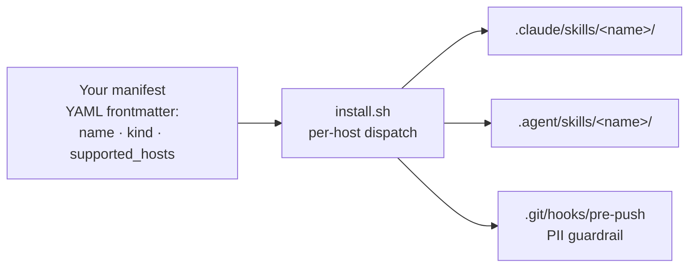

<p align="center">
  
</p>

<p align="center"><em>Inspired by the Noisy Cricket — agent primitives that punch far above their weight.</em></p>

<!--
  Badge convention (plan #15 task 7) — mirrors the harness side (task 6 v2):
    labelColor = 0a0a0a (ink, brand)
    color      = auto (semantic green/red on CI; semver-colored on release)
                 OR f4efe6 (paper) for state-less metadata (e.g. LICENSE)
    style      = for-the-badge (brutalist, ALL CAPS, sharp corners — matches banner motif)
    logo       = github (logoColor f4efe6) on CI + release badges
  CI badge points at the dedicated `ci-all.yml` aggregator workflow which waits
  for the 3 per-OS workflows on the same commit and reports a combined status —
  insulates the badge from any other apps' check suites.
  Compatibility (hosts that run Crickets) lives at wiki/reference/Compatibility.md.
-->

<p align="center">
  <a href="https://github.com/alexherrero/crickets/actions/workflows/ci-all.yml"></a>
  <a href="https://github.com/alexherrero/crickets/releases/latest"></a>
  <a href="LICENSE"></a>
</p>

<p align="center"><sub>Works with Claude Code + Antigravity — <a href="https://github.com/alexherrero/crickets/wiki/Compatibility">see compatibility</a></sub></p>

Inspired by the iconic noisy cricket from Men in Black, **Crickets** is a tactical suite of agent primitives engineered to punch far above their weight. Skills, hooks, sub-agents, bundles, MCP servers, slash commands, status lines, output styles, workflows, rules, snippets, settings-fragments. The execution engine behind [**Agent M**](https://github.com/alexherrero/agentm) — the primitives **you** carry into any project to make the system work.

[**Agent M**](https://github.com/alexherrero/agentm) holds the phase-gated workflow, auto-recall, and on-disk state — the structural backend. Crickets holds everything that rides on top.

> **Latest:** v1.0.2 (2026-05-24) — Crickets 1.0 + transparent-variant asset hotfix.  
> [Release notes](https://github.com/alexherrero/crickets/releases/latest) · [Agent M Evolution HLD](wiki/explanation/designs/agent-memory-evolution.md) · [CHANGELOG](CHANGELOG.md)

## What's inside

The current shipped catalog (see [wiki/reference/Customization-Types.md](wiki/reference/Customization-Types.md) for what each kind is):

### Skills (6)

| Skill | What it does |
|---|---|
| [`pii-scrubber`](skills/pii-scrubber/SKILL.md) | Agent-facing PII guardrail — scans the current git diff before commit/push, presents findings, offers redactions. Companion to the pre-push hook. |
| [`dependabot-fixer`](skills/dependabot-fixer/SKILL.md) | Fix breakage on a Dependabot PR. Reads failing CI logs, applies a bounded fix loop, pushes commits to the Dependabot branch, comments residual risks. Never merges. |
| [`ship-release`](skills/ship-release/SKILL.md) | Cut a tagged GitHub release with semver-driven version bumps from conventional commits. Writes CHANGELOG, tags, pushes, creates the release. |
| [`design`](skills/design/SKILL.md) | Human-facing design pipeline → agent execution handoff. `/design author` walks a locked 10-section template; `/design translate` splits the approved design into structural parts; `/design sequence` generates a `PLAN.md` per part for Agent M's `/work` + `/review` flow. |
| [`memory`](skills/memory/SKILL.md) | The Agent M memory skill itself. `/memory save` / `evolve` / `reflect` / `search` / `index-skills` / `discover-skills` / `adapt-skills` / `watchlist` / `promote`. Permeable A3 write boundary; collision-checked; supersession-not-deletion. |
| [`diataxis-author`](skills/diataxis-author/SKILL.md) | Author + maintain a Diátaxis-style wiki for any repo. `/diataxis author` / `check` / `repair` / `migrate` / `classify`. Subsumes the harness's `migrate-to-diataxis` predecessor. |

### Sub-agents (1)

| Sub-agent | What it does |
|---|---|
| [`evaluator`](agents/evaluator.md) | Read-only fresh-context grader. Caller supplies ARTIFACT + RUBRIC; evaluator returns PASS / NEEDS_WORK + per-rubric-item reasoning. Augments Agent M's `adversarial-reviewer` at `/review`. |

### Hooks (4)

| Hook | What it does |
|---|---|
| [`kill-switch`](hooks/kill-switch/hook.md) | Operator emergency halt for long-running Claude Code sessions. `touch .harness/STOP` → next `PreToolUse` halts the tool call; `rm` to resume. |
| [`steer`](hooks/steer/hook.md) | Mid-run redirect without restart. Write `.harness/STEER.md` with a "do it this way instead" instruction → next `PreToolUse` injects the contents into agent context + renames to `STEER.consumed-<iso-ts>.md` for audit trail. |
| [`commit-on-stop`](hooks/commit-on-stop/hook.md) | Safety-branch commit at session end. Fires on `Stop` event; dirty tree → `auto-save/<iso-ts>` branch with commit. Recovery via `git checkout auto-save/<ts>`. Never modifies the current branch; never pushes. |
| [`evidence-tracker`](hooks/evidence-tracker/hook.md) | Default-FAIL evidence enforcement on `/work` task closeouts. Blocks `[ ]` → `[x]` flips in `PLAN.md` unless the agent demonstrably `Read` the spec/test files first. Hybrid resolver (heuristic + per-task override + explicit opt-out with mandatory rationale). |

### Bundles (2)

| Bundle | What it does |
|---|---|
| [`quality-gates`](bundles/quality-gates/bundle.md) | One-shot install of `evaluator` + the four base hooks (kill-switch, steer, commit-on-stop, evidence-tracker). What most Agent M `/work` sessions want. Sibling-reference dispatch — primitives stay single-source-of-truth in their standalone locations. |
| [`example-bundle`](bundles/example-bundle/bundle.md) | Reference skeleton showing how to package a multi-primitive customization. Safe to delete in your fork. |

## Why Crickets?

|  | Cherry-picking from awesome-claude-code | Crickets |
|---|---|---|
| **Manifest schema** | None — each repo invents its own conventions; you read the README to figure out what each primitive expects | YAML frontmatter on every customization (`name` / `kind` / `supported_hosts` / `version`) validated by `scripts/validate-manifests.py` so the install layer can dispatch without guessing |
| **Per-host dispatch** | Manual per-project copying into `.claude/` / `.agent/` paths; you maintain the mapping yourself | One install command reads each manifest's `supported_hosts` and writes to the right host-specific paths automatically |
| **Sibling-reference bundles** | No bundle concept — pieces install individually; you remember the set | `--bundle quality-gates` installs `evaluator` + 4 base hooks in one shot; bundles point at standalone primitives so the source-of-truth stays in one place |
| **PII guardrails** | Per-author rigor; no enforcement layer | Three layers: pre-push hook (blocks commits), `pii-scrubber` skill (interactive scrub), CI gate (`check-no-pii.sh --all` + `gitleaks-action`) |
| **Paired-release coordination with Agent M** | Standalone repos; independent release cycles | Lockstep paired releases with `agentm`; release notes cross-link the sibling; CI green on both repos required at release commits |

Crickets isn't a curated list of other people's primitives — it's a single repo with one schema, one installer, one PII policy, and one coordinated release cycle paired with Agent M.

## How it works



One manifest, two host destinations (`claude-code` + `antigravity`). The installer reads each customization's `supported_hosts` and dispatches to the right paths per kind — see [wiki/reference/Per-Host-Paths](wiki/reference/Per-Host-Paths.md). Bundles use sibling-reference dispatch: a bundle is a manifest pointing at standalone primitives, not a copy of them.

## Get started

Crickets is one half of [Agent M](https://github.com/alexherrero/agentm). Install the harness alongside for the full system; Crickets also works standalone if you only want the customizations.

```bash
# Clone as a sibling of agentm (recommended layout)
cd ~/Antigravity
git clone https://github.com/alexherrero/crickets.git
git clone https://github.com/alexherrero/agentm.git   # the harness

# Drop everything Crickets ships into a target project
bash ~/Antigravity/crickets/install.sh /path/to/your-project
```

<details>
<summary>More install detail — bundles, individual skills/hooks, refresh, Windows</summary>

```bash
# Or pull just one bundle / skill / hook
bash ~/Antigravity/crickets/install.sh /path/to/your-project --bundle quality-gates
bash ~/Antigravity/crickets/install.sh /path/to/your-project --skill memory
bash ~/Antigravity/crickets/install.sh /path/to/your-project --hook kill-switch

# Refresh (true-sync — wipe + recreate managed dirs)
bash ~/Antigravity/crickets/install.sh --update /path/to/your-project
```

On Windows / PowerShell 7+:

```powershell
pwsh -NoProfile -File C:\path\to\crickets\install.ps1 C:\path\to\your-project
```

</details>

Full install detail: [wiki/how-to/Install-Into-Project.md](wiki/how-to/Install-Into-Project.md). Flag reference: [wiki/reference/Installer-CLI.md](wiki/reference/Installer-CLI.md).

## PII guardrails (foundational)

This repo is **public** and holds personal customizations. Three enforcement layers protect against personal information leaking into commits:

1. **Pre-push git hook** (`templates/hooks/pre-push`) — installed by Crickets' installer into target projects' `.git/hooks/pre-push`. Runs `check-no-pii.sh` against every push; blocks non-zero. **Mandatory enforcer.**
2. **`pii-scrubber` skill** — agent-facing interactive layer. Scans the current diff, presents findings, offers redactions interactively.
3. **CI gate** — `check-no-pii.sh --all` + the official `gitleaks-action` run on every push to GitHub.

See [CONTRIBUTING.md](CONTRIBUTING.md) for the override protocol.

## Adding your own customizations

- [Tutorial 1 — Your first customization](wiki/tutorials/01-First-Customization.md) — 10-minute walkthrough
- [Add a skill](wiki/how-to/Add-A-Skill.md)
- [Add a bundle](wiki/how-to/Add-A-Bundle.md)
- [Use the evaluator](wiki/how-to/Use-The-Evaluator.md)
- [Use the base hooks](wiki/how-to/Use-The-Base-Hooks.md)
- [Use the memory skill](wiki/how-to/Use-The-Memory-Skill.md)
- [Use the design skill](wiki/how-to/Use-The-Design-Skill.md)
- [Use the diataxis-author skill](wiki/how-to/Use-Diataxis-Author.md)
- [Use the quality-gates bundle](wiki/how-to/Use-The-Quality-Gates-Bundle.md)
- [Use the evidence-tracker hook](wiki/how-to/Use-The-Evidence-Tracker-Hook.md)

## Repo structure

<details>
<summary>Top-level layout</summary>

```text
crickets/
├── skills/             # standalone skills — pii-scrubber, dependabot-fixer, ship-release, design, memory, diataxis-author
├── agents/             # standalone sub-agents — evaluator
├── hooks/              # hooks — kill-switch, steer, commit-on-stop, evidence-tracker
├── bundles/            # multi-primitive bundles — quality-gates, example-bundle
├── commands/           # standalone slash commands (Claude Code + Antigravity surface)
├── mcp-servers/        # MCP server configs + launchers
├── status-line/        # Claude Code status-line customizations
├── output-styles/      # Claude Code output-style customizations
├── workflows/          # Antigravity-specific workflow primitives
├── rules/              # Antigravity-specific rules
├── snippets/           # fragments appended to AGENTS.md / CLAUDE.md at install time
├── settings-fragments/ # JSON fragments merged into host settings.json files
├── assets/             # Crickets brand assets — logo, banners, brand preview
├── templates/          # scaffolding (e.g. hooks/pre-push) installed into target projects
├── scripts/            # manifest validators + smoke tests + PII detector + CI helpers
├── lib/                # shared install plumbing — byte-identical to Agent M's lib/install/
├── wiki/               # Diátaxis-shaped docs (tutorials/, how-to/, reference/, explanation/)
├── AGENTS.md           # universal instructions for any AGENTS.md-aware host
├── CLAUDE.md           # Claude Code entry point — points back at AGENTS.md
├── install.sh          # POSIX installer (Linux + Mac)
└── install.ps1         # Windows installer (PowerShell 7+)
```

</details>

## Architecture history

Crickets grew across paired releases with Agent M. The full V1→V4 evolution of the memory system this toolkit feeds into lives in [Agent Memory Evolution](wiki/explanation/designs/agent-memory-evolution.md); the [V3 Retrospective](wiki/explanation/v3-retrospective.md) covers what shipped, what we learned, what's deferred.

## Status

Currently shipping **v1.0.2** — Crickets commits to a stable public API surface: bundle/manifest schema, installer flags, the `bundles/` namespace, and the 11 customization kinds. Internal surface (`scripts/`, `lib/install/`) remains pre-1.0 in spirit. See [CHANGELOG.md](CHANGELOG.md) and the [latest release](https://github.com/alexherrero/crickets/releases/latest). Crickets ships in lockstep with Agent M as paired releases.

## Contributing

Self-tested on every push by three per-OS workflows (Linux, Mac, Windows). Run the same gates locally:

```bash
bash scripts/smoke-install-bash.sh
python3 scripts/validate-manifests.py
bash scripts/check-syntax.sh
bash scripts/check-lib-parity.sh
bash scripts/check-no-pii.sh --all
```

Full guidance in [CONTRIBUTING.md](CONTRIBUTING.md).

## License

MIT. See [LICENSE](LICENSE).
