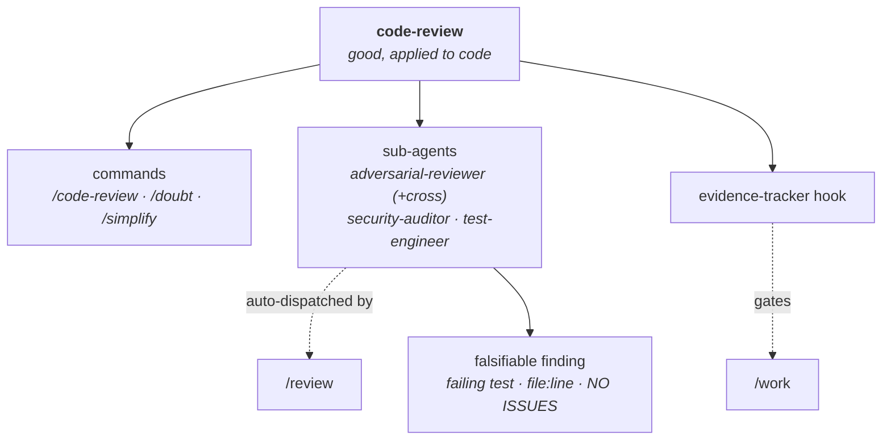

> [!NOTE]
> **LAUNCHED (lifted 2026-06-24, AG Phase 3; originally approved 2026-06-23).** child-design — **the `code-review` capability** (adversarial review — assume the code is broken and prove otherwise). `status: launched` (lifted into tracked `wiki/designs/` 2026-06-24, AG Phase 3). Points *up* at the [crickets HLD](crickets-hld.md).

# code-review

## Objective

`code-review` **assumes the code is broken and makes you prove it isn't** — adversarial review that reports a failing test, a `file:line` defect, or `NO ISSUES FOUND`, and **never fixes**. It is an implementation of the **`good`** opinion applied to code: the standard that a change has to survive a hostile read. The load-bearing discipline is the contract every reviewer returns against.

## Overview

The primitives, all delivered.

**Commands** *(operator-invoked):*

| Command | What it does |
|---|---|
| `/code-review` | Standalone adversarial review of a diff or PR. |
| `/doubt` | In-flight review of a decision *before* it stands. |
| `/simplify` | Cut accidental complexity, no behavior change. |

**Sub-agents** *(auto-dispatched during review):*

- `adversarial-reviewer` — the in-process critic.
- `adversarial-reviewer-cross` — a cross-model second opinion (Gemini).
- `security-auditor` — boundary threat modeling.
- `test-engineer` — coverage audit.

Plus the **`evidence-tracker`** hook (fires in `/work`), the `cross-review.sh` script, and the `security-review` + `testing-strategy` skills.

*Three operator-invoked commands + the auto-dispatched adversarial sub-agents + the `evidence-tracker` `/work` gate; every reviewer returns a falsifiable finding (prose rejected) — what `good` means concretely.*

## Design

### The commands

- **`/code-review`** — standalone adversarial review of a diff or PR (a commit range / branch / PR / URL, or the working-tree diff). It dispatches the cross-model reviewer first, then the in-process one for corroboration, and reports a failing test / `DEFECT file:line` / `NO ISSUES FOUND`; never fixes. *Invoked by the operator, on demand — a standalone command, not part of a workflow.*
- **`/doubt`** — in-flight review of a decision before it stands: CLAIM → EXTRACT → DOUBT → RECONCILE → STOP, with a hard 3-cycle cap. Catches a contract-misread or a wrong assumption *before* the code is written. *Invoked by the operator, on demand.*
- **`/simplify`** — cut accidental complexity (Chesterton's Fence — understand why code exists before removing it — + the Rule of 500); no behavior change; returns safe removals + Rule-of-500 flags for operator approval. *Invoked by the operator, on demand.*

### The sub-agents

- **`adversarial-reviewer`** — the in-process critic, framed "the code contains bugs, find them"; returns the three-form contract. *Invoked automatically as part of the `/review` workflow (in [development-lifecycle](crickets-development-lifecycle.md)), and by `/code-review`.*
- **`adversarial-reviewer-cross`** — a cross-model second opinion (Gemini, via `cross-review.sh`), graceful-fallback to the in-process reviewer when unavailable. *Invoked automatically by `/code-review` first, and by `/review` when a cross-model pass is available.*
- **`security-auditor`** — three-tier boundary threat modeling (LLM API / persistence / system execution) → `VULNERABILITY file:line`. *Invoked by the `security-review` skill, or automatically by `/review` when security review is requested.*
- **`test-engineer`** — Beyoncé-rule + prove-it coverage audit → `MISSING-TEST`. *Invoked by the `testing-strategy` skill, or automatically by `/review` when a coverage review is requested.*

### The contract — falsifiable findings only

Every reviewer returns one of three forms: **a failing test · a `DEFECT` / `VULNERABILITY` / `MISSING-TEST` at `file:line` · `NO ISSUES FOUND`.** **Prose-only critiques are rejected.** This is the discipline that makes the review trustworthy — it forces a finding you can act on or reproduce, not an opinion. It is also what `good` *means*, concretely.

### `evidence-tracker` — the verification gate

A PreToolUse hook (shipped here, enforcing [development-lifecycle](crickets-development-lifecycle.md)'s `/work`): it blocks a `[ ] → [x]` checkbox flip unless the task's verification evidence is present — default-fail, with a per-task `**Evidence:** none — <rationale>` opt-out. It keeps "done" honest. *Invoked automatically — the hook fires on every `/work` checkbox flip.*

### Opinions it consumes

code-review **implements `good`** — the adversarial-review contract *is* what `good` looks like applied to code: a change has to survive a hostile read, and a finding has to be a falsifiable `file:line`, not an opinion. *(The standard is hardwired in the reviewers today; requesting `good` by name — `opinion_request("good")` — is the Phase-3/4 registry work, the [Opinions design](https://github.com/alexherrero/agentm/wiki/agentm-opinions-and-gates).)*

## Dependencies

- **enhances [development-lifecycle](crickets-development-lifecycle.md)'s `review`** — `/review` dispatches the adversarial pass; the `evidence-tracker` hook gates `/work`.
- **implements the `good` opinion** ([agentm Opinions](https://github.com/alexherrero/agentm/wiki/agentm-opinions-and-gates)) — the adversarial-review contract *is* what `good` looks like.
- **composed by [diagnostics](crickets-diagnostics.md)** (hypothesis verification — *real bug, or an assumption?*) and **[maintenance](crickets-maintenance.md)** (a no-living-callers check on a removal).
- Points up at the [crickets HLD](crickets-hld.md); the requires/enhances mechanics are in [crickets-composition](crickets-composition.md).

## Risks & open questions

- **The `good` opinion is hardwired today** — the three-form contract is embedded in the reviewers; requesting `good` by name (`opinion_request`) is Phase-3/4 (the [Opinions design](https://github.com/alexherrero/agentm/wiki/agentm-opinions-and-gates)). **`[PENDING-IMPL]`** — wire the request-by-name when the Opinion registry ships; until then the hardwired contract *is* `good`.
- **The cross-model reviewer depends on an external CLI** (Gemini) — opt-in per invocation, editable to another model in `cross-review.sh`, and graceful-fallback to the in-process reviewer; not a hard dependency.
- **The `{domain}-review` family is future scope** — peer-review beyond code (`design-review`, `doc-review`) arrives as sibling plugins, not a bloated single one.
- **Re-audit triggers:** wire `opinion_request("good")` when the registry ships; add `{domain}-review` siblings when peer-review beyond code is needed.

## References

- crickets `src/code-review/` — commands (`/code-review`, `/doubt`, `/simplify`) · agents (`adversarial-reviewer`, `adversarial-reviewer-cross`, `security-auditor`, `test-engineer`) · `evidence-tracker` hook · `cross-review.sh` · skills (`security-review`, `testing-strategy`); declares `[adversarial-review]`
- **Up / composes:** [crickets HLD](crickets-hld.md) · [composition](crickets-composition.md) · [agentm Opinions](https://github.com/alexherrero/agentm/wiki/agentm-opinions-and-gates) (`good`)

## Amendment log

**2026-06-23 — added the structure diagram (diagram backfill).** Per the every-design-carries-a-diagram rule.

**2026-06-23 — authored from the seeded stub (grounded against the live `src/code-review` plugin); revised on operator review.** All primitives delivered — three operator-invoked commands (`/code-review`, `/doubt`, `/simplify`), four auto-dispatched adversarial sub-agents (incl. the cross-model variant), the `evidence-tracker` `/work` gate, two skills, `cross-review.sh`. Named the load-bearing invariant — **falsifiable findings only** (a failing test / `file:line` defect / `NO ISSUES`; prose rejected) — which is what `good` means concretely; added an **Opinions-it-consumes** clause (implements `good`). Operator review: framed it as *an* implementation of `good` *applied to code*; listed the commands as a table + the sub-agents individually; and made **invocation plain** (operator-invoked commands vs auto-dispatched agents/hook, each naming its workflow). Kept the name (the `review-workflows` rename was rejected). **Designed-not-built:** the `good` request-by-name (Phase-3/4, `[PENDING-IMPL]`) and the `{domain}-review` family. **Re-audit:** wire `opinion_request("good")`; add review siblings when needed.
