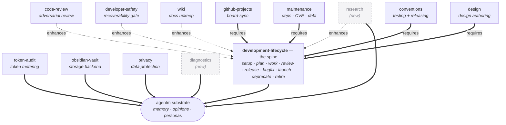

> [!NOTE]
> **LAUNCHED (lifted 2026-06-24, AG Phase 3; originally approved 2026-06-22).** child-design — **the composition mechanics**, parent [crickets HLD](crickets-hld.md): how capabilities combine with each other, lean on agentm's opinions, and compose onto the person. The parent stays high-level; this holds the wiring. `status: launched` (lifted into tracked `wiki/designs/` 2026-06-24, AG Phase 3). Points *up* at the [crickets HLD](crickets-hld.md).

# Crickets Composition Design

## Objective

Crickets is a box of stateless tools, yet the work it does holds together — `/release` knows the plan `/work` built, `code-review` sharpens what `/review` runs. This design specifies the mechanism behind that coherence: **composition** — how tools combine by capability-name, resolved at load, with every dependence pointing one way.

## Overview

Three kinds of composition meet here: capability with capability, capability with an agentm opinion, and the whole toolbox with the person (agentm). All three are **by name** and **one-way** — a unit names the capability it wants, the runtime wires it at load, and dependence points up the stack. A tool reaches another tool's surface, or an opinion, or the substrate, by asking the resolver for it; each plugin's code stays in its own plugin (the soft-composition rule, crickets' `developer-plugin-suite.md`).

The target shape is **thirteen plugin-capabilities**, and **thirteen plugins ship today** (the sets differ). The target renames `developer-workflows` → `development-lifecycle` (the spine, now owning the feature's whole arc — `launch` / `deprecate` / `retire` included), folds `testing-conventions` + `releasing-conventions` → `conventions` and `status-line-meter` → `token-audit`, and adds the two new `research` / `diagnostics`. The graph below is that target shape:

*Dashed green = soft `enhances:`; solid = hard `requires:`. **Dimmed nodes** (`research`, `diagnostics`) are the **new capabilities, not yet shipping** — their precise depends/enhances land in their per-capability sub-designs (`crickets-research`, `crickets-diagnostics`, to be authored). `development-lifecycle` (the spine — the renamed `developer-workflows`, now owning the feature's whole arc including `launch` / `deprecate` / `retire`) is the base most build on; `code-review`, `developer-safety`, and `wiki` enhance it; `github-projects`, `maintenance`, `conventions`, and `design` require it; `token-audit`, `obsidian-vault`, and `privacy` rest directly on the substrate. Everything rests, directly or through the spine, on the agentm substrate. Today the thirteen ship under current names (`developer-workflows`, `github-ci`, `design-docs`, `wiki-maintenance`, `pii`, the two `*-conventions`, `status-line-meter`); the renames + merges land in Phase-1/3 build. One line on what each capability is: the [HLD's sub-designs table](crickets-hld.md).*

## Design

### Capabilities compose with each other

A capability names two kinds of relationship to another, by capability name:

- **`requires:`** — a hard dependency: it will not run without the target (e.g. `github-projects` requires `developer-workflows`).
- **`enhances:`** — a soft dependency: it works alone, and does more when the target is present (e.g. `code-review` enhances `developer-workflows`'s `/review`).

At load time agentm's resolver (`capability_resolver.py`) matches names to installed capabilities, and the crickets bridge (`find_capability.py`) reaches it. These links arise where a primitive is shared across capabilities, or one capability builds on another's surface.

**How `enhances:` resolves.** The relationship is asymmetric and order-free: the enhancer names the target, the target knows nothing of its enhancers, and the resolver matches at load regardless of install order — installing the enhancer before or after the enhancee gives the same result. A soft match that finds nothing resolves to a **quiet absence**, so any subset of crickets installs and runs.

**The honesty lints** (in the generator's `lint_src.py`) keep the graph sound: the named target must exist, nothing enhances itself, `enhances:` and `requires:` cannot name the same capability, and a named target must be declared in some plugin's `capabilities:`. A capability declares the names it provides in `capabilities:`; those are what others may target. All thirteen shipping plugins declare `capabilities:` today.

**Version matching** is implemented in `capability_version_match.py` — a single-range semver check (`>=`, `>`, `<=`, `<`, `==`, `!=`, `~=`) that degrades to a non-match on malformed input rather than raising. A relationship can name a version range on its target; the open policy calls (enforce at load vs. call · warn vs. error) are in Risks.

### Capabilities compose with opinions

The same `requires:` / `enhances:` mechanism reaches *up* to agentm's [opinions](https://github.com/alexherrero/agentm/wiki/agentm-opinions-and-gates). A capability — or a single primitive — can **depend on** an opinion (its gate needs *what "done" looks like* to run at all) or be **enhanced by** one (it produces better output when *what "good" looks like* is available, and still runs without it). When the opinion is present it shapes the work; when absent, the capability degrades gracefully.

The opinion surfaces (done / good / efficient / how-we-engineer) and the request-by-name path a tool would query live in the [agentm Opinions design](https://github.com/alexherrero/agentm/wiki/agentm-opinions-and-gates) — and that path is **designed, not built**: today tools hardwire their opinion (e.g. `code-review` embeds the adversarial contract) instead of requesting it by name. The migration from hardwired to requested is Phase-3/4 work; until then this composition is the intended shape.

### The toolbox composes onto agentm — the one-way arrow

**crickets depends on agentm; agentm never depends on crickets.** That arrow is the load-bearing rule of the whole split. A tool draws on the substrate by *asking*: the authoritative resolver lives in agentm (`capability_resolver.py`); crickets reaches it through a thin bridge (`find_capability.py`) that discovers it by path-fallback and skips gracefully when agentm is absent. The graceful skip runs both ways — remove the tools and agentm still remembers; remove agentm and the tools still run, just without memory-backed continuity. A bare agentm is whole on its own.

Three decisions drew the arrow: the repo split made them siblings sharing only a byte-identical `lib/install/` (ADR 0006); the V5 unbundling deleted the phase loop from agentm and re-homed it in crickets, removing even the hard-require (ADR 0011); and the routing-plane de-vaulting kept agentm's substrate speaking in backend-agnostic terms, so a tool can ask without assuming vault paths (V5-6, in the `memory-storage-seam` living design). *(Transitional wrinkle: until the orchestration-split slim lands, agentm still carries baked-in copies of some dev-loop scripts from before the unbundling — a cleanup-status detail.)*

### Role-retirement (the transitional shape)

There is **no role tier**. What used to be called a "role" is a **persona** (an agentm concept — see the [agentm Personas design](https://github.com/alexherrero/agentm/wiki/agentm-personas)) wielding a package of crickets tools. The agent-definitions the phase loop ships today (`worker.md`, `tech-lead.md`, …) are transitional: their *stance* migrates up into agentm personas, and crickets keeps the *tools* plus the package — correlated tools named after the persona that wields them. The read-only helpers (`explorer`, `evaluator`) stay tools, by the cross-capability-judgment discriminator. This resolves the persona-vs-role question the launched `developer-plugin-suite.md` design deferred; `Coordinator-Roles.md` and the agent-defs reconcile to the persona-wields-tools shape when role-retirement lands.

## Dependencies

- **agentm's resolver, via the bridge** — composition's by-name lookups resolve through agentm's `capability_resolver.py`, reached by crickets' `find_capability.py` (path-fallback + graceful-skip). The one-way arrow: crickets depends on agentm, never the reverse.
- **The generator's lints** — `lint_src.py` enforces the four honesty lints over every plugin's `requires:` / `enhances:` / `capabilities:`; the [crickets build-system design](crickets-build-system.md) owns the generator.
- **Version matching** — `capability_version_match.py` (agentm) backs any version range on a relationship.
- **Sibling designs** — [agentm Opinions](https://github.com/alexherrero/agentm/wiki/agentm-opinions-and-gates) (the opinion surfaces + the request-by-name path), [agentm Personas](https://github.com/alexherrero/agentm/wiki/agentm-personas) (the persona tier that wields tool packages), [crickets build-system](crickets-build-system.md) (where the lints + `capabilities:` are generated).

## Risks & open questions

- **Version-matching policy is unsettled** — the matcher exists, but whether a range is enforced at load or at call, and whether a mismatch warns or errors, is the per-capability sub-designs' to settle.
- **The opinion request-by-name path is designed, not built** — today tools hardwire their opinion; the migration is Phase-3/4 (the [Opinions design](https://github.com/alexherrero/agentm/wiki/agentm-opinions-and-gates)).
- **The three new capabilities are tentative** — `research`, `diagnostics`, `lifecycle` do not ship yet and carry tentative edges; their precise depends/enhances land when their sub-designs are authored.
- **Role-retirement is mid-flight** — `Coordinator-Roles.md` + the transitional agent-defs (`worker.md`, `tech-lead.md`, …) reconcile to the persona-wields-tools shape when role-retirement lands.
- **A transitional baked-in-scripts wrinkle** — until the orchestration-split slim lands, agentm still carries copies of some pre-unbundling dev-loop scripts.
- **Re-audit triggers:** re-derive the relationship map from `dist/default-set.json` as the set grows; confirm the three new capabilities' edges when their sub-designs land; reconcile `Coordinator-Roles.md` at role-retirement; convert the mermaid map to a vector diagram at the parent's diagram pass; repoint the ADR references as agentm 0006/0011/0016 fold into living designs.

## References

- **Resolver + bridge:** agentm `scripts/capability_resolver.py` (`build_registry` · `capability_available` · `capability_resolve` + CLI) · crickets `src/developer-workflows/scripts/find_capability.py` (path-fallback discovery, graceful-skip)
- **Version match:** agentm `scripts/capability_version_match.py` (single-range semver check; graceful-degrade to a non-match on malformed input)
- **Lints:** the generator's `lint_src.py` (target-exists · no-self-enhance · enhances ∩ requires = ∅ · target is declared)
- **Living designs (the ADR model is retired in agentm + crickets):** crickets `wiki/designs/developer-plugin-suite.md` (the `enhances:` soft-composition design this reconciles, incl. the persona-vs-role deferral) · agentm `memory-storage-seam` (V5-6 routing-plane de-vaulting). Still-standing ADRs — agentm 0006 (crickets split), 0011 (V5 unbundling), 0016 (persona tier) — fold into living designs as the migration proceeds.
- **Siblings:** [agentm Opinions](https://github.com/alexherrero/agentm/wiki/agentm-opinions-and-gates) · [agentm Personas](https://github.com/alexherrero/agentm/wiki/agentm-personas) · [crickets build-system](crickets-build-system.md) · `wiki/reference/Coordinator-Roles.md` (the transitional role agent-defs)

## Amendment log

**2026-06-22 — grounded against live code, corrected, and conformed to the abbreviated-design template.**

Restructured from a topic-outline into the abbreviated template (Objective / Overview / Design / Dependencies / Risks & open questions / References / Amendment log): the framing + the relationship map move to Overview, the four mechanics become Design subsections, and Dependencies + Risks are drawn out of the inline prose. A read-only grounding pass against the live `agentm` + `crickets` repos corrected four drifts — version matching is **implemented** (`capability_version_match.py`), not a stub; all thirteen plugins declare `capabilities:` today (the former "6 of 13" gap is closed), so that claim is dropped; the dead ADR references are repointed at living designs (crickets soft-composition → `developer-plugin-suite.md`; agentm routing-plane → `memory-storage-seam`; the still-standing 0006/0011/0016 kept with a fold note); and the relationship map is now labeled as the **target shape** with the three unshipped capabilities visually dimmed, since the body had narrated the v6.0 target (renames, merges, new capabilities) in the present tense.

Verified-correct and unchanged: the `requires:`/`enhances:` semantics, the asymmetric/order-free/quiet-absence resolution, the four `lint_src.py` lints, the one-way arrow (bridge path-fallback + graceful-skip), and the read-only-helper discriminator. **Re-audit triggers:** re-derive the map from `dist/default-set.json` as the set grows; confirm the new capabilities' edges when their sub-designs land; convert the map to a vector diagram at the parent's diagram pass; repoint the ADR references as 0006/0011/0016 fold.

**2026-06-22 — map updated for the lifecycle merge (operator).** The standalone `lifecycle` capability is folded back into the spine: the map drops the `lifecycle` node, renames `developer-workflows` → `development-lifecycle` (the spine now owns the feature's whole arc, `launch`/`deprecate`/`retire` included), and the target count moves 14 → **13**. Two new capabilities remain dimmed (`research`, `diagnostics`). Why not keep `lifecycle` separate: `/launch` is the step right after `/release`, so splitting adjacent lifecycle steps across two plugins was an artificial seam. **Re-audit trigger:** when `github-ci` is reframed as `maintenance`, update that node too.

**2026-06-23 — `github-ci` → `maintenance` reframe (operator).** The map's `github-ci` node is renamed `maintenance` (deps repair + currency · CVE · tech-debt), still a hard `requires:` on the spine; the count stays 13 (a rename, not an add). `maintenance` composes `diagnostics` (its `dependabot-fixer` calls the diagnose engine — repair here, analysis there) and pairs with `privacy` (reactive advisory vs proactive static); those soft compose-edges aren't drawn on this requires/enhances spine map but live in the [maintenance sub-design](crickets-maintenance.md). **Re-audit trigger:** add the `maintenance → diagnostics` / `maintenance → privacy` compose-edges if the map grows a composition layer beyond the spine.
