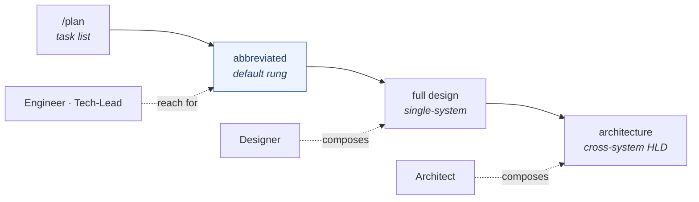
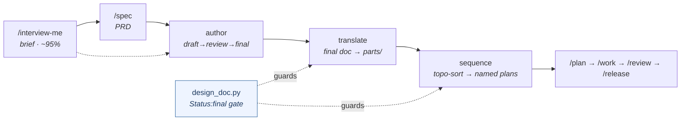

> [!NOTE]
> **LAUNCHED (lifted 2026-06-24, AG Phase 3; originally approved 2026-06-24).** child-design — **the `design` capability** (design authoring across the whole sizing ladder above `/plan`). `status: launched` (lifted into tracked `wiki/designs/` 2026-06-24, AG Phase 3). Points *up* at the [crickets HLD](crickets-hld.md).

# design

## Objective

`design` **authors design documents across the whole sizing ladder above `/plan`** — from a one-pager for small work up to a cross-system HLD set. It picks the right amount of design for the work and holds the section conventions, the templates, and the finalization discipline. It is the design-authoring surface of `how-we-engineer`. It renames `design-docs` → `design` (bare noun) and declares `[design, architecture]`.

## Overview

The three rungs of one ladder:

| Rung | Scope | Who reaches for it |
|---|---|---|
| **abbreviated** | a subset of the full doc for small work — **the default rung, where most work lands** | Engineer · Tech-Lead |
| **full** | single-system, the complete doc | Designer |
| **architecture** | cross-system / HLD — the four-pillar AG HLD set is the worked example | Architect |

The primitives:

| Primitive | Kind | Status | What it does |
|---|---|---|---|
| `/design` | command | delivered | The author → translate → sequence pipeline (impl owned by development-lifecycle; `design-docs` ships a thin wrapper). |
| `/spec` · `/interview-me` · `/document-decision` | command | delivered (re-homed) | PRD authoring · brief elicitation · decision capture. |
| `design_doc.py` · `design_sequence.py` · `stage_plan.py` | script | delivered (re-homed) | The Status:final gate + frontmatter parse · the Kahn topo-sort · the named-plan writer. |
| `adr` | skill | delivered | Decision-record authoring — **scoped** (agentm + crickets retired the ADR model; there it amends living designs instead). |
| design-doc template | template | delivered (re-homed) | The full-rung template + section conventions. |
| architecture-rung scaffolding | — | to build | Multi-system HLD + cross-system composition analysis + architecture-review. |
| abbreviated-design template | template | to build | The default-rung template. |

*One sizing ladder above `/plan` — abbreviated is the default rung most work lands on, full for a single system, architecture for cross-system HLDs (the four-pillar AG set is the worked example); each persona enters at its altitude.*

## Design

### Why we design

A design fixes the **architecture and the locked calls before any code** — so a plan has something to decompose and the loop has something to hold to. Without one, `/plan` invents scope; a design that drifts from the code misleads as much as a stale doc. Design sits at the **head of the loop**: it makes plans *possible* (it generates them) and grounds the whole loop end-to-end (`/plan`, `/review`, and `/release` all bind back to it). The discipline is to spend the **right amount of design for the work** — over-designing small work fails as surely as under-designing a cross-system change.

### What goes into a design — the three rung templates

What goes in is fixed by the **rung**. One ladder, three templates, each a deliberate shape:

| Rung | The shape | The sections |
|---|---|---|
| **abbreviated** *(default)* | the canonical **seven** — most designs land here | Objective · Overview · Design · Dependencies · Risks & open questions · References · Amendment log (+ optional Alternatives · Migrations) |
| **full** | the locked **ten** — a substantial single system with ops / launch / quality obligations | Context · Design *(Overview / Infrastructure / Detailed Design)* · Alternatives · Dependencies · Migrations · Technical Debt & Risks · Quality Attributes *(the 11-attribute walk)* · Project management · Operations · Document History |
| **architecture / HLD** | the **seven-section, vision-led** whole — names the pillars and how they fit, documents none in depth | vision-led opening · What X is for · The pillars/capabilities *(the heart — each links down to a sub-design)* · How they fit together · Sub-designs · References · Amendment log |

A design is **above `/plan`** (which produces a task list, not a design). Each persona enters at its altitude — Engineer / Tech-Lead at abbreviated, Designer at full, Architect at architecture.

### How a design adapts its template

The rungs **nest by addition**: an abbreviated design is a strict subset of the full template's sections, in the full template's order — so a design that grows graduates abbreviated → full by *adding* the heavier sections, never reshaping what it has. Within a rung, the sections flex to the work:

- the abbreviated rung includes **Alternatives / Migrations only when they apply**, and deliberately **drops** Infrastructure / Quality-Attributes / Project-management / Operations — adding one back only if a sub-design genuinely needs it (the anti-pattern it prevents: a how-the-generator-works sub-design carrying SLAs and work estimates);
- the full rung **walks Quality Attributes (11) and Operations (4) consciously but omits the N/A ones** — no N/A stubs;
- a real design freely shapes section *content* to the work while keeping the rung's required spine.

### The layering — how a design gets built

A finished design is several layers folded onto a rung template:

1. **The template** — the section spine; *picking the rung is the `how-we-engineer` sizing call.*
2. **The design-authoring conventions** — baked into the template: the section list + order, the **`[PENDING-IMPL]`** marker for a designed-but-not-yet-built clause, the **finalization discipline** (collapse the amendment log to one ≤2-paragraph "authored, reviewed, and finalized" entry), the **every-design-carries-a-diagram** rule, and — for a capability design — the mandatory **`### Opinions it consumes`** clause.
3. **The opinions** — design **implements `how-we-engineer`** (the sizing ladder, the templates, and the section conventions *are* how we engineer designs) and **consumes `good`** (what a sound design reads like — the adversarial-read bar). One-way: design renders the standard into a document; it does not author the opinion.
4. **The voice** — the operator's prose voice (`docs-prose-style`, an agentm **opinion**: subjective + learned, *not* a convention) is folded in so the design reads in one voice — second-person and plain (no peacock or AI-tell adjectives, no prior-art name-drops, no "this-not-that" antithesis), labels de-performed, plain names over insider metaphors. Read as always-load prose today; the intended future is the same **base ⊕ overlay** compose seam wiki already uses (`style_resolver.py`), requested by name — `[PENDING-IMPL]`.
5. **The published-doc structure** — a published design lands in `wiki/designs/` as the *explanation* mode of the **`documentation` convention** (Diátaxis), gated by [wiki](crickets-wiki.md)'s `check-wiki.py`.

The line that organizes the layers: **structure is a convention** (objective, gate-backed); **voice is an opinion** (subjective, learned).

### Self-reinforced learning

The conventions, templates, and voice that govern design authoring **evolve from what works** — they are living, amended artifacts (this very template grew its `### Opinions it consumes` clause because the operator noticed it was missing mid-review). The mechanism that is **built** is the memory engine: the reflection loop mines each finished session for durable lessons — it is how `docs-prose-style.md` itself grew, most of its rules sourced from operator edits during these design reviews — and heat-curation keeps the always-load voice earning its cost. **Designed-not-built** is the design-authoring-specific sharpening: the Experience → Opinions loop that would tune `how-we-engineer` / `good` from session signal, crystallization (phase-close distillation), and template-self-evolution as a *closed* loop — today that evolution is hand-applied by the operator at review. `[PENDING-IMPL]`.

### The authoring workflows — and where the primitives plug in

The authoring chain is a strictly-ordered pipeline **above `/plan`**, split between interactive prompts and deterministic helpers (the crickets idiom: gates + sorts + writes in unit-tested stdlib Python; section walks + proposals + approvals in the prompt).

- **Front matter (optional):** `/interview-me` drives a brief to ~95% confidence one question at a time; `/spec` writes a six-section PRD (its Out-of-scope section is the highest-value one). Both feed a confirmed brief downstream.
- **The core — `/design` author → translate → sequence:** **author** walks the rung template's sections and is the only verb that moves Status `draft → review → final` (final needs a human "approve as final"); **translate** (gated on Status:final + a non-empty Detailed Design, both via `design_doc.py`) splits the final doc into `parts/`, one per Detailed-Design subsection, each sized for a single `/work` cycle; **sequence** (`design_sequence.py` — a Kahn topo-sort with an alphabetical tie-break, so re-runs never churn) orders the parts by their dependency DAG and writes them via `stage_plan.py` — the first **activated** to a named `PLAN-<doc>-<part>.md`, the rest **queued** inert, never touching the singleton `PLAN.md`.
- **Decision capture:** `/document-decision` (the WHEN/HOW trigger) + the `adr` skill (the shape). Both still teach the immutable-ADR workflow; in agentm + crickets the ADR model is retired (amend living designs), so the `adr` skill is scoped to other repos.
- **The de-dup:** `development-lifecycle` owns the real `/design` implementation + the helpers + the full template; `design-docs` ships only a thin delegating wrapper (`requires: development-lifecycle`) + the unique `adr` skill — one logic owner, one pointer.

### How design feeds the dev process

Design makes plans **possible**, two ways:

1. **Generation** — `sequence` produces the named plans directly: one `/plan`-shaped body per part, mapping the parent's scope → Brief, verification → Goal, locked calls → Constraints, sibling parts → Out-of-scope, with `parent_design_doc` traceability — then hands off to the normal `/work → /review → /release` loop.
2. **Grounding** — even a hand-authored plan is bound back to the governing design: `/plan` reads a **bounded** slice (frontmatter + `## Locked design calls`, ~400-line cap, never the whole arc) and must cite `parent_design_doc:` or declare greenfield; a deterministic gate (`check-plan-grounding.py`) fails a plan that touches architecture without one; `/review` carries a design-conformance dimension and `/release` reconciles the diff against the locked calls. So design governs the loop **end-to-end**, not just plan creation.

A complete design **often needs research first** — research is a **soft input** (it *enhances*, never *requires*): the `explorer` read-only fan-out + bounded web lookups bring in what the work must know before it is designed or planned, feeding every rung's context. An architecture-rung HLD is the rung most likely to lean on it; the deep multi-source mode is forward-referenced to the operator's deep-research agent. Research feeds the context; it never gates the design. See [research](crickets-research.md).

### Built vs to build

**Delivered:** the `/design` author → translate → sequence pipeline · `/spec` · `/interview-me` · `/document-decision` · `design_doc.py` · `design_sequence.py` · `stage_plan.py` · the full design-doc template · the `adr` skill · the grounding hooks.

**To build (`[PENDING-IMPL]`):** the **architecture-rung scaffolding** (multi-system HLD + cross-system composition analysis + architecture-review — generalize from the AG HLD set); the **abbreviated-design template** packaged as a runnable `/design` template (an AG shape-spec today); the **finalize tooling** (auto-collapse the amendment log + the `[PENDING-IMPL]` stale-placeholder grep check — run by hand today, as in this set); **request-by-name** of the `how-we-engineer` / `good` / voice opinions (the Phase-3/4 registry); the **design-authoring self-improvement loop**; and **external (cross-model) review** (deferred).

### Opinions it consumes

design **implements `how-we-engineer`** (layer 3 — the sizing ladder + the section conventions *are* how we engineer designs) and **consumes `good`** (the read-bar); the operator's **voice** is the third opinion it folds in (layer 4). The arrow is one-way — design renders the standards into a document, it does not author them. *(Hardwired / always-load today; request-by-name is the Phase-3/4 registry work — the [Opinions design](https://github.com/alexherrero/agentm/wiki/agentm-opinions-and-gates).)*

## Dependencies

- **requires [development-lifecycle](crickets-development-lifecycle.md)** — design sits at the head of the loop, above `/plan`; `sequence` hands the loop its named plans, and the grounding hooks bind `/plan` · `/review` · `/release` back to the design.
- **implements `how-we-engineer` + consumes `good`** ([agentm Opinions](https://github.com/alexherrero/agentm/wiki/agentm-opinions-and-gates)) — the sizing ladder *is* how-we-engineer; `good` is the read-bar. It also folds in the operator's **voice** (an agentm opinion; always-load prose today, base⊕overlay request-by-name `[PENDING-IMPL]`).
- **published output sits under the `documentation` convention** ([conventions](crickets-conventions.md) via [wiki](crickets-wiki.md)) — a `wiki/designs/` page in Diátaxis *explanation* mode, gated by `check-wiki.py`.
- **enhanced by [research](crickets-research.md)** — a soft input feeding a design's context (the `explorer` fan-out + bounded web); it enhances, never gates.
- **composed by the Architect / Designer / Engineer-Tech-Lead personas** ([Personas](https://github.com/alexherrero/agentm/wiki/agentm-personas)) — each enters the ladder at its rung.
- Points up at the [crickets HLD](crickets-hld.md); the requires/enhances mechanics are in [crickets-composition](crickets-composition.md).

## Migrations

- **The capability rename** `design-docs` → **`design`** (bare noun), declaring `[design, architecture]`, with resolver aliasing.
- **The re-homing from `developer-workflows`** — `/spec`, `/interview-me`, `/document-decision`, `design_doc.py`, `design_sequence.py`, the design-doc template move in; the `requires` target is the renamed **`development-lifecycle`**.
- **De-dupe the two `/design` copies** — both `design-docs` and the old `developer-workflows` shipped one; `design` owns the single copy.
- **The ADR carve-out** — the `adr` skill stays, but in agentm + crickets the ADR model is retired (amend living designs instead); the skill governs every other repo until it migrates.

## Risks & open questions

- **The architecture rung is to-build** — the multi-system HLD scaffolding + cross-system composition analysis + architecture-review are greenfield; the four-pillar AG HLD set is the model to generalize from.
- **The abbreviated-design template is to-build** — the default rung needs its own template; today the abbreviated shape is applied by hand.
- **Finalization is manual until built** — the amendment-log collapse + the `[PENDING-IMPL]` stale-placeholder check run by hand (as in this design set).
- **Re-audit triggers:** build the architecture-rung scaffolding (generalize from the AG HLD set); ship the abbreviated template + the finalize tooling; flip `design-docs` → `design` + re-point `requires` at v6.0; de-dupe the `/design` copies at the re-home.

## References

- crickets `src/design-docs/` (→ `src/design/`) + the re-homed `developer-workflows` design family — `/design` (impl: `developer-workflows/commands/design.md`) · `/spec` · `/interview-me` · `/document-decision` · `adr` skill (design-docs-native) · `design_doc.py` · `design_sequence.py` · `stage_plan.py` · `templates/design-doc.md`; declares `[design, architecture]`
- **Templates:** abbreviated-design-template · hld-template · the full template (`developer-workflows/templates/design-doc.md`)
- **Voice:** `personal/_always-load/docs-prose-style.md` (the learned prose-voice opinion) · `style_resolver.py` (the base⊕overlay seam, built for wiki)
- **Up / composed by:** [crickets HLD](crickets-hld.md) · [composition](crickets-composition.md) · [Personas](https://github.com/alexherrero/agentm/wiki/agentm-personas) (Architect / Designer / Engineer-Tech-Lead) · [development-lifecycle](crickets-development-lifecycle.md) · [research](crickets-research.md) (the soft context input) · [conventions](crickets-conventions.md) + [wiki](crickets-wiki.md) (the `documentation` convention for published output) · [agentm Opinions](https://github.com/alexherrero/agentm/wiki/agentm-opinions-and-gates) (`how-we-engineer` / `good` / voice)

**2026-06-24 — authored, reviewed, and finalized.** *(Authored + deepened 2026-06-23; approved 2026-06-24.)* `design` authors design documents across the whole **sizing ladder above `/plan`** — three rungs of one ladder (**abbreviated** default · **full** · **architecture/HLD**), renamed `design-docs` → `design`, declaring `[design, architecture]`. The Design section is reasoning-first: **why we design** (fix architecture + locked calls before code; the head of the loop that makes plans possible), **what goes into each rung template** (the canonical-seven / locked-ten / vision-led-seven section structures), **how a design adapts its template** (rungs nest by addition; N/A-omit; the deliberately-dropped sections), **the layering** (template ⊕ design-authoring conventions ⊕ the `how-we-engineer` / `good` opinions ⊕ the operator's voice ⊕ the published `documentation` convention), **self-reinforced learning** (the built reflection loop that grew `docs-prose-style.md` from these reviews; the designed Experience→Opinions sharpening), **the author → translate → sequence workflows + plug-in points** (with a pipeline diagram), and **how design feeds the dev loop** (generation via `sequence` + grounding via the hooks; research a soft input). The organizing line: **structure is a convention, voice is an opinion.**

**Built vs designed.** Delivered: the `/design` author → translate → sequence pipeline (impl in development-lifecycle; design-docs a thin wrapper + the native `adr` skill), `/spec` · `/interview-me` · `/document-decision`, `design_doc.py` · `design_sequence.py` · `stage_plan.py`, the full template, the grounding hooks. `[PENDING-IMPL]`: the architecture-rung scaffolding (generalize from the AG HLD set), the abbreviated-design template packaged as a runnable `/design` template, the finalize tooling (amendment-log collapse + `[PENDING-IMPL]` stale-placeholder grep — run by hand today, as in this set), request-by-name of the opinions + voice (Phase-3/4 registry), the design-authoring self-improvement loop, external review. **Re-audit:** build the architecture rung + the abbreviated template + the finalize tooling; flip `design-docs` → `design` + re-point `requires` at v6.0; wire request-by-name when the registry ships.
