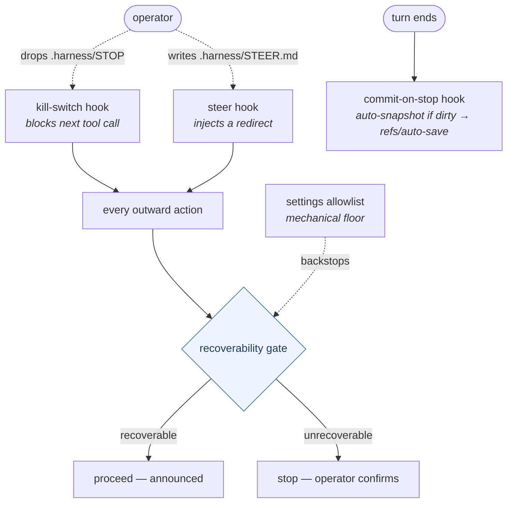

> [!NOTE]
> **LAUNCHED (lifted 2026-06-24, AG Phase 3; originally approved 2026-06-23).** child-design — **the `developer-safety` capability** (the control + safety layer: the recoverability gate, operator-control hooks, engineering-norm snippets + their enforcement). `status: launched` (lifted into tracked `wiki/designs/` 2026-06-24, AG Phase 3). Points *up* at the [crickets HLD](crickets-hld.md).

# developer-safety

## Objective

`developer-safety` is the **control + safety layer** for an autonomous agent session — the **recoverability gate** that decides what proceeds vs. what stops, the **operator-control hooks** (halt, redirect, snapshot), and the **engineering-norm snippets**. It keeps the `developer-` prefix as a deliberate control-layer marker (the standing naming exception). It declares `[recoverability]`.

## Overview

Nobody runs `developer-safety` — it is **ambient**. There is no `/safety` command; the capability wraps every session from underneath, through three channels that engage on their own:

- **standing doctrine** — the recoverability gate is always-load context the agent consults before any side-effecting action, and the same doctrine is inlined verbatim at the head of the phase commands (`/work` · `/bugfix` · `/release`);
- **always-on hooks** — `kill-switch` and `steer` run on every tool call (acting only when the operator drops a signal file), and `commit-on-stop` fires automatically at every turn-end;
- **the mechanical floor** — the host permission allowlist that deterministically gates a push regardless of the model's reasoning.

The operator touches it in exactly **two** ways: **dropping a control file** (`.harness/STOP` to halt, `.harness/STEER.md` to redirect) into a running session, or **answering a confirmation prompt** when an action the agent judged unrecoverable reaches the gate. Otherwise it is invisible.

It engages the phase loop one-directionally — `developer-safety` **enhances** [development-lifecycle](crickets-development-lifecycle.md); the loop never `requires` or calls it. The doctrine reaches the phases by inlining; the hooks engage host-automatically when the plugin is installed and **graceful-skip** when it isn't (the loop runs unchanged, on the standing doctrine alone). All primitives are delivered.

| Primitive | Kind | Engages | What it does |
|---|---|---|---|
| `recoverability` | skill | standing doctrine | The always-load classification — recoverable → proceed announced; unrecoverable → stop for confirmation. Inlined verbatim into `/work` · `/bugfix` · `/release`. |
| `kill-switch` | hook · PreToolUse | operator drops `.harness/STOP` | Blocks the next tool call until the file is removed — the operator's out-of-band halt. |
| `steer` | hook · PreToolUse | operator writes `.harness/STEER.md` | Injects the file into context to redirect mid-run (no restart), then archives it. |
| `commit-on-stop` | hook · Stop | automatic — every dirty turn-end | Snapshots the working tree to a hidden side ref `refs/auto-save/<ts>` — no work is ever lost. |
| `commit-no-coauthor` | snippet | composed by other plugins | No `Co-Authored-By` agent trailer — the operator is the sole author of intent. |
| `coauthor-guard` | hook · prepare-commit-msg | automatic — every commit *(to build)* | Deterministically **strips** any agent `Co-Authored-By` trailer before the commit is written — `commit-no-coauthor` made mechanical, on every host. |
| `worktrees-operator-initiated` | snippet | composed by other plugins | Worktrees only on operator initiation — never an autonomous spawn. |

*The operator's only manual touch-points are dropping a `STOP` / `STEER` file (halt / redirect) and answering a confirmation when an unrecoverable action hits the gate. Everything else is ambient — the judgment gate runs on every outward action (backstopped mechanically by the settings allowlist), and `commit-on-stop` snapshots a dirty tree automatically at every turn-end.*

### The safety gates, in principle

An autonomous session runs without a human watching each action. Three of the things a human-in-the-loop would otherwise catch each need a **gate** — and `developer-safety` is those three gates plus the engineering norms that ride underneath them.

1. **The judgment gate** — before an action that can't be taken back, stop. An agent left to run will eventually reach for something irreversible; the gate is the discipline of recognizing that case *before* acting and pre-announcing it for a human.
2. **The control gate** — the operator must be able to **halt or redirect a running session right now**, out of band, without waiting for it to finish or restarting it. Autonomy is only safe if it can be interrupted.
3. **The preservation gate** — if the session stops, crashes, or is halted, **no uncommitted work evaporates**. The cost of stopping has to be near zero, or the operator won't stop it.

**The load-bearing invariant — recoverability is reversibility, not blast-radius.** The judgment gate turns on one question: *can this be undone?* A large-blast-radius but reversible action (a force-push to your own un-shared branch, deleting a still-reachable branch) **proceeds, announced**; a tiny but irreversible one (a force-push that rewrites published shared history, a sole-ref delete of unmerged work, an immutable deploy) **stops and pre-announces**. When uncertain, it is treated as unrecoverable. This is what makes autonomous-by-default safe: the agent runs freely on everything it can undo, and only the genuinely-irreversible stops it.

### The gates, mapped to the parts

**The judgment gate → the `recoverability` doctrine + the mechanical floor.** The doctrine is a standing always-load skill — no command, no trigger; it governs *every* session — that classifies each side-effecting action **recoverable · unrecoverable · unresolved-decision**. The same text is inlined byte-identically at the head of `/work`, `/bugfix`, and `/release` (a drift test enforces the byte-identity), so inside the loop it is surfaced before every outward action and at each task's safety pre-check. The doctrine is the *judgment*; the **host permission allowlist is the mechanical floor underneath it** — recoverable push refspecs auto-proceed, force / delete / tag-overwrite refspecs route through a confirmation prompt, deterministically and regardless of the model's reasoning. The allowlist can't read intent (a force-push to a private branch and one to shared history match the same pattern), so it gates the whole destructive family conservatively and lets the prose draw the line. Prose decides; the floor can't be bypassed.

**The control gate → `kill-switch` + `steer`.** Both are PreToolUse hooks that run on every tool call but act only on an operator signal. `kill-switch`: the operator drops a `.harness/STOP` file and the next tool call is **blocked** (the hook exits non-zero) until the file is removed — a halt with no restart. `steer`: the operator writes `.harness/STEER.md`, its contents are **injected into the agent's context** to redirect the upcoming action, and the file is archived to an audit trail — a redirect, never a halt. Install order is load-bearing: `kill-switch` runs first, so a halt always takes precedence over a steer.

**The preservation gate → `commit-on-stop`.** A Stop hook that fires at every turn-end, fully automatic, self-gating on a dirty tree. When there is uncommitted work it snapshots the **full** working state (tracked + staged + untracked) to a hidden side ref `refs/auto-save/<ts>` — without touching HEAD, the index, or the working tree, and without ever pushing — then prints the recovery command. Stopping costs nothing.

**The norm layer → the two snippets, one of them deterministically enforced.** `commit-no-coauthor` (no `Co-Authored-By` agent trailer — the operator is the sole author of intent) and `worktrees-operator-initiated` (a worktree is only ever an operator act, never an autonomous spawn; ADR 0022 / 0028). Both are emitted as snippets and inlined into the phase commands that compose them — but `commit-no-coauthor` does not stop at doctrine: a **`prepare-commit-msg` git hook (`coauthor-guard`) deterministically strips any agent `Co-Authored-By` trailer** before the commit is written, so the norm holds even when the agent forgets or a host injects the trailer on its own. That gives the norm the same belt-and-suspenders shape as the judgment gate (doctrine over a mechanical floor) and the same deterministic git-layer enforcement as privacy's `pre-push` guard. It **strips rather than blocks** — the trailer simply never lands, so the autonomous loop is never interrupted. `worktrees-operator-initiated` stays doctrine-only: it is an authority / intent rule no hook can mechanize. `developer-safety` owns both standards; `conventions` and the phase loop *cite* them. *(The `coauthor-guard` hook is `[PENDING-IMPL]` — the strip is designed, not yet built; the snippet plus the host `includeCoAuthoredBy` setting are the floor until it ships.)*

### Host portability

The gates are not uniform across hosts. `commit-on-stop` is a pure side-effect, so it is **effective on both Claude Code and Antigravity** — as is `coauthor-guard`, which runs in git itself and so holds on every host (it even catches a host that injects the trailer automatically). `kill-switch` and `steer` depend on the host honoring a hook's exit code / stdout — which Antigravity does not — so there they fire but cannot halt or inject; they ship as no-harm, **Claude-Code-effective** primitives, with an always-on manual rule as the Antigravity fallback. The recoverability doctrine, being standing context, is host-portable.

### The boundary

`developer-safety` is **orthogonal to [privacy](crickets-privacy.md)** — a control layer and a data-protection layer are different concerns; `pii` was deliberately *not* folded here. The recoverability doctrine *names* privacy's pre-push PII guard as a mandatory carve-out, but it does not own it (the same goes for worker-tree initiation authority and `/integrate-worker` — carve-outs the doctrine names but other plugins own).

### Opinions

`developer-safety` doesn't consume an opinion so much as **provide** one of the standards the others rest on: the recoverable-by-default autonomy doctrine is part of what **`how-we-engineer`** means. The arrow is one-way — `how-we-engineer` and the development-lifecycle's finalize step cite this capability's gate; it cites nothing above it.

## Dependencies

- **standalone** — `requires: []`; ships alone.
- **enhances [development-lifecycle](crickets-development-lifecycle.md)** — one-directionally (the loop never `requires` it): the recoverability doctrine is inlined verbatim at the head of `/work` · `/bugfix` · `/release` (byte-identity drift-tested), and its hooks engage automatically when the plugin is installed, graceful-skip when not.
- **cited by [conventions](crickets-conventions.md)** — the `commit-no-coauthor` + worktree-authority + recoverability standards live here; conventions cites them.
- Points up at the [crickets HLD](crickets-hld.md); the requires/enhances mechanics are in [crickets-composition](crickets-composition.md).

## Risks & open questions

- **All delivered except the `coauthor-guard` enforcement hook** — the capability name is settled (`recoverability`, declared v0.3.1); the deterministic `commit-no-coauthor` strip (a `prepare-commit-msg` git hook) is **designed, not built** (`[PENDING-IMPL]`). It strips rather than blocks, so a silent strip never surfaces *why* a trailer appeared — acceptable, since the doctrine's stance is "strip it" regardless of cause.
- **Cite-don't-duplicate** — the snippets are the source of truth for their conventions; `conventions` cites, never re-owns them.
- **Re-audit triggers:** build the `coauthor-guard` strip hook (and reconsider strip-vs-block if a silent strip ever needs to be visible); keep the recoverability doctrine in sync with the global push-and-confirmation policy (`~/.claude/CLAUDE.md`); confirm `conventions` cites rather than copies the snippets at the conventions lift.

## References

- crickets `src/developer-safety/` — hooks (`kill-switch`, `steer`, `commit-on-stop` · `.sh` + `.ps1`) · `recoverability` skill · snippets (`commit-no-coauthor`, `worktrees-operator-initiated`) · **`coauthor-guard` `prepare-commit-msg` git hook (to build)**; declares `[recoverability]`
- **Doctrine:** `~/.claude/CLAUDE.md` (push + worktree policy) · ADR 0022 / 0028 (worktrees-operator-initiated)
- **Up:** [crickets HLD](crickets-hld.md) · [composition](crickets-composition.md) · [conventions](crickets-conventions.md) (cites the snippets)

## Amendment log

**2026-06-24 — folded ADRs 0003 / 0028 / 0022 into this design (AG Phase 4, move-and-retire); ADR 0009 re-homed to code-review (AG settle-sweep, 2026-06-25).**

**0003 — Base operator-control hooks: kill-switch, steer, commit-on-stop (2026-05-14; amended 2026-05-30).** Ship three Claude-Code-only hooks per-repo. `commit-on-stop` originally branched to a safety branch; amended to write a hidden `refs/auto-save/<ts>` ref via `git commit-tree` — never touching HEAD, index, or working tree; prunes to 10 snapshots. Why not keep the branch design: working-tree mutation and branch switching are inherent to stash+checkout; the redesign had to drop checkout entirely. Hidden refs (not `refs/heads/`) keep snapshots invisible to `git branch`. `git stash create` rejected for awkward tree-shape and untracked-file handling; `git commit` rejected because it honors `commit.gpgsign` and hangs the non-interactive hook. *Re-audit triggers:* `commit-tree`/`update-ref`/`GIT_INDEX_FILE` semantics change; Claude Code changes hook-event registration or `PreToolUse exit 2` semantics; Stop event fires after tree is wiped; `refs/auto-save/` gains other writers.

**0028 — Worktree authority broadened: config opt-in is operator authority (2026-06-14; partially supersedes 0022).** `isolation.mode: worktree-per-plan` in `.harness/project.json` counts as operator authority for auto-spawn, equal to an explicit `/spawn-worker`. Prohibition restated: "Never spawn without operator authority" (authority = explicit command OR durable config opt-in). Why not keep explicit-command-only: defeats the worktree-per-plan design — requiring `/spawn-worker` every time defeats the one-time-config intent. An additional per-invocation flag was rejected as equivalent-cost to a command; a durable config opt-in expressing the same intent is sufficient authority. *Re-audit triggers:* any agent or installer ever sets `isolation.mode` without explicit operator instruction; any code path calls `spawn_worker.py` outside the two authorized paths.

**0022 — Retire `worktrees-never-auto`: worktrees first-class but operator-initiated (2026-06-13; partially superseded by 0028).** Rename `worktrees-never-auto` → `worktrees-operator-initiated` and reframe: worktrees are first-class (coordinator creates them via `/spawn-worker`); autonomous creation stays prohibited. Why not delete the rule outright: would license autonomous spawn. Why not keep with an exception list: brittle — every future sanctioned workflow needs a carve-out; reframing on the initiation axis covers all future operator-initiated workflows without enumeration. *Re-audit trigger:* any drift toward autonomous worktree creation.

**2026-06-23 — authored, reviewed, and finalized.** Authored from the seeded stub and grounded against the live wiring (crickets `src/developer-safety` + the agentm phase loop + global config). `developer-safety` is the **control + safety layer** for an autonomous session, framed as three gates over a norm layer — **judgment** (the `recoverability` doctrine + the settings-allowlist mechanical floor; reversibility, not blast-radius), **control** (`kill-switch` halt + `steer` redirect, operator-signal-driven), **preservation** (`commit-on-stop`, automatic snapshot to `refs/auto-save/<ts>`), and the **norms** (`commit-no-coauthor` + `worktrees-operator-initiated`). It is **ambient, never invoked**: it `enhances` development-lifecycle one-way (the loop inlines the doctrine byte-identically across `/work`·`/bugfix`·`/release` and graceful-skips the hooks), and the operator touches it only by dropping a `STOP`/`STEER` file or answering an unrecoverable-action confirmation. `kill-switch`/`steer` are Claude-Code-effective; `commit-on-stop` and the git-layer enforcement hold on every host. Boundary: orthogonal to `privacy` (not folded). `### Opinions`: it *provides* the recoverability standard `how-we-engineer` cites, one-way.

On review the `commit-no-coauthor` norm gained **deterministic enforcement** — a `prepare-commit-msg` git hook (`coauthor-guard`) that **strips** any agent `Co-Authored-By` trailer before the commit lands (strip-not-block, so the loop is never interrupted), mirroring privacy's `pre-push` floor (`[PENDING-IMPL]` — the only greenfield piece). **Re-audit:** build `coauthor-guard`; keep the doctrine in sync with the global push-and-confirmation policy; confirm `conventions` cites rather than copies the snippets at the conventions lift.
