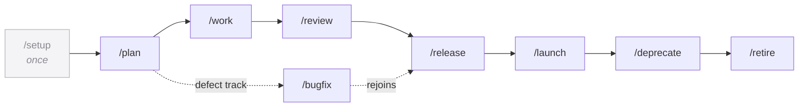

> [!NOTE]
> **LAUNCHED (lifted 2026-06-24, AG Phase 3; originally approved 2026-06-22).** child-design — the **development-lifecycle** capability: the loop a developer runs every day, a feature's whole life from plan to retirement. The base every other capability builds on. `status: launched` (lifted into tracked `wiki/designs/` 2026-06-24, AG Phase 3). Points *up* at the [crickets HLD](crickets-hld.md).

# development-lifecycle

## Objective

The development lifecycle is a developer's **bread and butter** — the loop you actually run every day, not a once-in-a-while ritual. You sit down at a repo, turn a brief into a plan, work the plan task by task, have the work torn at adversarially, and ship it under a recoverability gate; for long-lived code you then launch it to real users, deprecate what it replaces, and retire the dead interface. Each step is a short, isolated session with one job, and the next session picks up from **durable artifacts on disk** rather than a remembered conversation. This capability names those daily cycles, pins down where each begins and ends, and makes explicit how state survives between them — whether or not the agentm memory engine is mounted underneath. It is the base every other capability builds on.

## Overview

The lifecycle, first to last:

| Step | What it does |
|---|---|
| **`/setup`** *(once)* | First-time scaffold — writes the `.harness/` state files and fills `init.sh` / `AGENTS.md` with real project commands. |
| **`/plan`** | Turns a brief into `PLAN.md` with a task list + per-task verification criteria; writes no code; grounds against the governing design when one exists. |
| **`/work`** | Works the plan's tasks autonomously in sequence (implement → gates → commit per task); stops only on a failed safety pre-check or a needed clarification. |
| **`/review`** | Runs the deterministic gates first, then an adversarial pass primed to assume bugs exist; reports a failing test or a `file:line` defect, never fixing. |
| **`/release`** | The pre-merge gate — plan done + gates green, wait for CI, then push / tag / ship under the recoverability gate; archives the completed plan. |
| **`/launch`** | The pre-launch readiness gate before first production exposure — observability, a tested rollback, a flag off-switch, a staged-rollout plan. |
| **`/deprecate`** | Marks an interface for removal — compulsory vs advisory, enumerate callers, migrate now or attach a notice + a published removal date. |
| **`/retire`** | The code-removal gate — the Beyoncé-rule audit (remove, run the suite, prove nothing breaks), then delete the proven-dead interface. |

The one branch off this road is **`/bugfix`** — for defects it replaces `/plan` + `/work` with Report → Analyze → Fix → Verify (mandatory regression test, mandatory `/review`), then rejoins the `/release` path.

*The daily loop and the feature's endpoints, first to retirement; `/bugfix` is the alternate track to plan + work; each step is a short isolated session, state carried on disk between them.*

## Design

### Development Lifecycle

This is the loop itself: short, isolated sessions chained `/plan` → `/work` → `/review` → `/release` → `/launch` → `/deprecate` → `/retire` (after a one-time `/setup`), with `/bugfix` the alternate track to `/plan` + `/work`. Four properties hold across every cycle:

- **Deterministic where it can be.** Every cycle leans on helper scripts instead of re-deriving state in-prompt — `resolve_plan.py` (plan paths + mode), `isolation_config.py` (isolation mode), `spawn_worker.py` / `integrate_worker.py` / `finalize_unit.py` (worktree lifecycle), `preflight_reconcile.py`, and the `check-all.sh` gate battery. The agent supplies judgment; the scripts do the bookkeeping, so there are fewer places for drift to creep in.
- **Gates before judgment.** The deterministic gates (typecheck → lint → tests → build) run first and short-circuit on failure, before any LLM critique — cheap, truthful checks gate the expensive ones.
- **Recoverable by default.** A recoverable push / tag / release announces itself and proceeds; only a genuinely unrecoverable action stops for confirmation (the recoverability-gate doctrine, shared with [developer-safety](crickets-developer-safety.md)).
- **Runnable one-off, in a loop, or as a goal.** Each cycle is a stateless command driven by on-disk state, so it can run as a single session, **looped over a set** (e.g. break five designs into sub-plans in one pass), or handed a **goal** to pursue until done. These are the persona launch modes (see [Personas](https://github.com/alexherrero/agentm/wiki/agentm-personas)); a looped or goal-driven run is just N isolated sessions sharing the same durable substrate.

**Durable memory, with or without agentm.** State lives on disk, never in the conversation — the next session reads the artifacts, not your context. Two layers:

- **Standalone (always).** The `.harness/` substrate works against plain files with no memory engine mounted: `PLAN.md` / `PLAN-<slug>.md`, `progress.md` (append-only, one line per task/phase, never edited), `features.json` (`passes: true|false`, set only by `/review` + `/release`), `init.sh`, `project.json` (isolation + integration config), `board-items.json` (the board source of truth), `queued-plans/` (the staging tier), and a worktree-local `active-plan` marker. Every spec writes plain `.harness/<file>` state and works standalone; the memory layer is optional and graceful-skips.
- **agentm-backed (when configured).** The plugin never hardcodes a path: it resolves through agentm's storage seam (`resolve_plan.py` delegates to the seam when present, falls back to `.harness/` otherwise). With a vault backend the same artifacts land at **`<vault>/projects/<slug>/_harness/…`**, and reflection / recall memory lands in the vault's `_harness/`. The bytes and relative layout are identical across the device-local and vault backends — the developer's day looks the same either way.

So the per-workflow **Artifacts** lines below name paths relative to that root: `.harness/<file>` standalone, or `<vault>/projects/<slug>/_harness/<file>` when agentm is mounted. Reflection / recall memory lands in the vault only; the board mirror is `board-items.json` (canonical; the GitHub Project is the human mirror); all `.harness/` is gitignored, so state is never committed.

### Setup (one-time)

`/setup` is not a daily cycle — it runs **once per project** to lay down the substrate the cycles read.

- *Entry:* operator invokes `/setup`; the agent inventories `README`, the package manifest, `.github/workflows/`, and any existing `AGENTS.md` before asking anything.
- *Exit:* `.harness/` bootstrapped, `AGENTS.md` merged with a real `## This project` block, `init.sh` verified to boot (exit 0); operator ready for `/plan`.
- *Automated:* inventory-before-interview (ask only what files can't answer); write the scaffold without clobbering existing files; populate + verify `init.sh`; append one line to `progress.md`.
- *Enhancements:* wiki seed pages via the documenter ([wiki](crickets-wiki.md)); a GitHub backlog Project, ask-first ([github-projects](crickets-github-projects.md)).
- *Artifacts:* `PLAN.md` (seed), `progress.md`, `features.json`, `init.sh`, optional `verify.sh`, optional `project.json`; `AGENTS.md` (repo root, merged).

### Workflows

Each recurring cycle, with where it starts and stops, what it does on its own, what a sister capability adds, and where its artifacts land.

**`/plan`** — brief → task list, no code.
- *Entry:* `/plan <brief>` (`--name` / `--stage` / `--activate` modes); reads `PLAN.md` + `progress.md`, resolves the path via `resolve_plan.py`.
- *Exit:* `PLAN.md` written with a task list + per-task verification criteria (`Status: planning`); `features.json` updated only for net-new user features; ready for `/work`.
- *Automated:* resolve path + mode (never re-derive); interview into executable per-task criteria; `--activate` promotes a staged plan after a pre-flight reconcile; append one line to `progress.md`.
- *Enhancements:* design grounding — `find_governing_design.py` reads the governing design's locked calls, and a grounding gate blocks an architecture-touching plan with no cited design ([design](crickets-design.md), Hooks 2–3); pending-page declaration ([wiki](crickets-wiki.md)); board record + out-of-scope deferrals as backlog items ([github-projects](crickets-github-projects.md)).
- *Artifacts:* `PLAN.md` / `PLAN-<slug>.md` (active) or `queued-plans/PLAN-<slug>.md` (staged); `progress.md` / `progress-<slug>.md`; `features.json`; `board-items.json`.

**`/work`** — implement the tasks autonomously.
- *Entry:* `/work [--name <slug>] [task N]`; resolves the plan pair, reads the task list (first `[ ]` or `task N`), runs duplicate guards, checks isolation mode.
- *Exit:* per task — implement → gates green → mark `[x]` → log to `progress.md` → commit (one per task, no `Co-Authored-By`); on the final task, archive the plan, append a close-out, finalize the unit.
- *Automated:* per-task safety pre-check (stop mid-plan only on unrecoverable / ambiguous / scope-drifting / unverifiable / needs-clarification, else proceed); gates required green before `[x]`; no tags (reserved for `/release`); autonomous close-out at plan end.
- *Enhancements:* worktree isolation + recoverability-gate finalize ([developer-safety](crickets-developer-safety.md)); `explorer` read-only fan-out for unfamiliar code; pending → implemented page flips ([wiki](crickets-wiki.md)); task-progress + backlog sync ([github-projects](crickets-github-projects.md)); a design-divergence NOTE for `/review` to adjudicate ([design](crickets-design.md), Hook 4).
- *Artifacts:* `PLAN.md` (`[ ]`→`[x]`) → `PLAN.archive.YYYYMMDD-<slug>.md` at close; `progress.md` (per-task + close-out); `board-items.json`.

**`/review`** — adversarial critique, no fixes.
- *Entry:* `/review [range / task N]`; resolves the task context (default: the most-recently-completed task), runs the gates, probes for an adversarial reviewer + a governing design.
- *Exit:* gates reported (a red gate stops the run); on green, an adversarial pass returns a failing test / `file:line` defect / explicit `NO ISSUES FOUND` + design-conformance findings, triaged into recommended `/work` follow-ups; logged to `progress.md`. It never fixes — that is `/work`.
- *Automated:* gates first, short-circuit on failure; verify each finding reproduces before reporting; group + recommend follow-ups; log the outcome.
- *Enhancements:* a deeper adversarial pass in fresh context — assume bugs exist — and a cross-model second opinion when available ([code-review](crickets-code-review.md)); a design-conformance dimension ([design](crickets-design.md), Hook 1).
- *Artifacts:* `progress.md` (the outcome — `NO ISSUES FOUND` or N findings); reads `PLAN-<slug>.md` for the verification criteria.

**`/release`** — the pre-merge gate; ship.
- *Entry:* `/release`; checks preconditions (`Status: done`, all `[x]`, `/review` resolved, clean tree, branch ahead), re-runs the **full** gate suite (full tests + production build).
- *Exit:* `features.json` `passes: true` set only on verified features; version bumped + changelog written; push → wait-on-CI green → tag-reachability check → tag → release, all under the recoverability gate; plan archived; ready for the next `/plan` or `/bugfix`.
- *Automated:* precondition gate (any miss stops); full suite (not a subset); recoverable push/tag/release announce + proceed; archive + final `progress.md` summary (SHA, version, tag, URLs).
- *Enhancements:* design reconciliation of the full diff against the locked calls — divergence blocks the release ([design](crickets-design.md), Hook 5); a documenter wiki sweep that blocks on unresolved OPEN QUESTIONS ([wiki](crickets-wiki.md)); the `ship-release` changelog + semver bump ([conventions](crickets-conventions.md)); plan + feature board closeout ([github-projects](crickets-github-projects.md)).
- *Artifacts:* `features.json` (`passes: true`); `PLAN.archive.YYYYMMDD-<slug>.md`; `progress.md` (release summary); `CHANGELOG.md` (repo root).

**`/launch`** — first-production-exposure readiness gate.
- *Entry:* run before a feature first reaches production users (first real-traffic flag enable, staged-flag removal, a load-shifting infra change); not for routine patches.
- *Exit:* feature launched with a rollout plan in hand — RED metrics confirmed emitting, symptom-based alerts routing to a named owner, staged-rollout stages verified, the flag's removal scheduled within the next release cycle.
- *Automated:* verify observability wiring (send a test request, confirm metrics emit); test the rollback in a non-prod environment + document time-to-recovery; test the flag off-switch (< 5 min, no code change); advance the flag lifecycle created → dark → staged → full → removed; halt a ramp if RED metrics degrade.
- *Enhancements:* the observability deep-dive (`/observe` — RED instrumentation, structured logs, trace spans) ([diagnostics](crickets-diagnostics.md)); rollback + staged-rollout safety doctrine ([developer-safety](crickets-developer-safety.md)).
- *Artifacts:* `progress.md` (launch + rollout-plan summary); the rollout plan + flag schedule (in the changelog / runbook); feature flag state lives in the app, not `.harness/`.

**`/deprecate`** — mark an interface for retirement.
- *Entry:* run when an interface with callers is being removed, migrated, or sunset; not for live interfaces with no removal intent.
- *Exit:* the interface is **marked, not removed** — classified compulsory vs advisory; callers enumerated; for advisory, a deprecation notice + per-invocation log warning + a published removal date + changelog + downstream notification.
- *Automated:* classify (compulsory = all callers in-repo; advisory = external callers exist); enumerate callers via grep + type-checker; add the canonical deprecation notice + log warning; set a published removal date (no date = not a deprecation); update the changelog.
- *Enhancements:* changelog deprecation entries ([conventions](crickets-conventions.md)); a no-living-callers check ([code-review](crickets-code-review.md)).
- *Artifacts:* `progress.md` (the deprecation + removal date); `CHANGELOG.md`; the notice + log warning live in the code being deprecated.

**`/retire`** — prove-dead-then-delete *(forward-looking — see Risks)*.
- *Entry:* run after a deprecation window (advisory) or once all callers are migrated (compulsory), to remove a previously-deprecated interface confirmed dead.
- *Exit:* the code + all conditional branches on the symbol deleted, zero remaining references, full suite green; the removal commit carries proof of the Beyoncé-rule audit.
- *Automated:* verify preconditions (notice exists / callers migrated); the Beyoncé-rule audit — grep the symbol, remove locally (no commit), run the full suite; if it fails, fix the missed caller and repeat; delete permanently; confirm an empty grep (a non-empty grep blocks the commit); changelog the removal.
- *Enhancements:* full-suite verification ([conventions](crickets-conventions.md)); a pre-commit removal-safety hook ([developer-safety](crickets-developer-safety.md)); a cross-repo reference audit for published interfaces ([code-review](crickets-code-review.md)).
- *Artifacts:* `progress.md` (the removal + audit proof); `CHANGELOG.md` (removal entry with deprecation + removal dates).

**`/bugfix`** — the alternate track *(replaces `/plan` + `/work` for defects)*.
- *Entry:* `/bugfix <report / repro>`; captures the report verbatim into `## Report`, opens a tracking issue (announce + proceed).
- *Exit:* root cause pinned (`file:line`, a 3-why chain); a regression test written first (fails without the fix, passes with it); the minimal fix; a **mandatory** `/review`; the issue closed; one line to `progress.md`. A design flaw escalates to `/plan` rather than a symptom patch.
- *Automated:* reproduce → ask why 3× → pin root cause + scope; regression-test-first; gates green; the mandatory review; issue close.
- *Enhancements:* GitHub issue threading across all four phases ([github-projects](crickets-github-projects.md)); the mandatory adversarial review ([code-review](crickets-code-review.md)); a Known-Issues page only on a durable gotcha ([wiki](crickets-wiki.md)).
- *Artifacts:* `PLAN.md` (`## Report` + `## Analysis`); `progress.md` (tracking #, root cause, regression-test path); the regression test (in the repo's test tree).

### Concurrency

The harness is single-threaded *within* a unit of coherent work and fans out *across* units. The mechanism that makes both true is **named plans + git worktrees**, with integration serialized behind a lock.

- **The operator is the coordinator today.** Spawning a worker, picking the next plan off `queue_status.py`, and closing a worktree are **operator actions** — there is no autonomous scheduler driving the fan-out yet. The operator opens and closes sessions as needed; the future aspirations below are what would automate that coordination.
- **Named plans give each unit an address.** A bare `/plan` targets the singleton (`PLAN.md`); `--name <slug>` an active named pair; `--stage <slug>` an inactive staged pair under `queued-plans/`; `--activate <slug>` promotes a staged plan (refusing if its artifacts already shipped). `spawn_worker.py` gives a named plan its own checkout — a git worktree at `<repo>.worktrees/<slug>/` on a `worker/<slug>` branch, with a worktree-local `active-plan` marker that round-trips across sessions. `queue_status.py` is the read-only coordinator's glance (no leases).
- **Operator-authority gate (ADR 0028, refining 0022).** Worktree spawning is never autonomous: authority is an explicit `/spawn-worker` **or** a durable `isolation.mode: worktree-per-plan` opt-in in `project.json`; an in-worktree single-owner guard prevents nested spawns. Absent authority, `/work` proceeds in direct mode on the current branch.
- **Fan out N-wide, integrate single-writer.** Multiple workers build in parallel — each its own `worker/<slug>` branch + worktree, serialized only on a per-repo spawn lock for the `git worktree add` itself (with `gc.auto=0` during add), capped at 10 concurrent worktrees. Integration is strictly single-writer: `integrate_worker.py` holds an exclusive `integrate.lock` across the whole merge → gate → consolidate critical section (ADR 0030), merges `--no-ff`, and runs the full `check-all.sh` battery on the *post-merge* tree. Within a single plan, `/work` stays strictly single-threaded — the full task list, one task at a time, **no parallel implementers** (load-bearing).
- **Limitations.** Integration is a strict serialization point. Merge conflicts resolve in the worker (`integrate_worker.py` aborts + rolls back on conflict). A worktree is tightly bound to its plan slug, so moving work between plans needs manual edits. Submodule checkouts are shared across worktrees, so concurrent submodule updates can conflict.
- **Future aspirations.** Per-task worktrees (`isolation.mode: worktree-per-task`) are designed but incomplete — the spawn logic exists, full per-task CI/integration is deferred. The V5-5 orchestration split (queued, not shipped) would decompose the loop into distributed spawned sub-agents rather than one operator-driven session. The async board depth-maintainer (the V5-11 PM chief-of-staff) is designed but unbuilt, so board depth is hand-maintained until it ships.

### Opinions it consumes

The loop **requests `done`** (the check battery `/work` and `/release` run — *is it finished?*) and **`how-we-engineer`** (the phase discipline + the plan → design → architecture sizing ladder) by name. *(Hardwired today; the request-by-name registry is Phase-3/4 — the [Opinions design](https://github.com/alexherrero/agentm/wiki/agentm-opinions-and-gates).)*

## Dependencies

- **The crickets development-lifecycle plugin** carries the command specs (`/setup`, `/plan`, `/work`, `/review`, `/release`, `/bugfix`, `/launch`, `/deprecate`; `/retire` is forward-looking — see Risks) + the concurrency machinery.
- **Sister capabilities** — optional enhancements, each behind a `find_capability.py` probe, graceful-skip when absent: [code-review](crickets-code-review.md) (the adversarial pass), [developer-safety](crickets-developer-safety.md) (worktree isolation + recoverability-gate finalize), [github-projects](crickets-github-projects.md) (board-sync), [design](crickets-design.md) (design grounding + conformance, Hooks 1–5), [wiki](crickets-wiki.md) (the documenter), [conventions](crickets-conventions.md) (`ship-release` + the testing gate), [diagnostics](crickets-diagnostics.md) (`/observe`, for `/launch`).
- **agentm is a soft dependency** — every enhancement graceful-skips when agentm (or the capability) is absent; the `.harness/` substrate is the standalone floor. [research](crickets-research.md) composes onto `/plan`'s context-gathering (the `explorer` read-only fan-out), not a cycle of its own.
- Points up at the [crickets HLD](crickets-hld.md); the requires/enhances mechanics are in [crickets-composition](crickets-composition.md); requests the `done` + `how-we-engineer` opinions by name ([agentm Opinions](https://github.com/alexherrero/agentm/wiki/agentm-opinions-and-gates)); the loop / goal launch modes are the [Personas design](https://github.com/alexherrero/agentm/wiki/agentm-personas).

## Risks & open questions

- **`/retire` is forward-looking** — the lifecycle tail names it, but it is not a shipped command; its Beyoncé-rule deletion logic currently lives inside `/deprecate`. The design must not imply `/retire` is invokable today; the first build splits it out.
- **The `/deprecate` → `/retire` split must be lossless** — every step in today's deprecation logic lands in exactly one of `/deprecate` (mark) or `/retire` (remove).
- **`/observe` is a sister enhancement, not a core cycle** — `/launch` calls it; it lives in [diagnostics](crickets-diagnostics.md), linked, never folded into the loop.
- **The phase-loop depth is at altitude** — each phase's full spec lives in its command file; this design captures the lifecycle shape, the per-workflow contract, the durable-memory wiring, and concurrency, not every internal step of every phase.
- **Loop / goal modes are partly designed** — running a cycle one-off works today; the looped + goal drivers are persona launch modes, some of which are designed-not-built ([Personas](https://github.com/alexherrero/agentm/wiki/agentm-personas)).
- **`developer-safety` naming** — it kept the `developer-` prefix while this capability dropped it; `developer-safety` → `safety` is left open.
- **Re-audit triggers:** split `/retire` out of `/deprecate`; flip per-task worktrees + the orchestration split + the loop/goal drivers to as-built as they ship; update the `github-ci` reference if it reframes to `maintenance`.

## References

- **Command specs:** crickets `src/developer-workflows/commands/` (→ `development-lifecycle`) — `setup` · `plan` · `work` · `review` · `release` · `bugfix` · `launch` · `deprecate` (+ `retire`, to author)
- **Concurrency machinery:** `scripts/` — `spawn_worker.py` · `integrate_worker.py` · `queue_status.py` · `task_isolation.py` · `isolation_config.py` · `preflight_reconcile.py` · `finalize_unit.py` · `resolve_plan.py` · `stage_plan.py`; ADR 0028/0022 (worktree authority), 0030 (integration lock)
- **Durable-memory wiring:** agentm `wiki/designs/device-wide-architecture.md` (V5-6 routing-plane — identical bytes across backends; V5-3 storage cutover — device-local canonical, vault as plugin); `resolve_plan.py` seam delegation
- **Sisters:** [code-review](crickets-code-review.md) · [developer-safety](crickets-developer-safety.md) · [github-projects](crickets-github-projects.md) · [design](crickets-design.md) · [wiki](crickets-wiki.md) · [conventions](crickets-conventions.md) · [diagnostics](crickets-diagnostics.md) · [research](crickets-research.md)
- **Up:** [crickets HLD](crickets-hld.md) · [composition](crickets-composition.md) · [agentm Opinions](https://github.com/alexherrero/agentm/wiki/agentm-opinions-and-gates) (`done`, `how-we-engineer`) · [agentm Personas](https://github.com/alexherrero/agentm/wiki/agentm-personas) (loop / goal launch modes)

## Amendment log

**2026-06-24 — folded ADRs 0002 / 0004 / 0023 / 0024 / 0026 / 0029 / 0030 into this design (AG Phase 4, move-and-retire).**

**0002 — `evaluator` sub-agent: read-only fresh-context grader (2026-05-13; amended 2026-05-17, 2026-05-25).** Ship `evaluator` as a standalone agent in `crickets/agents/evaluator.md` with tool allowlist `[Read, Glob, Grep]`, a PASS/NEEDS_WORK output contract, and a caller-supplied inline rubric. Coexists with `adversarial-reviewer`. Why not sidecar `rubric.md`: more machinery to maintain; inline rubric is more flexible. Why not replace `adversarial-reviewer`: the two agents serve different framings. *Re-audit triggers:* if a rubric class genuinely can't be expressed without `Bash`; if consumers want PASS/PARTIAL/FAIL; if reusable stored rubrics become needed.

**0004 — Design skill: human-facing design pipeline → agent execution handoff (2026-05-15; amended 2026-05-16).** `/design` ships as three sub-commands (`author`, `translate`, `sequence`). Stage 5 execution reuses `/work` + `/review`. One PLAN.md per part; no-Bash tool allowlist; skill lives in crickets. Why not per-stage skills: would duplicate the `/work` phase. Why not one shared PLAN.md: couples part lifecycles. Why not put `/design` in the harness: conflates customization with phase orchestration. *Re-audit triggers:* `/design author` abandoned mid-flow on first real design; part-split override rate >50%; every Claude Code release that changes phase semantics. *See also:* 0024 (the divergent command port of this skill).

**0023 — Gate the integrated tree: merge-then-gate with hard-reset rollback (2026-06-13).** `/integrate-worker` does: capture pre-merge HEAD → `git merge --no-ff worker/<slug>` → run `check-all.sh` → on red: `git reset --hard` → on conflict: `git merge --abort`. Never pushes. Why not gate-then-merge: proves the wrong artifact (validates against old base, not the main it's about to join). Why not leave main broken on failure: a broken main is a shared-state failure. `--no-ff` chosen because it records an explicit integration commit the rollback anchor and safe `git branch -d` prune both rely on. *Re-audit triggers:* `/integrate-worker` ever gains a push step or runs on a published branch; `check-all.sh` gains a step that mutates remote state.

**0024 — Package `/design` as a command, not a skill (2026-06-13; accepted at v3.10.0).** `/design` ships as a crickets command (`developer-workflows`) with three sub-verbs (`author`, `translate`, `sequence`). Deterministic work in tested Python helpers; `sequence` wires onto `stage_plan.py`. 0004 stays `accepted` — this is a divergent port, not a supersession. Why not skill packaging: crickets phase loop is uniformly commands; a skill splits the authoring step off the surface every other phase shares. Why not prompt-only: crickets leans on tested Python helpers; re-deriving harness paths in prompt prose would fork path logic. *Re-audit triggers:* sequencing ever writes or mutates the singleton `PLAN.md`; per-part naming collides with a hand-authored named plan.

**0026 — Phase-aware model routing in developer-workflows (2026-06-14).** Agent defs use `model:` frontmatter (enforced at spawn). Slash commands use a prompt-level nudge (advisory only). Routing: `worker.md`/`/work`/`/bugfix` → Opus; `researcher.md`/`tech-lead.md`/`/plan`/`/review`/`/design` → Sonnet. All overridable per-session. Why not omit the nudge: makes the routing policy invisible at point-of-use. Why not route everything to Sonnet: `/work`/`/bugfix` need the strong model; quality cliff on mis-route costs more than the premium. *Re-audit triggers:* host exposes a command-level model enforcement API; either named model is deprecated; the global `~/.claude/CLAUDE.md` token-discipline block diverges from these defaults.

**0029 — Concurrent-release coordination: tag-from-main, branch protection, single writer (2026-06-15).** Three hardening layers: (1) `check_tag_reachability.py` gate in `check-all.sh` + CI (every tag must be reachable from main); (2) main branch protection (required CI + squash/rebase-only + no force-push + linear history); (3) `/release` is the sole tag creator — `/work` and `/bugfix` explicitly prohibit tag creation. Why not pre-tag guard only: defense-in-depth catches manually-created off-main tags. Why not merge-queue bot: unjustified overhead at solo/2–4-plan scale. *Re-audit triggers:* tag scan exceeds 1 s in practice; merge-queue bottleneck becomes observable.

**0030 — Generated artifacts have a single writer: defer the version bump to the serialized integrator (2026-06-15).** Workers commit `src/` changes + regenerate `dist/` at the current (unbumped) version — never touching `group.yaml` version or `marketplace.json`. The serialized integrator on `main` owns the bump + registry + final regen. `dist-sync` gate stays fully authoritative everywhere; `version-bump` gate becomes branch-aware (advisory on `worker/` branches, authoritative on `main`). Why not per-plugin `marketplace.json` fragments: same-plugin concurrency still collides, adds fragment-assembly machinery. Why not `merge=union` driver: hides conflict by concatenating both sides, produces garbled registry entries. Why not defer regeneration too: weakens branch CI; a stale `dist/` wouldn't surface a generation break until integration. *Re-audit triggers:* concurrency grows beyond 4–5 simultaneous landers; CI topology change makes the `worker/` branch-name signal unreliable.

**2026-06-23 — added a lifecycle-flow diagram (diagram backfill).** Per the every-design-carries-a-diagram rule.

**2026-06-23 — added an Opinions-it-consumes clause (portfolio backfill).** Made explicit which opinions the loop requests by name (`done` + `how-we-engineer`) — a standard Design clause adopted across the capability designs.

**2026-06-22 — authored, reviewed, and finalized.**

The `development-lifecycle` capability — the loop a developer runs every day, plan → retirement. Formed by **merging the standalone `lifecycle` capability into the renamed spine** (`developer-workflows` → `development-lifecycle`): `/launch`, `/deprecate`, and a new `/retire` (which splits today's combined `/deprecate` into *mark* + *remove*) join the phase loop, since they are the tail of the development lifecycle, not a separate concern. The genuinely-distinct concerns still shed (`/observe` → diagnostics, design family → design, `researcher` → research; `/ci-cd` stays — it is pipeline authoring, part of the spine). The capability drops the `-workflows` suffix and the `developer-` prefix (the exception narrows to `developer-safety`).

Authored to the operator's structure and grounded against the live specs: a **bread-and-butter** Objective (no "spine"); a table Overview of the cycles first → retire; a Design of **Development Lifecycle** (four cross-cutting properties — determinism via helper scripts, gates-before-judgment, recoverable-by-default, runnable one-off/loop/goal — plus the two-layer durable-memory wiring, identical on disk with or without agentm), a separate **Setup (one-time)**, **Workflows** (each cycle's entry / exit / automated / enhancements / artifacts-with-relative-paths, sisters linked), and **Concurrency** (operator-as-coordinator-today; named plans + worktrees; fan-out-N / integrate-single-writer; limitations; future aspirations). **Built-vs-designed:** `/retire`, per-task worktrees, the orchestration split, and the loop/goal drivers are designed-not-built; full per-phase authoring is a later pass. **Re-audit triggers:** split `/retire` out of `/deprecate`; flip the designed pieces as they ship; update the `github-ci` reference if it reframes to `maintenance`; settle `developer-safety` → `safety`.
