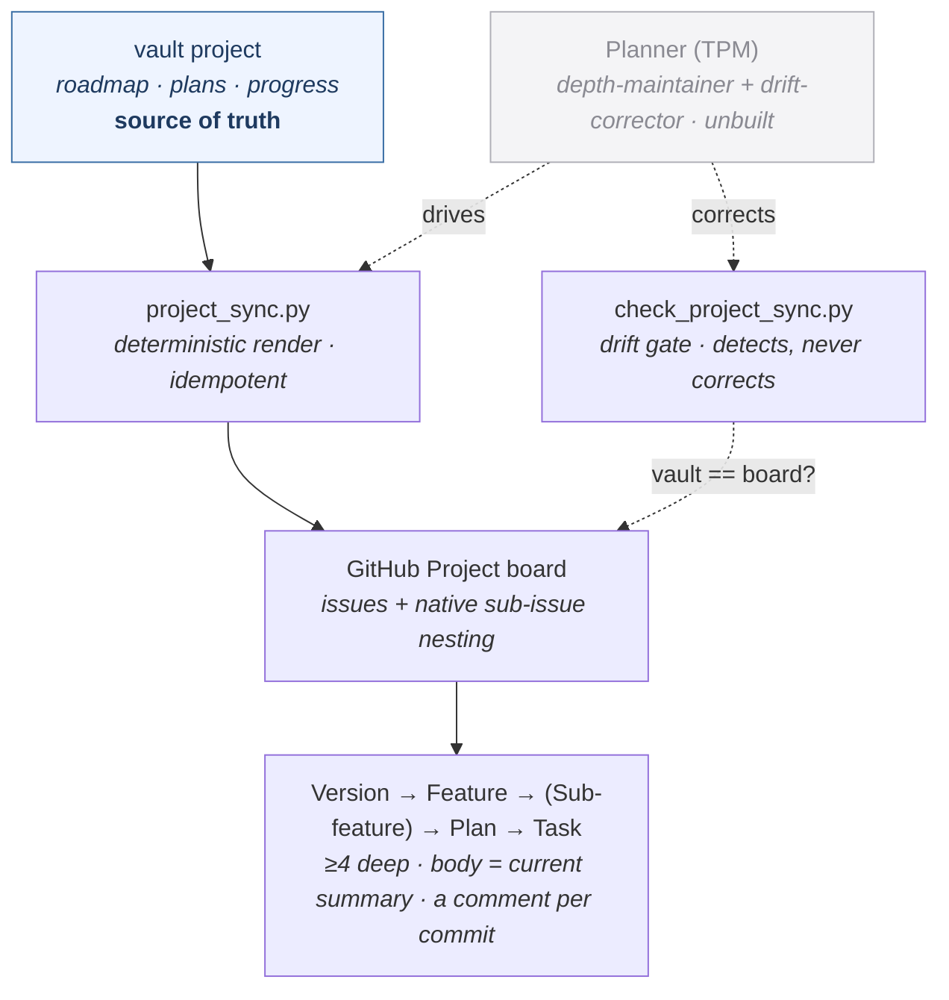

> [!NOTE]
> **LAUNCHED (lifted 2026-06-24, AG Phase 3; originally approved 2026-06-23).** child-design — **the `github-projects` capability** (one-way deterministic board-sync — project a vault project's roadmap/plan/progress onto a GitHub Project board). `status: launched` (lifted into tracked `wiki/designs/` 2026-06-24, AG Phase 3). Points *up* at the [crickets HLD](crickets-hld.md).

# github-projects

## Objective

`github-projects` **projects vault state onto a GitHub Project board** — a one-way, deterministic, idempotent sync where the **vault stays the source of truth and the board is the generated human mirror.** It is platform-bound (`github-`) and keeps its name. It declares `[board-sync]`.

## Overview

The renderer, model, drift detector, schema, and templates are delivered; the field-mirroring orchestration inside them is designed-not-yet-wired (see Design):

| Primitive | Kind | What it does |
|---|---|---|
| `project_sync.py` | script | The single idempotent write path — renders each vault item to a GitHub Issue and reconciles it (create / update / noop). |
| `project_model.py` | script | The board model — the taxonomy + the Version→Feature→Sub-feature→Plan→Task parent chain + the materialization partition. |
| `check_project_sync.py` | script | The drift **detector** — fails the gate when the board body diverges from the rendered source, or an issue has no backing vault item. |
| `project_schema.json` | rule | The board-shape contract — the parent chain + the DC-2 field set (Track · Type · Priority · Start · Target · Status). |
| per-type templates | template | The locked kickoff / progress / closeout triads (task · plan · feature · sub-feature) + single-line forms (version · idea · backlog-item · promotion). |

*One direction only — the vault is authored; `project_sync.py` renders it to nested issues (≥4 levels deep; each work item carries a kept-current summary body + a comment per commit); `check_project_sync.py` detects drift but never corrects. The **Planner (TPM)** persona (unbuilt) drives the write path to hold the depth floor + correct drift; until it ships, that is hand-maintained.*

### One-way, idempotent, deterministic

The sync runs **vault → board and never back.** `project_sync.py` is a single write path that converges — running it twice changes nothing the second time — so it is safe to re-run on every plan-state change. The render is fully deterministic: the script owns all structure (field order, `YYYY-MM-DD` dates, the commit/entity links built from a SHA or id, the `gh` posting); the only model-supplied part is the human sentences in the template `{{placeholders}}`. A human reads the board for a glance; the vault is where the state actually lives.

### Levels → issues, and what's on the board when

Every taxonomy type — **version · feature · sub-feature · plan · task** (plus top-level `backlog-item` · `idea` · `bug`) — renders to **one real GitHub Issue** (not a draft card, so the nesting + Gantt roll-up work), and the parent chain becomes **native GitHub sub-issue nesting**: Version → Feature → Sub-feature → Plan → Task.

**What materializes when** is the load-bearing partition (DC-1): everything **feature-and-up** — Versions, Features, Sub-features (+ top-level Backlog-items / Ideas) — is mirrored **the moment it exists, started or not** (it is the human-facing roadmap and must always be visible). **Plan + Task issues materialize only for the *active* plan**, at work-start — future plans/tasks live implicitly under their already-materialized feature until picked up, to bound issue volume. Never pre-persist task breakdowns; always persist features-and-up.

### The depth floor — at least four

A live plan's board reaches **at least four levels — Version → Feature → Plan → Task — always, with Sub-feature an optional fifth.** Flattening to epic- or feature-level is **drift** (an under-populated source), not a simplification. The always-on roadmap tier (feature-and-up) is the floor for *unstarted* work; the moment a plan goes active, Plan + Task complete the ≥4 chain beneath it.

### Two surfaces — a current-summary body and a per-commit comment trail

A version is a one-line *About*. A work item (task / plan / feature / sub-feature) carries **two surfaces**:

- **The issue body — a kept-current summary.** ① **Kickoff** (`Goal · Done-when` for a task, `Goal · Why-it-matters` for a feature) at start, a **current progress summary** that reflects where the work stands right now, and ③ **Closeout** (`Outcome · Landed/Shipped-link · date`) at ship. The body answers *what is this, and where does it stand* — at a glance.
- **A comment per commit — the granular trail.** Each commit posts a **GitHub issue comment** — a timeline entry (`{date} ([sha](commit-url)): {summary}`, the commit link built deterministically from the SHA). The comments answer *what happened, commit by commit.* (Altitude follows the unit: a task comments per commit, a plan per task, a feature per plan shipped.)

### Per-commit comment + keep-the-summary-current — two idempotent surfaces

The two surfaces reconcile differently, both idempotently:

- **The body summary** is **re-rendered from the source and byte-compared** to the live body each sync → **create / update (`gh issue edit --body`) / noop**. Whole-body replacement means any out-of-band edit on GitHub is overwritten on the next sync, and an unchanged state is a clean noop.
- **The per-commit comments** are **append-only, posted once per commit SHA.** Idempotency is by **SHA-keyed dedupe**: before posting, the sync checks whether a comment for that commit already exists (the comment carries its SHA; the vault source records which SHAs are posted) → post only if absent. So re-running never double-posts a commit's comment.

> **Designed delta from as-built.** The shipping plugin today folds per-commit progress into the issue **body** (one line per commit, no comment path — there is no `gh issue comment` call). This design moves the per-commit update to a **comment** (the granular timeline) and keeps the body as the **current summary** — a `[PENDING-IMPL]` change that adds the `gh issue comment` post + the SHA-keyed dedupe, while the body-reconcile path stays as-is.

### Status — mirrored at lifecycle transitions

Status is a custom Project field — **Todo → In Progress → Done** — moved at the phase transitions, not free-floating:

- **work-start (`/plan`)** → *In Progress* + the ① kickoff;
- **while working** → stays *In Progress*; a comment posts per commit, the body summary stays current;
- **ship** → the ③ closeout → *Done* → the issue is **closed**.

Container items (Version) carry no status thread — they roll up child status natively; pre-work cards (Backlog-item / Idea) are static, ordered by Priority, with no thread until promoted.

**Built vs designed (the honest split).** The shipping path writes the **issue body + open/closed state** — that part is wired, idempotent, drift-gated. The **DC-2 Project fields** (Track · Type · Priority · Start · Target · **Status**) have deterministic `gh` argv builders but **no live callers yet** — they are operator-gated backfill, not the unit-tested wired path. So today the live status signal is **open-vs-closed**; the Status *field* transition is designed, awaiting the field-write wiring (the Planner-era automation, below).

### The drift gate detects; the Planner corrects

`check_project_sync.py` is the **detector**: a board body that differs from the rendered source is `update` drift, an issue with no backing vault item is `orphan` drift — it **fails the gate but does not auto-correct**. Auto-correction + holding the depth floor as plans churn is the job of the **Planner (TPM)** persona — the renamed (was the "V5-11 PM chief-of-staff"), still-unbuilt async depth-maintainer + drift-corrector that *drives* this deterministic write path. It does **not** own the write path — `github-projects` owns `project_sync.py`; the Planner is the intelligence above it. Until the Planner ships, depth + drift are **hand-maintained**, and an epic-level render is drift, not the correct state.

### Opinions

None — `github-projects` **mirrors, it does not judge.** It projects whatever state the vault holds; whether that state is good, done, or correctly prioritized is the planning personas' call (the **Planner** above it), not the projection's.

## Dependencies

- **requires [development-lifecycle](crickets-development-lifecycle.md)** — it mirrors that loop's roadmap / plan / progress artifacts; the board is meaningless without the phase state that feeds it, and the `/work` commit hook is what drives the per-commit ② line.
- **driven by the [Planner (TPM)](https://github.com/alexherrero/agentm/wiki/agentm-personas) persona** — the renamed depth-maintainer + drift-corrector composes `github-projects` (soft `enhances`) to hold the ≥4 depth floor + correct drift; it **drives** the write path, never owns it. Unbuilt — until it ships, depth/drift are hand-maintained.
- **consumed by the Operator dashboard (designed)** — a unified read-only `/status` (plans + board + phase transitions + health) extends `queue-status` and reads board-sync; see [Personas](https://github.com/alexherrero/agentm/wiki/agentm-personas).
- **routes per repo** — agentm items → Project **#2**, crickets items → Project **#5** (split 2026-06-02); each item lands on its own repo's board. `dev-setup` is intentionally vault-only (no mirror; its absence is not drift).
- Points up at the [crickets HLD](crickets-hld.md); the requires/enhances mechanics are in [crickets-composition](crickets-composition.md).

## Migrations

- **The `requires` target is renamed** — it required `developer-workflows`; that capability is now **`development-lifecycle`** (the spine rename), so the `requires:` edge re-points. Mechanical, with resolver aliasing.
- The capability name itself is stable (platform-bound, keeps `github-projects`).

## Risks & open questions

- **The renderer + detector + model + templates are delivered; the field-mirroring layer is designed-not-wired.** The issue body + open/closed state sync today; the DC-2 Project fields (incl. **Status**) have argv builders with no live callers (operator-gated backfill). So the live status signal is open-vs-closed; the Status-field transition awaits wiring.
- **The per-commit *comment* is a designed delta** — the plugin today appends per-commit lines to the issue **body** (no comment path; there is no `gh issue comment` call). This design moves the per-commit update to a **`gh issue comment`** with **SHA-keyed dedupe** (post once per commit) and keeps the body as a **current summary**. `[PENDING-IMPL]`.
- **Depth decays without the Planner** — the depth-maintainer + drift-corrector (the **Planner (TPM)** persona, renamed from the V5-11 PM chief-of-staff) is unbuilt; until it ships the ≥4 floor is hand-maintained and drifts toward epic-level. The detector flags it; nothing auto-corrects.
- **A board-sync rethink is in flight** (2026-06-19 research + handoff) — these mechanics are the pre-rethink documented state; reconcile this design against the rethink's outcome before the lift.
- **The Operator `/status` dashboard is designed, not built** — it consumes board-sync but lives closer to the persona / queue-status surface.
- **Re-audit triggers:** build the per-commit `gh issue comment` + SHA-keyed dedupe (body → current summary); wire the DC-2 field writes (incl. the Status transition); build the **Planner** depth-maintainer / drift-corrector; reconcile against the github-projects rethink; re-point the `requires` edge at the `development-lifecycle` rename; build the unified `/status` when the Operator surface lands.

## References

- crickets `src/github-projects/` — `project_sync.py` · `project_model.py` · `check_project_sync.py` · `project_schema.json` · the per-type template set; declares `[board-sync]`
- **The conventions:** DC-1 (`v4-41-project-human-source.md`) — the materialization partition + the progress altitudes (task = per commit, plan = per task, feature = per plan shipped) + the title-in-plain-language / link-everything rules
- **The boards:** agentm → Project #2 · crickets → Project #5 (split 2026-06-02); `dev-setup` vault-only
- **Rethink in flight (2026-06-19):** `_harness/RESEARCH-FINDINGS-github-projects-rethink-20260619.md` · `HANDOFF-github-projects-rethink-20260619.md`
- **Up / consumed by:** [crickets HLD](crickets-hld.md) · [composition](crickets-composition.md) · [Personas](https://github.com/alexherrero/agentm/wiki/agentm-personas) (Planner — drives this; Operator — reads it) · [development-lifecycle](crickets-development-lifecycle.md)

**2026-06-23 — authored, reviewed, and finalized.** `github-projects` is the **one-way, deterministic, idempotent board-sync** — the vault stays the source of truth, the GitHub Project is the generated human mirror; it declares `[board-sync]` and **mirrors, it does not judge** (no opinion). Every taxonomy type renders to **one GitHub Issue** with **native sub-issue nesting** (Version→Feature→Sub-feature→Plan→Task); the **DC-1 materialization partition** keeps features-and-up always on the board (the roadmap, started or not) and adds Plan+Task only for the **active plan** at work-start. The depth floor is **≥4** (Version→Feature→Plan→Task, Sub-feature an optional fifth) — epic-level is drift. Each work item carries **two surfaces**: a **kept-current summary body** (① kickoff + current progress + ③ closeout, whole-body byte-compare reconcile) and **a per-commit GitHub comment** as the granular trail. **Status** is mirrored at lifecycle transitions (Todo→In Progress→Done, Done closes the issue). The **Planner (TPM)** persona (renamed from the V5-11 PM chief-of-staff; now a persona, unbuilt) **drives** this write path to hold depth + correct drift — it does not own it.

**Built vs designed:** the renderer (`project_sync.py`), model (`project_model.py`), drift **detector** (`check_project_sync.py`), schema, and templates ship, writing the issue **body + open/closed state**. Designed-not-wired (`[PENDING-IMPL]`): the **per-commit `gh issue comment`** + **SHA-keyed dedupe** (operator decision — a comment, not the as-built body line; the body becomes the current summary), the **DC-2 field writes** incl. the Status-field transition (operator-gated backfill — argv builders with no live callers), and the **Planner** depth-maintainer / drift-corrector. Routes per repo (agentm→#2, crickets→#5; dev-setup vault-only). **Re-audit:** build the per-commit comment + dedupe; wire the DC-2 field writes; build the Planner; reconcile against the 2026-06-19 board-sync rethink (these are the pre-rethink mechanics); re-point `requires`→`development-lifecycle`; build the Operator `/status`.
