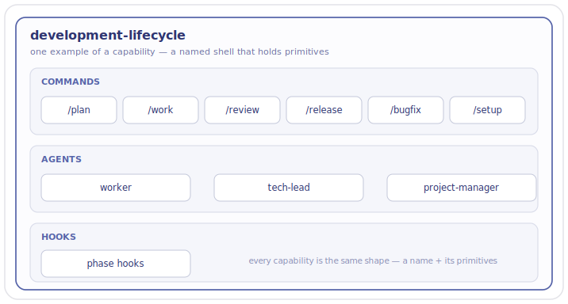

> [!NOTE]
> **LAUNCHED — the live crickets parent design** (lifted into tracked `wiki/designs/` 2026-06-20, AG Phase-2 C0; all sub-designs content-final 2026-06-24, AG Phase 3). **Reconciles** the earlier standalone designs (developer-plugin-suite + crickets-v3-native-plugins) — their "three"/"six"-plugin identity-lines are superseded — which have since been subsumed into this HLD's [composition](crickets-composition.md) + [build-system](crickets-build-system.md) children (AG Wave 2, 2026-06-24). Built on design-doc Appendix C; inherits the shared beliefs from the [Foundations HLD](https://github.com/alexherrero/agentm/wiki/agentm-foundations-hld) by reference, and composes onto the person — the [agentm HLD](https://github.com/alexherrero/agentm/wiki/agentm-hld). Governance keys stamped: `governs: [src/**, scripts/**]`, `area: crickets/architecture` (AG Phase-2 C0.2).

# Crickets — the toolbox the assistant picks up

A useful assistant is a person and the tools it works with — the [Foundations](https://github.com/alexherrero/agentm/wiki/agentm-foundations-hld) make that case, and [agentm](https://github.com/alexherrero/agentm/wiki/agentm-hld) is the person. crickets is the tools: the abilities the assistant picks up to actually get work done — planning, building, reviewing, releasing, and more. Each is **stateless** — it holds nothing of its own between uses. The memory, the opinions, and the hat being worn all live in agentm; a tool draws on them, does its job, and is set back down, and the person remembers what happened. Add a tool or take one away and the person still stands; the toolbox grows and changes without disturbing who's holding it.

This doc is about the toolbox: the capabilities it implements, how a capability is built once and shipped everywhere, and how the whole thing composes onto the person. The shared beliefs live up in the [Foundations](https://github.com/alexherrero/agentm/wiki/agentm-foundations-hld); the person is the [agentm HLD](https://github.com/alexherrero/agentm/wiki/agentm-hld).

## What crickets is for

- **One source of truth** — each capability is described once; everything it ships is generated from that, never kept in sync by hand.
- **Clean composition** — tools sit beside each other and combine, instead of tangling into one another.
- **Optionality** — any capability can be added or left out, and the base still works on its own. A bare agentm is whole; crickets is the part you bolt on.
- **Subordination** — the tools serve the person and never grow a will of their own: crickets can lean on agentm, agentm never leans on crickets.

## The capabilities

crickets is **thirteen capabilities** — each a self-contained plugin, each written once and generated for every host (next section). A capability is a named ability with a handful of primitives inside it — commands, agents, skills, hooks. *(Eleven of the thirteen ship today; `research` and `diagnostics` are newly designed, not yet built. Several reached their final names: `developer-workflows` → `development-lifecycle`, `github-ci` → `maintenance`, `pii` → `privacy`, `wiki-maintenance` → `wiki`, `design-docs` → `design`, `testing`+`releasing` merged → `conventions`, `status-line-meter` folded into `token-audit`; the once-separate `lifecycle` capability folded into the spine.)* A few examples:

- **`development-lifecycle`** (the phase loop) — the phase commands (`/plan`, `/work`, `/review`, `/release`, `/bugfix`, `/setup`, plus `/launch`, `/deprecate`, `/retire`), the agent-defs that run them (worker, tech-lead, the Planner (TPM) coordinator), and the phase hooks.
- **`code-review`** — the adversarial-reviewer agent (plus a cross-model variant), the `/code-review` command, and the cross-review shell-out.
- **`developer-safety`** — the recoverability skill, the commit-on-stop hook, and the gate carve-out tests.

The capability *name* is the plugin name; the makeup is what's inside. A capability is really just a **shell with a name** — the work lives in the primitives it holds:

*A capability is a shell that holds primitives. Here, `development-lifecycle` holds its commands, agents, and hooks — every capability is the same shape, just a different name and a different set of primitives.*

**Capabilities build on each other.** The same primitive can sit in more than one capability, and a capability can lean on another — it may **depend on** one (it won't run without it) or be **enhanced by** one (it works alone, but does more when the other is present). Those depend-and-enhance links come, in part, from primitives being shared or building on each other.

**They can lean on an opinion, too.** A capability — or a single primitive — can depend on or be enhanced by one of agentm's named [opinions](https://github.com/alexherrero/agentm/wiki/agentm-hld) (*what "done" looks like*, *what "good" looks like*), the same way it leans on another capability. When the opinion is present it shapes the work; when it's absent, the capability degrades gracefully and carries on.

Crickets is thirteen capabilities. Full details are available below and in the [composition sub-design](crickets-composition.md).

## How a capability is composed

A capability is written **once** and runs on **many platforms**. You author it in one place — the capability's primitives — and a build step renders it into the native shape each host expects, so the same capability runs on Claude Code, Antigravity, and any host added later. Different hosts support different primitive types, so a host may get only the subset of a capability's primitives it can express. *(The build pipeline — the single source, the per-host generator, the drift gate — is the [build-system sub-design](crickets-build-system.md).)*

## Roles

Roles aren't a thing in crickets. What looks like a role — *worker*, *reviewer*, *tech-lead* — is a **persona**, which is an agentm concept; crickets only supplies the tools (capabilities and their primitives) a persona wields. See the [agentm Personas design](https://github.com/alexherrero/agentm/wiki/agentm-hld) for how primitives and capabilities get composed into a stance and wired to opinions. *(The transitional shape of today's role-style agent-defs lives in the [composition sub-design](crickets-composition.md).)*

## How crickets composes onto agentm

Two things compose here, both **one-way**. Capabilities compose with **each other** by name — one names what it depends on or enhances, and the toolbox wires them at runtime, so any subset installs and runs. And the whole toolbox composes onto **agentm**: crickets leans on agentm, agentm never leans on crickets. A bare agentm is whole on its own; remove a tool — or the substrate — and what's left degrades gracefully rather than breaking. *(The resolver, the bridge to agentm, and how the one-way rule is held are the [composition sub-design](crickets-composition.md).)*

## Sub-designs

The mechanics live in sub-designs, so this HLD stays high-level.

**Cross-cutting:**
- [Build system](crickets-build-system.md) — the single source, the per-host generator, the drift gate, host-subset coverage.
- [Composition](crickets-composition.md) — capability↔capability and capability↔opinion (depends/enhances), the full relationship map, the one-way arrow onto agentm, and the role-retirement detail.
- [Model + effort routing](https://github.com/alexherrero/agentm/wiki/agentm-model-effort-routing) — the model × effort tier scale (T0…T4, with Claude + Gemini equivalents), the persona→tier map, and the `tier:` persona-manifest axis. *(An agentm-parented cross-cutting design — it sits up under the [agentm HLD](https://github.com/alexherrero/agentm/wiki/agentm-hld); its enforcement surface is here, the agent-defs that carry the `model:` + `effort:` frontmatter.)*

**One per capability** *(the consolidated set — each design is now authored + content-final, 2026-06-24):*

| Capability | What it is |
|---|---|
| development-lifecycle | the spine — a feature's whole life: setup / plan / work / review / release / bugfix + launch / deprecate / retire (renamed from `developer-workflows`; sheds the design + observability + CI commands) |
| code-review | adversarial review |
| design | design authoring — abbreviated / full / architecture rungs |
| developer-safety | the recoverability gate |
| wiki | docs upkeep |
| github-projects | board-sync — vault → board, ≥4 levels deep, a per-commit comment trail; the write path is driven by the Planner (TPM) persona |
| maintenance | keep the shipped codebase healthy — dependency repair + currency, CVE, tech-debt, + a tentative `content-refresh` (renamed from `github-ci`) |
| conventions | the base-standards shell — 8 domains: testing · releasing · ci · code-quality · agentic-engineering · reliability · coding · documentation (the `documentation` domain owns the Diátaxis structure `wiki` enforces) |
| obsidian-vault | the storage backend |
| token-audit | token metering (absorbs `status-line-meter`) |
| privacy | privacy / data protection — `pii` first, extensible (e.g. secret-leak prevention, redaction) |
| research | deep research *(new)* |
| diagnostics | observability / troubleshooting *(new)* |

## References

- design-doc **Appendix C** — the ratified crickets Overview this HLD expands (the input spec, not a sibling)
- [Foundations HLD](https://github.com/alexherrero/agentm/wiki/agentm-foundations-hld) — the shared beliefs, inherited by reference; [agentm HLD](https://github.com/alexherrero/agentm/wiki/agentm-hld) — the person (personas, opinions) crickets composes onto
- the earlier standalone designs this HLD reconciled (their "three"/"six"-plugin identity-lines are superseded by the current set — thirteen capabilities at target, eleven shipping today) have been **subsumed** into the [composition](crickets-composition.md) + [build-system](crickets-build-system.md) children (AG Wave 2, 2026-06-24)
- per-component source paths (scripts, ADRs, manifests) live in the sub-designs above

## Amendment log

**2026-06-24 — the two reconciled standalone designs subsumed into the children (AG Wave 2).** The earlier `developer-plugin-suite.md` + `crickets-v3-native-plugins.md` — which this HLD reconciled (the "three"/"six"-plugin identity-lines, superseded) and up-pointered at the 2026-06-20 lift — are now move-and-retire **subsumed** into the [composition](crickets-composition.md) (the `enhances:` soft-composition + ADRs 0017/0027) and [build-system](crickets-build-system.md) (the `src` → generate → `dist` pipeline + ADRs 0013/0015) children, and deleted (git history retains them). The `reconciles:` frontmatter + the banner/References now name the living children. No-loss verified per design before each deletion. *Re-audit trigger:* none — the reconcile relationship is fully absorbed into the parent→child structure.

**2026-06-24 — folded ADRs 0006 / 0011 into this design (AG Phase 4, move-and-retire).**

**0006 — Gemini CLI host removal (2026-05-17).** Drop standalone Gemini CLI from supported hosts; keep Claude Code and Antigravity (Gemini-in-IDE). Legacy paths get backup-not-hard-delete cleanup with operator confirmation and `--no-legacy-cleanup` flag for CI. Why not keep Gemini CLI: zero observed use; maintenance scales with host count; inconsistency with new skills already shipping as 2-host. ADR amendments (not rewrites) preserve audit trail. *Cross-repo:* the agentm side of the paired release is in the agentm CHANGELOG (v2.4.0). *Re-audit triggers:* Antigravity becomes Gemini-restricted or changes shape; a Gemini CLI successor ships within ~6 months; cleanup prompt fires on non-toolkit-managed paths.

**0011 — Antigravity 2.0 + Antigravity CLI host support (2026-05-25).** Adopt Antigravity 2.0 + Antigravity CLI under the single existing `antigravity` slug. Update installer dispatch from `.agent/skills/` (singular) to `.agents/skills/` (plural). Add `kind: plugin` primitive. Sub-agent-as-skill preserved. Hooks stay Claude-Code-only. Why not split `antigravity`/`antigravity-cli` slugs: shared agent harness means identical dispatch. Why not adopt `.subagents/` first-class slot: no such directory exists in agy v1.0.2 (confirmed via binary string inspection). Why not plugin-wrap every skill: plugin delivery is user-global, not project-scoped. *Re-audit triggers:* Antigravity 2.0 desktop does NOT use `.agents/` plural; future agy releases change the discovery path; Google adds a file-based hook surface.

**2026-06-24 — reconciled to the now-final child designs.** All 14 AG child designs are content-final, so the body is brought current: the worked example + caption use `development-lifecycle` (the renamed spine, not `developer-workflows`); the capabilities note completes the rename ledger; the capability rows name the facts that landed in review — `github-projects` (≥4 depth floor · per-commit comment trail · driven by the **Planner (TPM)** persona), `maintenance` (+ the tentative `content-refresh` primitive), `conventions` (the 8-domain base-standards shell, incl. the new **documentation** domain that owns the Diátaxis structure `wiki` enforces); the "per-capability sub-designs not yet written" caveat is closed; and the new cross-cutting **[model + effort routing](https://github.com/alexherrero/agentm/wiki/agentm-model-effort-routing)** design (the model × effort tier scale + the `tier:` persona-manifest axis — agentm-parented) is named in Sub-designs. Why not rewrite the 06-20/06-22 entries' "fourteen": they are history (the target *was* 14 then; the 06-22 entry records the merge to 13) — the body is the current truth. **Re-audit trigger:** at the Phase-3 lift, regenerate `diagrams/crickets-capability-example.svg` (relabelled `development-lifecycle` ✓) and re-sync the launched parent copy (this entry ✓).

**2026-06-23 — `github-ci` → `maintenance` reframe (operator).** `github-ci` is renamed-in-place and broadened to **`maintenance`** — keep the shipped codebase healthy: dependency repair + currency, CVE/security patching, tech-debt inventory ([maintenance sub-design](crickets-maintenance.md)). Count stays 13 (a rename). The load-bearing call: **the repair lives in `maintenance`, the analysis in `diagnostics`** — `dependabot-fixer` is recast as a caller of the diagnose engine. The sub-designs table + the [composition](crickets-composition.md) map are reconciled; the `github-ci` stub is retired. **Re-audit trigger:** recast `dependabot-fixer` onto the diagnose engine when diagnostics ships.

**2026-06-22 — lifecycle merged into the spine; target 14 → 13 (operator).** The separate `lifecycle` capability is withdrawn: rather than split `/launch` + `/deprecate` + `/retire` into their own plugin, the spine is renamed `developer-workflows` → **`development-lifecycle`** and owns the feature's whole arc (plan → release → launch → deprecate → retire). Why not keep it separate: `/launch` is the step right after `/release`, so splitting adjacent lifecycle steps across two plugins was an artificial seam; the genuinely-distinct concerns still leave the spine (`/observe` → diagnostics, `/ci-cd` → maintenance, design family → design, `researcher` → research). The spine drops the `-workflows` suffix (its reserved use dissolves) and the `developer-` prefix (the exception narrows to `developer-safety`). Sub-designs table is now the thirteen; the [composition](crickets-composition.md) map is reconciled. **Re-audit trigger:** when `github-ci` is reframed as `maintenance` (queued), update the table + map again.

**2026-06-21 (C4 fold) — ADRs 0001 + 0007 retired into this HLD (AG Phase 2).** The agentm/crickets ADR model was retired (AG design-doc §5); ADR 0001 (crickets purpose / public-with-PII-guardrails framing) and ADR 0007 (MemoryVault discovery + mining) folded into this parent HLD and deleted via `migrate-adr.py` (inbound links repointed here, index + sidebars pruned). Their decision history is preserved in the two dated entries at the **foot** of this log. *Why not keep them as ADRs:* the append-only model forces a chain-read to reach live truth; one living body collapses the chain. *Re-audit trigger:* if the crickets↔agentm split, the public-repo posture, or the adapt-don't-import enforcement is revisited, amend the relevant section here rather than reviving a record.

**2026-06-21 (C0.2) — stamped governance keys: `governs: [src/**, scripts/**]`, `area: crickets/architecture`.** AG Phase-2 C0.2. The two broad globs make the parent HLD the **broad fallback** over both crickets code trees (mirrors the agentm HLD's multi-tree `[scripts/**, harness]`); Phase-3 / C4 sub-designs narrow with capability-specific globs (`src/<group>/**`, specific `scripts/*.py`) and the resolver prefers them automatically (most-specific-wins). `area: crickets/architecture` follows the canonical two-level `<root>/<domain>` vocabulary the AG area-taxonomy defines and the shipped agentm designs carry (`agentm/architecture`, `shared/foundations`); child areas are `crickets/<capability>` (e.g. `crickets/developer-safety`, seeded by the C4 ADR fold). `shape:` is not stamped on design docs per the governance contract (it is the SHAPE axis for host-loaded primitives, not design artifacts). With these keys the crickets bridge (`find_governing_design.py --root <crickets>`) resolves `src/…` and `scripts/…` targets to this HLD instead of greenfield. *(Corrected from the initial 2026-06-21 stamp — bare `crickets` / `[src, scripts]` — to the canonical two-level area + glob form once agentm's shipped designs confirmed the convention.)* *Re-audit trigger:* when C4 / Phase-3 sub-designs are authored, narrow their `governs:` globs and seed child areas; the parent's broad globs can tighten as every subtree gains a more-specific owner.

**2026-06-20 (lift) — lifted into tracked `wiki/designs/`; `status: proposed → launched`.** AG Phase-2 C0. Moved from the vault `hld-drafts/` to `wiki/designs/crickets-hld.md` as the live crickets parent design; frontmatter took the tracked-design convention plus `kind: design` / `scope: arc`. Cross-repo links to the agentm Foundations + agentm HLDs were rewritten to `github.com/alexherrero/agentm/wiki/…` URLs (they resolve once agentm lifts its parents — A0); the still-seeded cross-cutting children (build-system, composition) are now plain-text references pending their Phase-3 authoring (a launched wiki page must not link to unpublished pages). Up-pointers added on the two reconciled standalone designs (both since subsumed into the children — see the 2026-06-24 Wave 2 entry above). **Why not stamp `governs:`/`area:`/`shape:` now:** that convention is agentm A1's substrate deliverable — stamping before it locks risks the two repos diverging; deferred to C0.2. *Re-audit trigger:* stamp the governance keys when A1's convention + the area taxonomy are confirmed; confirm the agentm-wiki URLs resolve once A0 lands.

**2026-06-20 — authored, reviewed, and finalized.**

Authored 2026-06-19 from the ratified Overview (design-doc Appendix C) and a read-only grounding sweep, then upleveled through operator review to plain English: a **capability is a shell that holds primitives** (commands, agents, skills, hooks), led by one worked example (developer-workflows). The mechanics were sharded into two seeded cross-cutting children — **build-system** (the single-source → generated, drift-gated build) and **composition** (capability↔capability, capability↔opinion, and the one-way compose-onto-agentm seam). The **role-retirement** is propagated here: there is no role tier — a role *is* a persona, and crickets provides tools + packages.

The 2026-06-20 **portfolio chart pass** (design-doc "Forward plan") set the target to **fourteen capabilities**: a **naming rule** (bare-noun default; banned `-workflows` + Opinion-names; the `developer-` exception), the consolidations (`testing` + `releasing` → `conventions`, `status-line-meter` → `token-audit`, `pii` → `privacy`), the spine **re-homing** into new `research` / `diagnostics` / `lifecycle` capabilities, and three proposed renames (`code-review` → `review-workflows`, `token-audit` → `efficiency`, `research` → `research-workflows`) adversarially **rejected**. The Sub-designs table is the consolidated fourteen in **final names**; the chart was verified **sound** by the `ag-portfolio-verify` workflow. (Eleven of the thirteen ship today; `research` and `diagnostics` are designed, not yet built.)

`status` stays `proposed` until the Phase-1 lift flips it to `launched`. **Re-audit triggers:** author the fourteen per-capability sub-designs in Phase 3 (final names); reconcile `Coordinator-Roles.md` + the agent-defs when the role-retirement lands. *(2026-06-20 cleanup: the example diagram is now a vector image, and the composition child's relationship map carries the final fourteen names — that map stays mermaid, since a dependency graph benefits from auto-layout, with vector conversion an option at its voice pass.)*

---

*Folded decision history (AG Phase-2 C4 — records retired into this HLD; git holds the full ADR text):*

**2026-05-22 — MemoryVault discovery + mining (was ADR 0007).** Shipped the discovery surface as `/memory` sub-commands (index-skills · reflect corpus · discover-skills · adapt-skills · watchlist) with a deterministic-Python Pass-1 (6-rule rubric + GitHub-metadata + trust signals) → LLM-sub-agent Pass-2 (`adapt-evaluator`) architecture for the highest-judgment task. *Load-bearing:* **adapt-don't-import is architecturally enforced** — the sub-agent's write allowlist is scoped to the watchlist, so new skills enter only by operator-typed fork, never auto-promotion. Stdlib-only; operator-editable source/trust whitelists (configure-don't-build). *Why not auto-fork / pure-heuristic / hardcoded lists:* auto-fork makes adoption advisory not architectural; a heuristic alone is blind to semantic fit; hardcoded lists can't evolve without code. *Note:* the memory surface itself moved to agentm in the V5 unbundling — this records the crickets-era decision. *Re-audit trigger:* any request to soften the manual-fork-only contract (e.g. auto-promote HIGH + trusted-org + stars) supersedes the enforcement and must be re-decided here.

**2026-05-12 — crickets purpose, scope, public-with-PII-guardrails (was ADR 0001).** Established crickets as a **separate public GitHub repo** sibling to agentm: independent release cycles, `lib/install/` shared byte-identically (CI-gated), every customization-primitive kind in its own `src/` subdir with a YAML manifest (`name`/`description`/`kind`/`supported_hosts`/`version`), the installer dispatching per host. **Public-with-PII-guardrails** — three layers from day one: the pre-push hook (mandatory enforcer) · the `pii-scrubber` skill (interactive layer) · the CI gitleaks gate. *Why not lower-parity-in-place / two-surfaces-one-repo:* both keep one README balancing harness-users vs customization-users and either tax skill growth or harness coherence; the clean repo split removes the parity tax and keeps each identity focused (full discussion: [agentm Foundations HLD](https://github.com/alexherrero/agentm/wiki/agentm-foundations-hld)). **Amended 2026-05-17** (v0.9.0): Gemini CLI dropped from supported hosts → forward scope `{claude-code, antigravity}` (the host-scope reduction is its own record, ADR 0006, folding in a later C4 arc). **Amended 2026-05-20** (v0.9.2): embeddings narrowed to local-only (`{local, stub}`), default `BAAI/bge-large-en-v1.5`, assuming desktop-class operator hardware. *Re-audit trigger:* a customization kind needing a fundamentally different shape (binary artifacts, large-file storage), or `lib/install/` byte-identity drift (recovery: `sync-lib.sh`).
