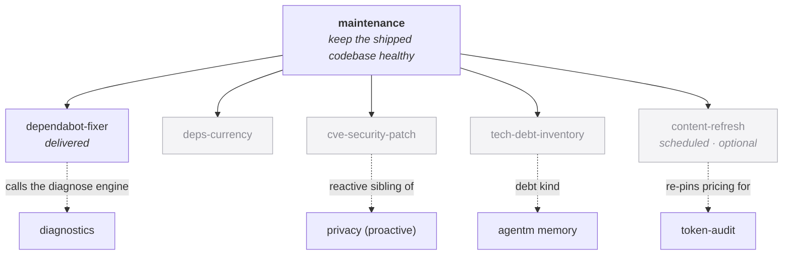

> [!NOTE]
> **LAUNCHED (lifted 2026-06-24, AG Phase 3; originally approved 2026-06-23).** child-design — **the `maintenance` capability** (keep an already-shipped codebase healthy: dependency repair + currency, security patching, tech-debt inventory). `status: launched` (lifted into tracked `wiki/designs/` 2026-06-24, AG Phase 3). Points *up* at the [crickets HLD](crickets-hld.md).

# maintenance

## Objective

`maintenance` is the capability that **keeps an already-shipped codebase healthy** — the repair and currency work on a live repo: dependency updates that broke, dependencies that have drifted out of date, security advisories that need patching, and accumulated tech-debt that needs inventorying. It is the executing arm of the **Maintainer** persona ("keep the house clean — deps, docs, drift"). It **diagnoses by composing [diagnostics](crickets-diagnostics.md)** and **acts by editing the repo** under bounded, never-merge, never-disable-checks guarantees — analysis stays in diagnostics; the act of fixing lives here.

## Overview

`maintenance` covers four concerns (one delivered, three greenfield), plus a tentative fifth — an optional, scheduled **content-refresh**:

| Primitive | What it does |
|---|---|
| **`dependabot-fixer`** *(delivered)* | Repair a broken dependency update — a red Dependabot PR fixed under a bounded loop. |
| **`deps-currency`** *(greenfield)* | Keep dependencies current — surface drifted-but-not-yet-failing deps *before* CI goes red. |
| **`cve-security-patch`** *(greenfield)* | Patch a vulnerable dependency on a security advisory, before it fails CI. |
| **`tech-debt-inventory`** *(greenfield)* | A standing, recallable, classified debt backlog — not an ad-hoc one-shot pass. |
| **`content-refresh`** *(greenfield · optional · scheduled · tentative)* | Periodically refresh the harness's external-sourced content against a checklist — model pricing (`pricing.py`), the **model+effort routing chart** (re-pin on model releases), adapted-skill upstreams, other pinned snapshots. |

*The repair lives here, the analysis in diagnostics (`dependabot-fixer` calls the diagnose engine); `cve-security-patch` is privacy's reactive sibling; `tech-debt-inventory` leans on memory; `content-refresh` re-pins token-audit's pricing on a schedule; one delivered + three greenfield + a tentative optional content-refresh (dimmed).*

## Design

### `dependabot-fixer` — repair a broken dependency update *(delivered)*

- *Entry:* a `dependabot/*` branch with red CI (or `/dependabot-fix [pr]`); preconditions: `gh` authed, clean tree, `verify.sh` executable.
- *Exit:* the PR's CI green or an honest abort — commits pushed to the Dependabot branch, a PR comment with the summary + a **residual-risks** section; never merged (a human merges).
- *Automated:* gather the failing CI + upstream CHANGELOG → **call the [diagnostics](crickets-diagnostics.md) engine** to classify the failure + confidence → consult `.harness/known-migrations.md` recipes first → a bounded loop (≤3 iterations: Edit → `verify.sh` → re-diagnose) → comment + abort honestly on low confidence.
- *Composes:* [diagnostics](crickets-diagnostics.md) — the **recast**: it calls the diagnose engine for the failure category instead of parsing CI logs inline; the repair loop stays here.
- *Artifacts:* git commits on the Dependabot branch; a PR comment; an optional `.harness/progress.md` line.

### `deps-currency` — keep dependencies current *(greenfield)*

- *Entry:* scheduled or on-demand — the *before-CI-goes-red* gap (drifted-but-not-failing deps), distinct from native Dependabot auto-merge (green PRs) and `dependabot-fixer` (red PRs).
- *Exit:* an inventory of installed-vs-latest + a surfacing of what's drifted, as a **passive report / recall entry** — not a PR (it stays advisory, to avoid competing with native Dependabot and the blast-radius of auto-opened PRs); a PR-emitting mode is a later option.
- *Automated:* read the repo's manifests, compare installed vs latest, surface the drift; optionally record a depends-on / version-constraint memory entry so currency state is recallable.
- *Composes:* [diagnostics](crickets-diagnostics.md) (the currency check is an analysis the engine can host; maintenance owns curating the update) + optionally the agentm memory engine (a depends-on kind).

**`[PENDING-IMPL]`** — build the inventory + the report/recall surfacing (documenter).

### `cve-security-patch` — patch a vulnerable dependency *(greenfield)*

- *Entry:* a security advisory **handed to it** (advisory-as-input) for a dependency **not yet failing CI** — the gap `dependabot-fixer` (CI-red only) and `privacy` (static patterns) both miss.
- *Exit:* the vulnerable dependency patched, under the same repair guarantees as `dependabot-fixer`.
- *Automated:* take the advisory → identify the affected dependency + a safe version → patch → `verify.sh` → comment.
- *Composes:* [privacy](crickets-privacy.md) — its **reactive sibling**: privacy owns proactive static-pattern secret/PII scanning, this acts on advisories. Two halves of supply-chain / secret hygiene, opposite triggers.

**`[PENDING-IMPL]`** — build the advisory workflow as a skill that takes an **advisory as input** (documenter); a real GHSA/NVD polling integration is a later, service-shaped build.

### `tech-debt-inventory` — a standing, recallable debt backlog *(greenfield)*

- *Entry:* on-demand capture, or fed by a [code-review](crickets-code-review.md) / `/simplify` pass that surfaces debt.
- *Exit:* a classified debt entry in memory (taxonomy: refactoring · performance · security-debt · documentation · friction-metrics), recallable and prioritizable over time.
- *Automated:* capture + classify debt into a `debt`/`friction` memory kind; optionally a CI gate enforcing inventory discipline (the `check-no-pii` analogue for debt).
- *Composes:* the agentm memory engine (a new `debt` entry-kind — a convention over the existing append/search/recall, no schema change) + [code-review](crickets-code-review.md) (the episodic `/simplify` + adversarial passes populate and draw from the standing inventory).

**`[PENDING-IMPL]`** — build the classification + surfacing (documenter); the `debt` kind is a **memory convention** (no schema change), and the taxonomy + the optional CI gate are maintenance's.

### `content-refresh` — refresh external-sourced content *(greenfield · optional · scheduled · tentative)*

- *Entry:* an **opt-in scheduled task** (the agentm scheduler / cron), or on-demand. Optional per install — like `wiki-watch`, off unless turned on.
- *Exit:* the harness's pinned external content re-checked against a **refresh checklist** and surfaced as a report — safe mechanical re-pins applied under the repair guarantees, judgment-bound drift surfaced for operator review.
- *Automated:* walk the checklist → for each source fetch the current upstream → diff against the pinned snapshot → re-pin or flag. Two classes: **mechanical re-pins** (model pricing in token-audit's `pricing.py`; the model-version strings in the [model+effort routing chart](https://github.com/alexherrero/agentm/wiki/agentm-model-effort-routing) on a model release) auto-apply under the bounded / never-merge guarantees; **judgment-bound drift** (an adapted skill's upstream changed, or a genuinely new model that needs a *tier* placement — `adapt-don't-import` and tier-assignment are human calls) surfaces to the watchlist instead of auto-editing.
- *Composes:* [token-audit](crickets-token-audit.md) (re-pins `pricing.py` — the standing mitigation for its pricing-drift risk) + the [model+effort routing chart](https://github.com/alexherrero/agentm/wiki/agentm-model-effort-routing) (re-pins its model strings on a model release) + the **adapt-skills watchlist** (re-checks the upstreams behind adapted skills) + the agentm **scheduler** (the scheduled trigger).
- *Distinct from `deps-currency`:* currency tracks **package versions** drifting in the manifests; content-refresh tracks **pinned external-content snapshots** (pricing tables, adapted upstream text) going stale. Different sources, same keep-current spirit.

**`[PENDING-IMPL]` · tentative** — flagged 2026-06-23 (AG token-audit review) as the home for the content-refresh idea; decide own-capability-vs-primitive + author at the post-docs-review pass. The checklist + the re-pin/flag split are the design seed.

### The repair guarantees

maintenance is the one side that **edits the repo**, so every primitive acts under the guarantees `dependabot-fixer` already enforces: **bounded** (a capped fix loop) · **never merge** (a human merges) · **never disable a check or modify a test to pass** · **never pin to an older version** · **residual-risk-honest** (never claims "fully verified" — it reports what it tried and what's still risky). Analysis is diagnostics' job; the *act* of fixing is maintenance's, always gated.

### The boundary

- **vs [development-lifecycle](crickets-development-lifecycle.md) (`/ci-cd`)** — `/ci-cd` is pipeline *authoring* (gate ordering, shift-left); it stays in the loop. maintenance acts on an *existing* repo's deps/debt/advisories. One writes the workflow; the other reacts to it going red or to deps drifting.
- **vs [diagnostics](crickets-diagnostics.md)** — diagnostics is the analysis-only diagnose engine; it never edits. maintenance is the only side that applies a fix. The `dependabot-fixer` recast (caller, not re-implementer) is the load-bearing instance.
- **vs [privacy](crickets-privacy.md)** — privacy = proactive static-pattern scanning; maintenance's `cve-security-patch` = the reactive advisory-driven sibling. Same domain, opposite trigger.
- **vs [code-review](crickets-code-review.md)** — code-review = ad-hoc `/simplify` (episodic, diff-scoped); maintenance = the standing recallable backlog those passes feed and draw from.

### First slice — the rename, nothing else

Rename `github-ci` → `maintenance` *in place*: `group.yaml` name + `capabilities: [maintenance]`, the directory, the `R-dependabot` detection rationale in agentm's `detect_project.py`, and the cross-links — with **zero behavior change** to `dependabot-fixer` (pure rename, gates stay green). The three greenfield primitives + the diagnostics recast sequence after, and depend on `diagnostics` existing as a named capability first.

### Opinions it consumes

maintenance **requests `done`** — a repair is not finished until `verify.sh` passes and the residual risks are stated honestly (the repair guarantees are `done` applied to a fix) — and composes **`good`** when it leans on code-review / diagnostics. *(Hardwired today; request-by-name is Phase-3/4 — the [Opinions design](https://github.com/alexherrero/agentm/wiki/agentm-opinions-and-gates).)*

## Dependencies

- **requires `development-lifecycle`** (hard) — the `verify.sh` / `.harness` contract `dependabot-fixer` runs against.
- **composes [diagnostics](crickets-diagnostics.md)** (soft) — calls the diagnose engine to classify failures (the `dependabot-fixer` recast; `deps-currency` too); maintenance applies the fix, diagnostics never edits.
- **pairs with [privacy](crickets-privacy.md)** — the reactive (advisory) half of supply-chain / secret hygiene to privacy's proactive (static) half.
- **leans on the agentm memory engine** — a `debt`/`friction` entry-kind (tech-debt inventory) + an optional depends-on/version kind (currency), via the existing append/search/recall.
- **feeds + draws from [code-review](crickets-code-review.md)** — the standing inventory behind the episodic `/simplify` passes.
- **the executing arm of the Maintainer persona** ([agentm Personas](https://github.com/alexherrero/agentm/wiki/agentm-personas)).
- Points up at the [crickets HLD](crickets-hld.md); the requires/enhances mechanics are in [crickets-composition](crickets-composition.md).

## Migrations

The rename is **in place**: the plugin directory `github-ci` → `maintenance`, `group.yaml` name + `capabilities: [ci-repair]` → `[maintenance]` (with `dependabot-fixer` now a *primitive within* maintenance rather than its own capability noun), the `R-dependabot` detection rationale in agentm's `detect_project.py`, and the wiki cross-links. `dependabot-fixer`'s behavior does not change in the rename. Consumers that named `github-ci` / `ci-repair` resolve through an **alias** at the v6.0 rename (resolver aliasing), so existing `requires:` keep resolving.

## Risks & open questions

- **Sequencing — diagnostics before the recast.** The `dependabot-fixer` recast (caller, not re-implementer) needs `diagnostics` to exist as a named capability to call; until then it keeps its inline CI-log parsing. Rename first (zero-behavior), recast once diagnostics ships.
- **The repair guarantees must hold across every primitive.** `deps-currency`, `cve-security-patch`, and any future repairer edit the repo, so they inherit `dependabot-fixer`'s bounded / never-merge / never-disable / never-pin-older / residual-risk-honest contract. A greenfield primitive that edits *without* them is the risk.
- **Advisory by decision — the honest limitation.** `deps-currency` surfaces a passive report (not a PR), and `cve-security-patch` takes an advisory as input (no polling). So a drifted dep nobody reviews, or a vuln nobody feeds it, isn't acted on. A PR-emitting / polling mode is a deliberate later escalation, not a silent gap.
- **The concern is host-neutral; the flagship is github-bound.** `dependabot-fixer` is github-specific (`gh`, `dependabot/*`, GHSA) — a permanent property of *that primitive* under a host-neutral concern (the `github-projects` → `board-sync`, `obsidian-vault` → `storage-backend` pattern). Non-github primitives (renovate, plain manifest scanning) are an open door, not planned. The plugin declares the umbrella `[maintenance]` capability, `dependabot-fixer` a primitive within it (the bare `[ci-repair]` noun is dropped).
- **`content-refresh` is tentative + optional.** Flagged here (2026-06-23) as the likely home for the content-refresh idea — an opt-in scheduled task on the agentm scheduler; own-capability-vs-primitive is a post-docs-review call. It depends on the scheduler existing and on a clean split between mechanical re-pins (auto) and judgment-bound drift (surfaced, not auto-edited).
- **Re-audit triggers:** rename-in-place first (gates green, zero behavior change); recast `dependabot-fixer` onto the diagnose engine when diagnostics ships; flip the `[PENDING-IMPL]` markers as each greenfield primitive lands; decide `content-refresh`'s home + author it at the post-docs-review pass; reconcile the composition map + HLD + chart (`github-ci` → `maintenance`) at approval.

## References

- **Delivered:** crickets `src/github-ci/skills/dependabot-fixer/SKILL.md` (→ `maintenance`) (the bounded fix loop) · agentm `scripts/detect_project.py` (the R-dependabot detection rule) · `.harness/known-migrations.md` (per-project recipes, consulted first)
- **Composes:** [diagnostics](crickets-diagnostics.md) (the diagnose engine) · [privacy](crickets-privacy.md) (proactive static / this reactive advisory) · [code-review](crickets-code-review.md) (the episodic `/simplify` passes) · the agentm memory engine (the `debt` + depends-on kinds) · [token-audit](crickets-token-audit.md) + the adapt-skills watchlist + the agentm scheduler (`content-refresh`)
- **Up:** [crickets HLD](crickets-hld.md) · [composition](crickets-composition.md) · [agentm Personas](https://github.com/alexherrero/agentm/wiki/agentm-personas) (Maintainer — the persona this is the executing arm of)

## Amendment log

**2026-06-23 — added `content-refresh` as a tentative fifth primitive (operator flag, AG token-audit review).** An optional, scheduled (opt-in, agentm-scheduler) primitive that periodically refreshes the harness's external-sourced content against a checklist — model pricing (`pricing.py`, the standing mitigation for token-audit's pricing-drift risk), the model+effort routing chart (re-pinned on model releases), adapted-skill upstreams, other pinned snapshots — with **mechanical re-pins auto-applied** under the repair guarantees and **judgment-bound drift surfaced** to the watchlist (never auto-edited). Distinct from `deps-currency` (package versions vs pinned content snapshots). `[PENDING-IMPL]` + tentative: own-capability-vs-primitive is a post-docs-review decision.

**2026-06-23 — added the primitives + engine/caller diagram (diagram backfill).** Per the every-design-carries-a-diagram rule.

**2026-06-23 — added an Opinions-it-consumes clause (portfolio backfill).** Made explicit which opinions maintenance leans on (`done` — the repair guarantees; `good` via code-review/diagnostics) — a standard Design clause adopted across the capability designs.

**2026-06-23 — authored, reviewed, and finalized.**

`maintenance` keeps an already-shipped codebase healthy — the renamed-in-place, broadened `github-ci`, the executing arm of the Maintainer persona. Four primitives, one delivered (`dependabot-fixer`) + three greenfield (`deps-currency`, `cve-security-patch`, `tech-debt-inventory`). The load-bearing line: **the repair lives here, the analysis in [diagnostics](crickets-diagnostics.md)** — `dependabot-fixer` is recast as a *caller* of the diagnose engine, and every repairer acts under the named **repair guarantees** (bounded · never-merge · never-disable · never-pin-older · residual-risk-honest). `cve-security-patch` is [privacy](crickets-privacy.md)'s reactive advisory-driven sibling; `tech-debt-inventory` turns the episodic `/simplify` pass into a standing memory-backed backlog (a `debt` memory-kind convention). `/ci-cd` stays in development-lifecycle (pipeline authoring).

Operator decisions (2026-06-23): rename **in place** first (zero behavior change, gates green), recast `dependabot-fixer` after diagnostics ships; `deps-currency` surfaces a **passive report** (not a PR); `cve-security-patch` is **advisory-as-input** (a skill, no polling); the `debt` kind is a **memory convention** (taxonomy + optional CI gate maintenance's); the plugin declares an umbrella **`[maintenance]`** capability (drop `[ci-repair]`, `dependabot-fixer` a primitive within); the github binding is a **permanent property** of the flagship primitive under a host-neutral concern. **Built-vs-designed:** `dependabot-fixer` delivered; the three greenfield primitives + the recast designed. **Re-audit triggers:** rename first; recast on the diagnose engine when diagnostics ships; flip `[PENDING-IMPL]` as each primitive lands; reconcile the composition map + HLD + chart at this approval.
