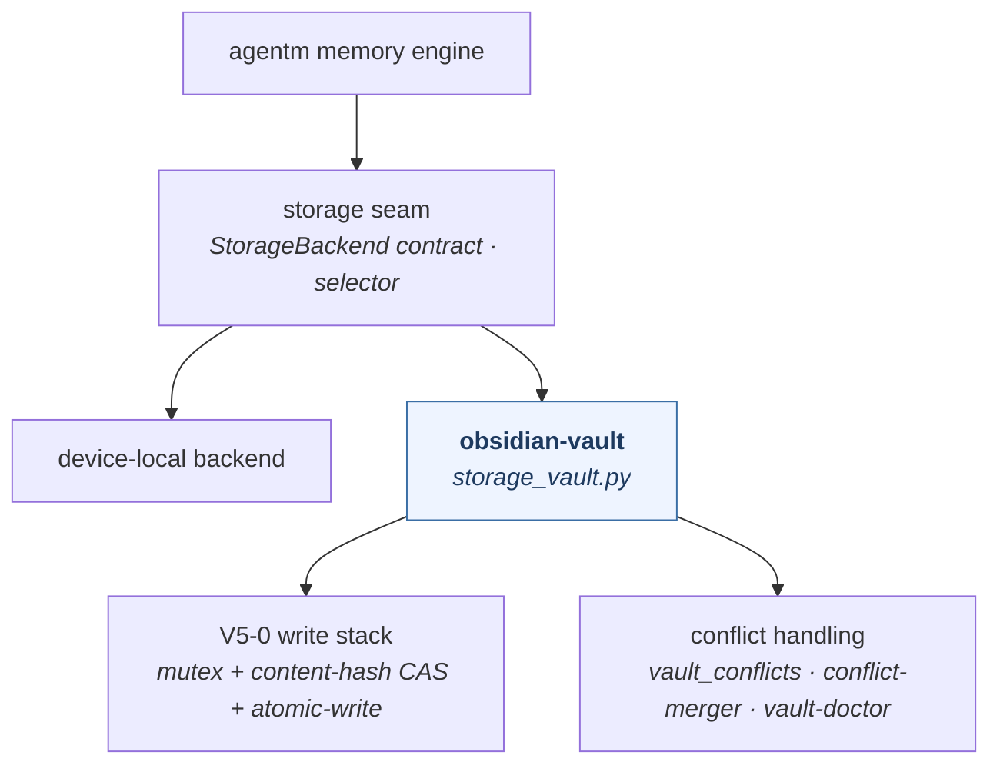

> [!NOTE]
> **LAUNCHED (lifted 2026-06-24, AG Phase 3; originally approved 2026-06-23).** child-design — **the `obsidian-vault` capability** (the Obsidian / Google-Drive storage backend for the agentm memory engine). `status: launched` (lifted into tracked `wiki/designs/` 2026-06-24, AG Phase 3). Points *up* at the [crickets HLD](crickets-hld.md).

# obsidian-vault

## Objective

`obsidian-vault` is the **Obsidian / Google-Drive storage backend** for the agentm memory engine — a swappable adapter that implements the substrate's `StorageBackend` contract, depending one-way *up* on the storage seam. It is platform-bound infrastructure (`-backend`) and keeps its name. It declares `[storage-backend]`.

## Overview

All delivered:

| Primitive | Kind | What it does |
|---|---|---|
| `storage_vault.py` | script | The `vault` backend — implements `StorageBackend`, composing the V5-0 write stack (mutex + CAS + atomic-write). |
| `doctor_vault.py` | script | Read-only health check — vault path resolves, selection routes here, no unresolved conflicts. |
| `vault_conflicts.py` | script | GDrive / DriveFS sync-conflict detection. |
| `conflict-merger-session-start` | hook | SessionStart notice for conflict + duplicate files (non-blocking). |
| `vault-doctor` | skill | Operator-facing wrapper over `doctor_vault.py` (Claude Code + Antigravity). |

*The memory engine reaches storage through the seam; `obsidian-vault` is one interchangeable backend (device-local is the other), implementing the `StorageBackend` contract one-way up; it composes the V5-0 concurrency stack + GDrive-conflict handling.*

## Design

### One-way up — a backing plugin, never a back-edge

`obsidian-vault` **implements the seam contract; the seam never imports it.** It imports `vault_lock`, `storage-seam` types, and `harness_memory`'s conflict classifier from the present engine (not vendored) and exposes the backend the selector dispatches to. This is the load-bearing direction: a crickets *backing* plugin reaches up into agentm's substrate contract; agentm never depends down on the plugin (the kernel's old built-in was deleted at V5-3, leaving this the sole vault backend).

### Concurrency + conflicts

`storage_vault.py` composes the **V5-0 write stack** — `vault_mutex` (an advisory `mkdir` lock outside the synced store) + content-hash compare-and-swap + atomic-write (temp → fsync → rename) — so two sessions writing the same synced vault both land and neither corrupts. On top, `vault_conflicts.py` + the `conflict-merger` hook + `vault-doctor` surface the GDrive / DriveFS sync-conflict files this backend uniquely has to deal with.

### Opinions

None — `obsidian-vault` is **infrastructure below the substrate**; it stores bytes and consumes no opinion. (The judgment about *what* to store and *how* to recall lives in the memory engine above it.)

## Dependencies

- **requires the agentm storage seam** — `StorageBackend` / `Capabilities` / `Locator` / `Info` types, `vault_lock`, and the engine's conflict classifier; imported one-way up, never vendored.
- **consumed by the agentm memory engine** — the backend the selector dispatches `save` / `recall` / `forget` to when the vault backend is configured.
- Points up at the [crickets HLD](crickets-hld.md); the storage contract is in the [agentm Memory System](https://github.com/alexherrero/agentm/wiki/agentm-memory-system) / `memory-storage-seam`.

## Migrations

None today — the names are stable post-V5-2. **Backlog (filed):** separate Google-Drive *sync* from the Obsidian *vault format*; when done, a bare **`vault`** capability emerges with `obsidian-vault` and other backends as specializations (the platform-bound → bare-noun path the naming rule describes). The selector still name-hardcodes `obsidian-vault@crickets` — a tracked lean-v1 generalization (design-doc §9.1).

## Risks & open questions

- **All delivered** — no greenfield; `storage_vault.py` is byte-faithful from the retired kernel built-in (parallel-run + conformance verified).
- **Selector hardcoding** — `backend_selection.py` name-hardcodes `obsidian-vault@crickets`; generalizing it is the lean-v1 exception, tracked separately.
- **The GDrive / Obsidian split** is backlog, not scheduled — when it lands, the bare `vault` capability emerges.
- **Re-audit triggers:** generalize the selector when a second backend ships; split GDrive-sync from Obsidian-format at the `vault`-capability backlog item.

## References

- crickets `src/obsidian-vault/` — `storage_vault.py` · `doctor_vault.py` · `vault_conflicts.py` · `conflict-merger-session-start` hook · `vault-doctor` skill; declares `[storage-backend]`
- **The contract it implements:** [agentm Memory System](https://github.com/alexherrero/agentm/wiki/agentm-memory-system) / `memory-storage-seam` (the `StorageBackend` port) · `vault_lock` (the V5-0 primitives)
- **Up:** [crickets HLD](crickets-hld.md) · [composition](crickets-composition.md)

## Amendment log

**2026-06-23 — authored, reviewed, and finalized.** Authored from the seeded stub and grounded against the live `src/obsidian-vault` plugin. All primitives delivered — `storage_vault.py` (the backend), `doctor_vault.py`, `vault_conflicts.py`, the `conflict-merger` hook, the `vault-doctor` skill. Named the load-bearing direction — **one-way up** (implements the seam contract; the seam never imports it; the sole vault backend since the kernel built-in was deleted at V5-3) — and the V5-0 concurrency stack + GDrive-conflict handling. `### Opinions`: none — it is infrastructure below the substrate. Carries the seam/backend diagram. The GDrive/Obsidian split + the selector generalization are filed backlog (the bare `vault` capability emerges when the split lands). **Re-audit:** generalize the selector when a second backend ships; split GDrive-sync from Obsidian-format at the `vault`-capability backlog item.
