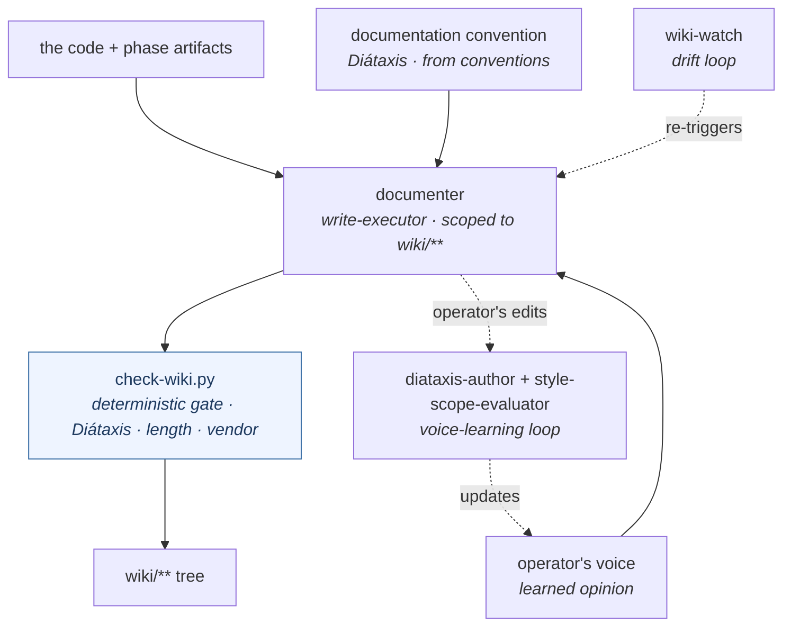

> [!NOTE]
> **LAUNCHED (lifted 2026-06-24, AG Phase 3; originally approved 2026-06-23).** child-design — **the `wiki` capability** (opinionated, template-driven wiki maintenance in the operator's voice). `status: launched` (lifted into tracked `wiki/designs/` 2026-06-24, AG Phase 3). Points *up* at the [crickets HLD](crickets-hld.md).

# wiki

## Objective

`wiki` **keeps the documentation tree true to what the code does, structured by Diátaxis, and written in the operator's voice** — a write-executor scoped to `wiki/`, a deterministic linter, and a template + voice-learning skill, driven at phase boundaries. It **enforces the `documentation` convention** (the Diátaxis structure, owned by [conventions](crickets-conventions.md)) and applies the operator's **voice** (an agentm opinion). It renames `wiki-maintenance` → `wiki` (bare noun) and declares `[wiki]`.

## Overview

A wiki earns trust only if it stays **true to the code, consistently structured, and in one voice** — otherwise it rots into stale, shapeless prose nobody reads. `wiki` is the system that holds those three: a deterministic structure **floor**, opinionated **authoring**, a drift **watch**, and a **voice-learning** loop — all scoped to `wiki/` and driven at phase boundaries. It enforces the **`documentation` convention** (Diátaxis, from [conventions](crickets-conventions.md)) and writes in the operator's **voice** (an agentm opinion).

*The `documenter` authors each page from three inputs — the code + phase artifacts, the **`documentation` convention** (Diátaxis structure, from conventions), and the operator's **voice** — then the deterministic `check-wiki.py` gate must pass before it lands in `wiki/**`. The `wiki-watch` loop re-triggers on drift; the operator's edits feed the voice-learning loop back into the voice.*

## Design

### Why a wiki

Docs that drift from the code are worse than no docs — they read as authoritative and quietly mislead. A wiki earns its keep only when three properties hold: it is **true** to what the code does, **structured** so a reader lands on the right kind of page, and written in **one voice**. `wiki` exists to make those hold *automatically*, at phase boundaries, instead of resting on a human remembering to update a page. The trajectory it serves is a navigable knowledge base that compounds — not a pile of pages.

### The structure — Diátaxis, owned by conventions

The structure standard is **Diátaxis**: every page is exactly one of four modes — **tutorials · how-to · reference · explanation** — and never blends them (the single-mode rule), under an intent-group folder layout, with length ceilings and a naming style. This is a **base standard, not a wiki-private rule** — it lives as the **`documentation` convention in [conventions](crickets-conventions.md)** (the house-standards shell, where "how we structure docs" sits alongside testing + ci). `wiki` is its **executor**: `check-wiki.py` is the gate, the templates encode it, the `diataxis-author` skill authors against it, and a per-repo `.diataxis-conventions.md` overrides it. The canonical Diátaxis definition is in conventions; wiki tools it.

### The system that keeps it true

Four parts, in the order they run:

1. **A deterministic floor.** `check-wiki.py` enforces the `documentation` convention mechanically — single-mode, length (with a soft-warning carve-out for load-bearing pages), the vendor gate — in CI (`wiki-sync.yml`). Structure is a gate, not an LLM's mood.
2. **Opinionated authoring.** The `documenter` agent — **hard-scoped to `wiki/**`** (+ `Home.md` / `_Sidebar.md` / `project.json`), never touching code — authors each page from the code, the documentation convention, and the voice, in templates, preview-before-write.
3. **A drift watch.** `wiki-watch` runs one cycle that detects doc-worthy changes and re-dispatches the `documenter`, so docs follow the code instead of waiting on a human.
4. **A voice-learning loop.** When the operator edits a page, `diataxis-author` generalizes the lesson, `style-scope-evaluator` recommends a scope (global / per-project / per-repo), and the confirmed lesson lands in a voice overlay. The voice is **learned and stored, not hardcoded** — which is how the docs sound like the operator across repos.

The floor guarantees structure; authoring + watch keep the docs true to the code; the voice loop keeps them consistent — the three properties, held without a human in the loop.

### The parts

| Primitive | Kind | What it does |
|---|---|---|
| `documenter` | agent | The write-executor — creates / updates / prunes pages; **hard-scoped to `wiki/**`** (+ the three index files); never touches code. |
| `check-wiki.py` | script | The deterministic gate — enforces the `documentation` convention (Diátaxis single-mode · length · vendor). |
| `diataxis-author` | skill | The authoring + voice-learning skill — templates, the single-mode rule, the edit-driven style-capture loop. |
| `wiki-author` · `wiki-watch` | skill | Authoring entry + the one-cycle drift watch. |
| `diataxis-evaluator` · `style-scope-evaluator` | agent | Read-only judges for the ambiguous mode-classification + voice-scope calls. |
| `/wiki-init` · `/wiki-watch` · `/recent-wiki-changes` | command | Init · the drift watch · the recent-changes digest. |
| `wiki-sync.yml` | workflow | The CI sync that runs the gate. |

### Opinions + conventions it consumes

wiki **enforces the `documentation` convention** ([conventions](crickets-conventions.md)) — the objective Diátaxis structure, one-way: wiki reads + gates it, never authors it. And it **consumes two agentm opinions**: **`good`** applied to docs (a page is good when it is true, single-mode, and findable) and the operator's **voice** (the learned prose style). The split *is* the conventions↔opinions line: the **structure** is objective + gate-backed → a convention; the **voice** is subjective + learned → an opinion. *(Hardwired / overlay today; request-by-name is the Phase-3/4 registry work — the [Opinions design](https://github.com/alexherrero/agentm/wiki/agentm-opinions-and-gates).)*

## Dependencies

- **requires [conventions](crickets-conventions.md)** — consumes + enforces the **`documentation` convention** (the Diátaxis structure); `check-wiki.py` is that convention's gate. wiki tools the standard; conventions owns it.
- **enhances [development-lifecycle](crickets-development-lifecycle.md)'s `documentation`** — the `documenter` runs at the loop's phase boundaries to keep docs in step with the code.
- **consumes the operator's voice + `good`** ([agentm Opinions](https://github.com/alexherrero/agentm/wiki/agentm-opinions-and-gates)) — the subjective prose voice (a learned overlay) + what a good doc is.
- **the Maintainer persona's drift detector (designed)** — a proactive docs-drift loop depends on the agentm **scheduler**; this capability is its write surface. See [Personas](https://github.com/alexherrero/agentm/wiki/agentm-personas).
- Points up at the [crickets HLD](crickets-hld.md); the requires/enhances mechanics are in [crickets-composition](crickets-composition.md).

## Migrations

- **The capability rename** `wiki-maintenance` → **`wiki`** (bare noun), with resolver aliasing (`[wiki-maintenance]` → `[wiki]`).
- **The `enhances` target re-points** — it enhanced `developer-workflows:documentation`; that capability is now **`development-lifecycle`**.
- The plugin directory (`src/wiki-maintenance/`) follows the rename at v6.0.

## Risks & open questions

- **All delivered** — the agents, commands, scripts, skills, and the CI workflow ship today; the rename is mechanical.
- **The `documentation` convention home is new** — the Diátaxis standard + its gate (`check-wiki.py`) ship in wiki today; landing the standard as the `documentation` domain in [conventions](crickets-conventions.md) is the structural lift (conventions owns it, wiki keeps enforcing). Until then the standard lives in wiki's skill + linter.
- **The Maintainer drift detector is designed, not built** — its proactive loop waits on the agentm scheduler.
- **Phase-5 conformance sweep** — the wiki conformance pass (analyze the tree against the foundations + the classification spine) is driven through this capability; it is scheduled work, not yet run.
- **Re-audit triggers:** flip `wiki-maintenance` → `wiki` + re-point the `enhances` edge at v6.0; build the Maintainer drift loop when the scheduler lands; run the Phase-5 conformance sweep.

## References

- crickets `src/wiki-maintenance/` (→ `src/wiki/`) — agents (`documenter`, `diataxis-evaluator`, `style-scope-evaluator`) · commands (`/wiki-init`, `/wiki-watch`, `/recent-wiki-changes`) · scripts (`check-wiki.py`, `wiki_init.py`, `wiki_watch_*`, `vendor_gate.py`) · skills (`diataxis-author`, `wiki-author`, `wiki-watch`) · `wiki-sync.yml`; declares `[wiki]`
- **Up / enhances:** [crickets HLD](crickets-hld.md) · [composition](crickets-composition.md) · [development-lifecycle](crickets-development-lifecycle.md) · **[conventions](crickets-conventions.md) (the `documentation` convention it enforces)** · [Personas](https://github.com/alexherrero/agentm/wiki/agentm-personas) (Maintainer) · [agentm Opinions](https://github.com/alexherrero/agentm/wiki/agentm-opinions-and-gates) (`good` + the voice)

## Amendment log

**2026-06-23 — authored, reviewed, and finalized.** `wiki` keeps the documentation tree **true to the code, structured by Diátaxis, and in the operator's voice** — a `documenter` write-executor (hard-scoped to `wiki/**`), the `check-wiki.py` deterministic gate, the `diataxis-author` authoring + voice-learning skill, the `diataxis-evaluator` + `style-scope-evaluator` judges, the `/wiki-*` commands, and `wiki-sync.yml`; all delivered. The design reads **reasoning → structure → maintenance-system → parts**: why a wiki (drifted docs mislead; true · structured · one-voice), the **Diátaxis structure** (owned by the [conventions](crickets-conventions.md) `documentation` domain, enforced here), the four-part system that holds it (deterministic floor → opinionated authoring → drift watch → voice-learning loop), then the parts.

The load-bearing split (operator-ratified): the objective **structure** is the **`documentation` convention** — wiki **requires conventions** and consumes + enforces it (`check-wiki.py` is its gate), one-way; the subjective **voice** is an agentm **opinion** (a learned overlay), as is **`good`** applied to docs. **Migrations:** `wiki-maintenance` → `wiki` + the `enhances` re-point (`developer-workflows` → `development-lifecycle`) at v6.0; the `documentation` standard lands as a conventions domain. **Designed-not-built:** the Maintainer drift detector (waits on the agentm scheduler); the Phase-5 conformance sweep. **Re-audit:** land the documentation domain in conventions; flip the rename + re-point at v6.0; build the Maintainer loop; run the conformance sweep.
