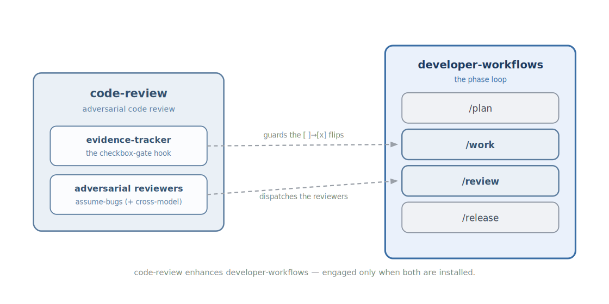

<!-- mode: reference -->
# Code Review

## Architecture

Code Review gives your agent a skeptical second pair of eyes on any change. Rather than confirm that the code looks fine, it assumes there is a bug and tries to prove one — so it catches the real problems a rubber-stamp review waves through.

### Diagram

### How it works

Point it at a diff or a PR and it runs an adversarial review. A reviewer reads the change assuming it contains a bug, and — when Gemini is available — a second reviewer does the same from a different model, so the two do not share one model's blind spots. Each returns something you can act on: a failing test, a `DEFECT: file:line`, or `NO ISSUES FOUND` — never loose prose. When `developer-workflows` is also installed, those reviewers run automatically at the `/review` phase, and an `evidence-tracker` hook stops a task from being ticked off until the agent has actually read the spec and test files.

### Composition

| Direction | Plugin | How |
|---|---|---|
| Enhances (soft) | [Developer-Workflows](Developer-Workflows) | Runs the adversarial reviewers at `/review` and guards `/work`'s checkbox flips — only when both are installed. |
| Enhanced by (soft) | — | None. |
| Requires (hard) | — | None. Code Review is fully standalone. |
| Required by (hard) | — | None. |

### Why not

Code Review is opinionated, and it will not fit every workflow. Reach for something else if:

- You already trust another review pass — a human reviewer, a linter suite, or a different AI reviewer — and don't want a second opinion on every change.
- You want a reviewer that talks through its reasoning; this one deliberately answers only with a failing test, a `DEFECT: file:line`, or `NO ISSUES FOUND`.
- You would rather the reviewer start from "this is probably fine." The assume-a-bug framing is intentionally adversarial, and on small or throwaway changes it can feel like overkill.

## Reference

### Commands & skills

Each primitive links to the source that implements it.

| Primitive | Kind | What it does |
|---|---|---|
| [`/code-review`](https://github.com/alexherrero/crickets/blob/main/src/code-review/commands/code-review.md) | command | Adversarial review of a diff or PR. |
| [`/doubt`](https://github.com/alexherrero/crickets/blob/main/src/code-review/commands/doubt.md) | command | Fresh-context review of a decision before it stands. |
| [`/simplify`](https://github.com/alexherrero/crickets/blob/main/src/code-review/commands/simplify.md) | command | Cut accidental complexity from a change. |
| [`security-review`](https://github.com/alexherrero/crickets/blob/main/src/code-review/skills/security-review/SKILL.md) | skill | Three-tier boundary security review. |
| [`testing-strategy`](https://github.com/alexherrero/crickets/blob/main/src/code-review/skills/testing-strategy/SKILL.md) | skill | Coverage audit — the Beyoncé Rule, DAMP, Prove-It. |
| [`adversarial-reviewer`](https://github.com/alexherrero/crickets/blob/main/src/code-review/agents/adversarial-reviewer.md) | sub-agent | Assume-bugs critic; returns a failing test or a `DEFECT`. |
| [`adversarial-reviewer-cross`](https://github.com/alexherrero/crickets/blob/main/src/code-review/agents/adversarial-reviewer-cross.md) | sub-agent | The same, cross-model via Gemini; degrades gracefully. |
| [`security-auditor`](https://github.com/alexherrero/crickets/blob/main/src/code-review/agents/security-auditor.md) | sub-agent | Finds the unvalidated boundary crossing. |
| [`test-engineer`](https://github.com/alexherrero/crickets/blob/main/src/code-review/agents/test-engineer.md) | sub-agent | Finds the behavior with no test. |
| [`evidence-tracker`](https://github.com/alexherrero/crickets/blob/main/src/code-review/hooks/evidence-tracker/hook.md) | hook | Blocks a `[ ] → [x]` flip until specs and tests are read (Claude-only). |

### Configuration

No configuration — the plugin works out of the box.

## See also

- [First code review](01-First-Code-Review) — the tutorial.
- [Review a change](Use-Code-Review) · [Simplify a diff](Simplify-A-Diff) · [In-flight decision review](Use-Doubt-Review) — the how-tos.
- [Why adversarial review](Why-Adversarial-Review) — why the assume-bugs framing works.
- [Code-review design](crickets-code-review) · [Composition design](crickets-composition) — the deeper design.

[Reference](Reference) · [Architecture](Architecture) · [Home](Home)
