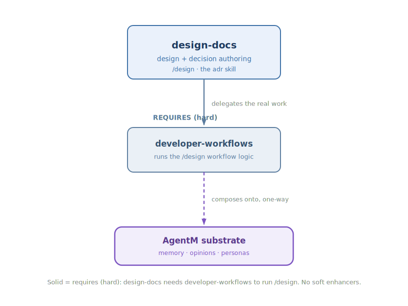

<!-- mode: reference -->
# Design Docs

## Architecture

Design Docs gives your agent the two authoring disciplines that come before any code is written: thinking a change through as a design, and capturing an architectural decision so a future reader can trust it. Instead of jumping straight into a plan, you talk the design out first, then let the agent turn it into an ordered set of small, buildable pieces — so the hard thinking happens up front, when it is cheapest to change your mind. It also teaches the agent when a decision is worth recording and what a durable record looks like, so the reasoning behind a call survives long after the call is made. It slots on top of the phase loop: Design Docs needs Developer Workflows installed, and hands the plans it produces straight to that loop's `/work` step.

### Diagram

The authoring pipeline, then how the plugin composes:

### How it works

The plugin does two things. The first is the design pipeline, and it runs in three steps. It starts by interviewing you to draw out what you actually want, and writes that up as a design doc you approve before anything moves on. It then breaks the approved design into structural pieces, and finally sequences those pieces into named plans in the order they should be built. What you get at the end is one design turned into a set of small, buildable plans, each ready for the `/work` step to pick up. The `/design` command is the door in; the workflow behind it lives in Developer Workflows, which is why Design Docs needs that plugin installed.

The second is the decision-record discipline. As the agent works, it watches for genuine architectural decisions — the kind whose reasoning a future reader will need — and knows both when one is worth recording and what a durable record should contain: the context, the call and why not the alternative, the consequences, and a trigger for revisiting it later. This runs on its own, whenever such a decision comes up, not only when you ask for it. It is aimed mainly at projects that still keep standalone decision-record files; crickets and agentm themselves now fold decisions into their living designs instead.

### Composition

| Direction | Plugin | How |
|---|---|---|
| Enhances (soft) | — | None. |
| Enhanced by (soft) | — | None. |
| Requires (hard) | [Developer-Workflows](Developer-Workflows) | The `/design` command delegates to developer-workflows' `/design` implementation; without it the command has nothing to delegate to. |
| Required by (hard) | — | None. |

### Why not

Design Docs is opinionated about how design authoring should flow, and it will not fit every project. Reach for something else if:

- You do not run the harness's plan-driven workflow — the `/design` pipeline assumes `developer-workflows` is installed to do the real work, so on its own the command is inert.
- Your project still keeps standalone ADR files and wants a heavier decision-record tool; the `adr` skill teaches a format and a discipline, it does not manage an ADR index or lifecycle.
- The change in front of you is small and self-explanatory. A one-file fix rarely needs a design doc or a decision record, and running the pipeline for it is more ceremony than the work warrants.

## Reference

### Commands & skills

Each primitive links to the source that implements it.

| Primitive | Kind | What it does |
|---|---|---|
| [`/design`](https://github.com/alexherrero/crickets/blob/main/src/design-docs/commands/design.md) | command | Author → translate → sequence a design doc into named plans; delegates to developer-workflows. |
| [`adr`](https://github.com/alexherrero/crickets/blob/main/src/design-docs/skills/adr/SKILL.md) | skill | Decision-record discipline — when to write an ADR and the five-section shape with re-audit triggers. |

### Configuration

No configuration — the plugin works out of the box. The `/design` command reads its workflow settings from `developer-workflows`, and the `adr` skill draws its canonical shape from the `adr-shape` entry in `~/.claude/CLAUDE.md`; neither adds a config key of its own.

## See also

- [How to author a design](Author-A-Design) — the step-by-step guide for `/design author → translate → sequence`.
- [How to record an architectural decision](Record-An-Architectural-Decision) — the amendment-log workflow, and where the `adr` skill still applies.
- [Developer-Workflows](Developer-Workflows) — owns the `/design` and `/document-decision` implementations this plugin builds on.
- [Development lifecycle design](crickets-development-lifecycle) · [Design-docs design](crickets-design) — the deeper design.

[Reference](Reference) · [Architecture](Architecture) · [Home](Home)