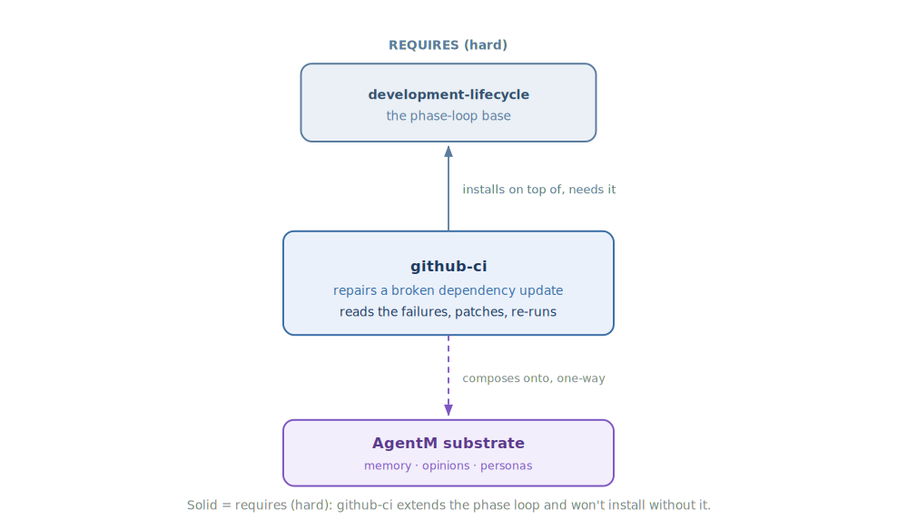

<!-- mode: reference -->
# GitHub CI

## Architecture

GitHub CI takes the busywork out of dependency updates. When a bot opens a pull request to bump a package and your checks go red, this plugin steps in: it reads what broke and tries to patch it for you, so the routine breakage a version bump causes gets cleared without you stopping to babysit each one. It knows when it's out of its depth — if a fix needs real judgment, it stops and says so rather than guessing, and it never merges, so you stay in charge of the call that matters. GitHub CI builds on the base development loop and doesn't stand alone.

### Diagram

The repair loop — how a red dependency-update PR is diagnosed, patched, and re-checked, and where it stops:

How it composes — the base it requires and the substrate it rests on:

### How it works

The plugin ships one skill that repairs a broken dependency update. It kicks in when a bot's update PR fails your checks — either on its own, or when you ask it to fix one. To work out what to do, it reads the failing check logs and the new package's release notes together, so it's fixing against what actually changed upstream rather than guessing. If your project keeps its own notes on how to migrate that package, it tries those first.

From there it works in a tight loop: apply a fix, push it up, watch the checks re-run, and try again if they're still red — up to a small, capped number of attempts so it never spins forever. When the checks go green it leaves a note on the PR flagging anything you should still double-check. When a fix would take real judgment, it stops and tells you plainly instead of forcing a bad patch. It stops at the fix and never merges — that call stays with you. It leans on your project's migration notes when they exist but doesn't need them, so it works in any repo with dependency updates and CI.

### Composition

| Direction | Plugin | How |
|---|---|---|
| Enhances (soft) | — | None. |
| Enhanced by (soft) | — | None. |
| Requires (hard) | [Developer-Workflows](Developer-Workflows) | A hard dependency (`standalone: false`) — GitHub CI installs on top of the base phase loop rather than standing alone. |
| Required by (hard) | — | None. |

### Why not

GitHub CI is deliberately narrow, and it will not fit every setup. Reach for something else if:

- Your dependency updates break in ways that need real design judgment — an API redesign, a behavior change with no clear migration; the bounded loop only handles well-understood, mechanical cases and aborts on the rest.
- You already run a CI-repair or auto-merge tool you trust, and don't want a second automated hand on your Dependabot branches.
- The change is a one-off you'd rather fix by hand — spinning up the loop for a single trivial bump is more than a small change needs.

## Reference

### Commands & skills

The plugin ships one primitive, linked to its source.

| Primitive | Kind | What it does |
|---|---|---|
| [`dependabot-fixer`](https://github.com/alexherrero/crickets/blob/main/src/github-ci/skills/dependabot-fixer/SKILL.md) | skill | Bounded autonomous loop that repairs mechanical breakage on a Dependabot PR — reads failing CI logs and the upstream CHANGELOG, patches, re-runs, comments residual risk. Never merges. |

### Configuration

One optional environment variable tunes the fix loop; otherwise the plugin works out of the box.

| Setting | Default | Effect |
|---|---|---|
| `DEPENDABOT_FIX_BUDGET` | `3` | Caps the number of fix iterations the loop attempts before giving up. |

## See also

- [Developer Workflows](Developer-Workflows) — the base plugin GitHub CI requires.
- [Manifest schema](Manifest-Schema) — `requires:` vs `enhances:` and the `standalone` invariant.
- [Plugin anatomy](Plugin-Anatomy) — what a crickets plugin is and how it's structured.
- [Install crickets plugins](Install-Into-Project) — the install modes.

[Reference](Reference) · [Architecture](Architecture) · [Home](Home)