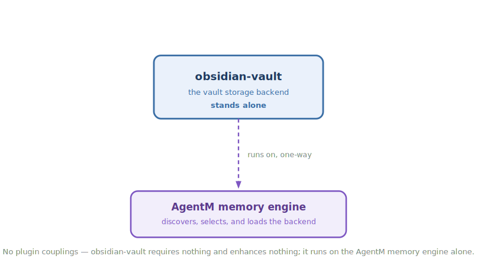

<!-- mode: reference -->
# Obsidian vault backend

## Architecture

Obsidian Vault lets your agent keep its memory inside your own Obsidian vault instead of a store buried in a device-local folder. Everything the agent learns lands as plain Markdown you can open, read, and edit in Obsidian — and because the vault lives on Google Drive, that memory follows you from one device to the next. It also knows how to cope with the mess cloud sync leaves behind, spotting the conflict and duplicate files Drive scatters around so your memory stays clean. This is a storage backend the memory engine picks up and runs on its own, so nothing in your normal workflow calls it directly. It stands alone — it needs no other plugin, only a vault to point at.

_Some of this page describes the backend's finished shape, which isn't fully live yet. The plugin is built and running alongside the engine's built-in store, but it isn't the default store yet. The health check and conflict detection are usable today; the rest is the target it's being proven against, not yet the shipped behaviour, and the sections below say which is which._

### Diagram

How memory reaches the vault — the engine hands each save to the backend, which writes plain Markdown into the Drive-synced folder while watching for the conflict files sync leaves behind:

How it composes — obsidian-vault requires and enhances nothing, standing alone on the AgentM memory engine that discovers and loads it:

### How it works

The heart of the plugin is a storage backend — the piece the memory engine writes to and reads from. When you point the engine at your vault, it hands every save to this backend, which writes the memory out as Markdown into the folder Drive keeps in sync. Because that folder can be open on more than one machine at once, the backend takes care to let two sessions write to the same vault without clobbering each other's work. It leans on the engine's own building blocks to do that rather than carrying its own copies, so it always runs as part of the engine, never on its own.

Cloud sync has a habit of leaving litter behind — a duplicate here, a "conflicted copy" there — whenever two devices touch the same file. The plugin knows what those stray files look like and can point them out so you can clean them up. On Claude Code it does this for you at the start of a session; everywhere else, a small health check surfaces the same thing on demand and confirms your vault is wired up and conflict-free.

### Composition

| Direction | Plugin | How |
|---|---|---|
| Enhances (soft) | — | None. |
| Enhanced by (soft) | — | None. |
| Requires (hard) | — | None. The plugin is standalone (`requires: []`); it depends on the agentm memory engine at runtime, not on another crickets plugin. |
| Required by (hard) | — | None. |

### Why not

Obsidian vault backend is opinionated about where memory lives, and it will not fit everyone. Reach for something else if:

- You don't keep an Obsidian vault, or you don't sync one through Google Drive — the device-local backend the engine ships with needs no plugin and no setup.
- You want a store with server-side encryption or true multi-writer transactions; this backend stores plain Markdown and reconciles concurrent writes by comparing file contents, not through a database.
- You'd rather not deal with sync-conflict files at all. Cross-device Drive sync produces them, and while the plugin detects and surfaces them, resolving each pair is still your call.

## Reference

### Commands & skills

The plugin is mostly a `scripts/` backend payload the agentm engine loads; the only thing you drive by hand is the `vault-doctor` health check. Each primitive links to the source that implements it.

| Primitive | Kind | What it does |
|---|---|---|
| [`vault-doctor`](https://github.com/alexherrero/crickets/blob/main/src/obsidian-vault/skills/vault-doctor/SKILL.md) | skill | A read-only health check — your vault path, which backend is active, and a conflict sweep. Works on both hosts. |
| [`conflict-merger-session-start`](https://github.com/alexherrero/crickets/blob/main/src/obsidian-vault/hooks/conflict-merger-session-start/hook.md) | hook | Surfaces the conflict and duplicate files Drive sync leaves behind, at session start (Claude Code only). |
| [`storage_vault.py`](https://github.com/alexherrero/crickets/blob/main/src/obsidian-vault/scripts/storage_vault.py) | script | The vault backend itself — reads and writes your memory as Markdown, sharing the engine's write-lock so two sessions don't clobber each other. |
| [`doctor_vault.py`](https://github.com/alexherrero/crickets/blob/main/src/obsidian-vault/scripts/doctor_vault.py) | script | The read-only probe behind `vault-doctor` — checks the vault path, the active backend, and conflicts; it writes nothing. |
| [`vault_conflicts.py`](https://github.com/alexherrero/crickets/blob/main/src/obsidian-vault/scripts/vault_conflicts.py) | script | Detects Google Drive's sync-conflict and duplicate files, reusing the engine's own filename classifier. |

### What the backend does

The engine talks to every storage backend through the same small set of operations, and the vault backend implements them: resolve a location, read, write, list a directory, and check whether something exists — plus two conveniences, get info and make a directory. Alongside those it tells the engine what it can and can't do, so the engine knows what it's working with:

| The backend… | |
|---|---|
| handles concurrent writers | yes — two sessions can write to the same vault safely |
| produces conflict files | yes — cross-device sync leaves them, and the backend detects them |
| encrypts at rest | no — memory is stored as plain Markdown |
| syncs across devices | yes — through Google Drive |
| conflict strategy | a whole-file merge for Drive's conflicted copies |

The exact per-operation contracts are still being finalized as the backend moves from running alongside the built-in store to replacing it.

### How the engine finds and uses it

The engine discovers the plugin by looking in a known place under your plugin-install directory, and ranks a vault it detects there. If you tell the engine to use the vault backend but the plugin isn't installed, it stops and says so rather than quietly falling back to the device-local store. To keep concurrent writes safe it shares the engine's own write-lock rather than carrying a copy, and it only ever runs as part of a running engine. On install it reads your existing vault path in place — it never rewrites your config, and it moves no data, so there's nothing to re-set-up.

### What's live today

Two pieces are usable right now: the `vault-doctor` health check and the conflict detection behind it. The rest — the backend serving as your live memory store, and the proofs that let it replace the built-in one — is built but still being verified. Before the switch-over, the backend has to pass its checks: that it stores and reads back your Markdown exactly, that it matches the built-in store byte-for-byte while both run side by side, and that it correctly refuses a write when another session changed the same file first. That last check matters most — passing the round-trip proofs alone wouldn't catch a backend that had quietly lost its concurrency guard — so the switch-over gate asserts it directly. The full gate is described in the [obsidian-vault design](crickets-obsidian-vault).

### Host coverage

| Host | Automatic nudge | Detection |
|---|---|---|
| Claude Code | yes — fires at session start | reachable automatically and on demand |
| Antigravity | no — there's no session-start event to hang it on | reachable on demand, through the `vault-doctor` check |

On Antigravity you don't lose conflict detection — only the automatic nudge. The `vault-doctor` skill and its conflict check work on both hosts. See the [Antigravity limitations register](Antigravity-Limitations#2--hooks) for the host-gap context.

### Configuration

The vault location is resolved at runtime, not baked into the plugin. The engine reads `plugins.obsidian-vault.vault_path` from its config (set via `agentm_config --vault-path`), and `$MEMORY_VAULT_PATH` is the per-invocation override. The plugin itself reads that path in place and never writes it. There's nothing else to configure — it works out of the box once a vault is set.

## See also

- [Install the vault backend](Install-The-Vault-Backend) — install the plugin and prove it matches the built-in store before the switch-over.
- [CI gates](CI-Gates) — the gate battery this backend's proofs will join.
- [Plugin anatomy](Plugin-Anatomy) — what a crickets plugin's `scripts/` payload is.
- [Antigravity limitations](Antigravity-Limitations) — why the automatic session-start nudge is Claude-only, and the host-gap register it belongs to.
- [obsidian-vault design](crickets-obsidian-vault) · [vault-git design](crickets-vault-git) — the deeper design.

[Reference](Reference) · [Architecture](Architecture) · [Home](Home)
