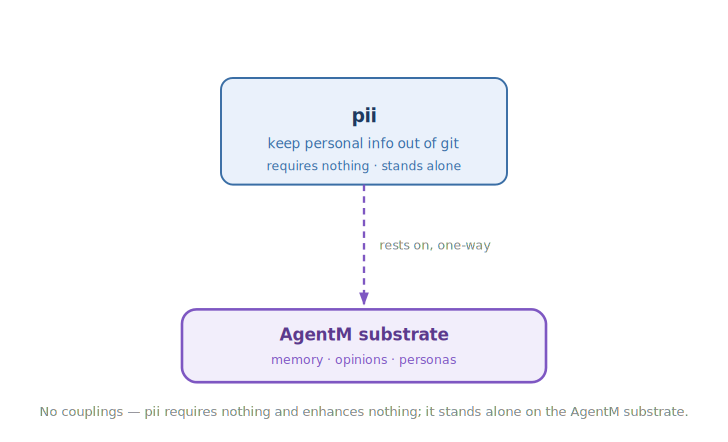

<!-- mode: reference -->
# PII Guardrail

## Architecture

PII Guardrail keeps personal information out of your git history. Real emails, personal file paths, API keys, and phone numbers have a way of ending up in committed content, and once they land in a shared history they are painful to pull back out. This plugin gives you defense in depth against that: it nudges the agent toward safe stand-ins as it writes, offers an on-demand scan that finds and helps you fix anything that slipped through, and backs both with a hard block right before a push so nothing leaks even if the earlier layers miss. It needs nothing else to run and stands on its own.

### Diagram

The four-layer defense — each layer catches what the one before it missed:

How it composes — pii requires nothing and enhances nothing, so it stands alone on the AgentM substrate:

### How it works

The plugin defends in four layers, from the gentlest to the most absolute. The first is a rule the agent follows as it writes: reach for a safe stand-in from the start — a placeholder email domain, `$HOME` instead of a real home directory, an env-var reference instead of a real token, a reserved fake phone number. When something real slips through anyway, the second layer is an on-demand scan you run before a commit or push. It reads your changes, points at each piece of personal information by file and line, suggests a redaction, and loops with you until everything is clean — it fixes, it doesn't just complain.

The last two layers are automatic and unskippable. A check runs right before every push and blocks it if anything got through, whether or not anyone thought to scan; and the same check runs again in CI as a final backstop. The idea is that the first two layers keep the last two from ever having to fire.

### Composition

| Direction | Plugin | How |
|---|---|---|
| Enhances (soft) | — | None. PII Guardrail is fully standalone. |
| Enhanced by (soft) | — | None. |
| Requires (hard) | — | None. `requires: []` — it runs on its own. |
| Required by (hard) | — | None. |

### Why not

PII Guardrail is opinionated about what a safe stand-in looks like, and that won't suit every project. Reach for something else if:

- Your team already has secret-scanning you trust — a pre-commit framework, a hosted scanner, or your own CI check — and you don't want a second pass with its own opinions.
- You disagree with the prescribed stand-ins. The rule is specific about RFC 2606 domains, `$HOME`, angle-bracket placeholders, and the `555-01xx` range; a project with different conventions would fight it.
- The change is small or throwaway and never leaves your machine. The scan-and-remediate loop is worth it before a push, but can feel heavy on content that will never be committed.

## Reference

### Commands & skills

Each primitive links to the source that implements it.

| Primitive | Kind | What it does |
|---|---|---|
| [`pii-patterns`](https://github.com/alexherrero/crickets/blob/main/src/pii/rules/pii-patterns.md) | rule | Proactive stand-ins — never write a real email, path, key, or phone number into committed content. |
| [`pii-scrubber`](https://github.com/alexherrero/crickets/blob/main/src/pii/skills/pii-scrubber/SKILL.md) | skill | Scans the diff or working tree for PII, surfaces findings as `file:line`, and loops until clean. |

### Configuration

No configuration — the plugin works out of the box.

## See also

- [Privacy design](crickets-privacy) — the four-layer defense in depth.
- [CI gates](CI-Gates) — the `check-no-pii` gate that backstops the scan.
- [Plugin anatomy](Plugin-Anatomy) — what a crickets plugin is.

[Reference](Reference) · [Architecture](Architecture) · [Home](Home)