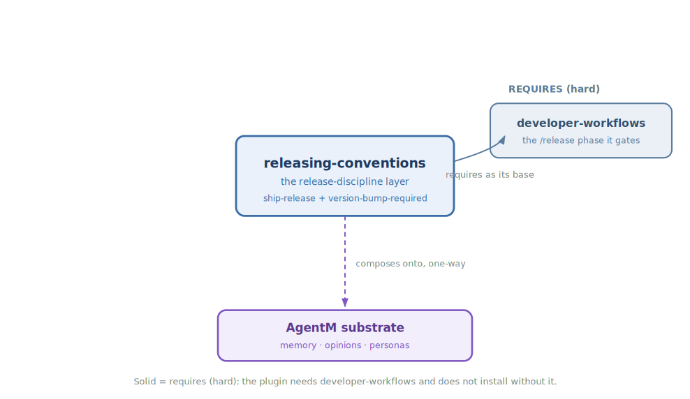

<!-- mode: reference -->
# Releasing Conventions

## Architecture

Releasing Conventions gives your releases one repeatable set of rules, so cutting one is a checklist you follow rather than a thing you improvise each time. It answers the questions that trip up a release under pressure: what has to be true before you tag, what a changelog entry should read like, and how to coordinate two repos that ship together — then it runs the cut itself, once everything checks out. It also watches your changes as you work, so a version bump never gets forgotten. Think of it as the checklist and the button together: `ship-release` runs the pre-release checklist first, and only once every item passes does it auto-size the version from your commits, prepend the changelog, tag, push, and open the GitHub release. It builds on Developer Workflows, adding its release gate to that plugin's `/release` phase, so you need Developer Workflows installed alongside it.

### Diagram

The release gate — every checklist item must pass before you tag and publish:

How it composes — the base it requires and the substrate it rests on:

### How it works

The plugin does its job in two places. As you work, it watches for changes that touch something users can see, and flags any that would ship without bumping the version — so the bump is caught while you are still editing, not after the release goes out. It knows the one time this is fine: when several people are building in parallel and whoever lands the work owns the bump rather than each author.

When you are ready to ship, it runs a release checklist before you tag anything: tests green on every operating system, the version bumped, a changelog entry written, everything committed, no loose ends left open. It also tidies the changelog into a consistent shape, and when two repos release together it settles which one ships first so their release notes point at each other correctly. Only once the whole checklist passes does `ship-release` cut the release itself — classifying your commits to size the version bump, prepending the changelog, tagging, pushing, and creating the GitHub release. Because it builds on Developer Workflows, this checklist-then-cut sequence is what that plugin's `/release` phase runs before anything goes out.

### Composition

| Direction | Plugin | How |
|---|---|---|
| Enhances (soft) | — | None. |
| Enhanced by (soft) | — | None. |
| Requires (hard) | [Developer-Workflows](Developer-Workflows) | The `/release` phase this discipline gates; the skill's checklist is what that phase applies before tagging. Both must be enabled for the skill to load. |
| Required by (hard) | — | None. |

### Why not

Releasing Conventions encodes one opinionated way to release, and it will not suit every project. Reach for something else if:

- Your release rules differ — a different changelog format, a different bump policy, or no cross-repo coordination — and you would have to fight the built-in checklist rather than lean on it.
- You already have a release tool or CI pipeline that owns these gates, and a second discipline layer on top only adds friction.
- The change is small or the project is throwaway, where a full pre-release checklist and a version-bump rule are more ceremony than the work needs.

## Reference

### Commands & skills

Each primitive links to the source that implements it.

| Primitive | Kind | What it does |
|---|---|---|
| [`ship-release`](https://github.com/alexherrero/crickets/blob/main/src/releasing-conventions/skills/ship-release/SKILL.md) | skill | Pre-release checklist, changelog shape, paired-release order, and version-bump policy — then the cut itself: commit classification, semver auto-sizing, CHANGELOG prepend, tag, push, and `gh release create`. |
| [`version-bump-required`](https://github.com/alexherrero/crickets/blob/main/src/releasing-conventions/rules/version-bump-required.md) | rule | Flags a diff that touches a user-visible primitive without bumping the group's `group.yaml` version. |

### Configuration

No configuration — the plugin works out of the box. It requires `developer-workflows` to be enabled as its base.

## See also

- [Developer-Workflows](Developer-Workflows) — the `/release` phase this discipline gates, plus `/work`, `/plan`, and `/bugfix`.
- [Customization Types](Customization-Types) — what `kind: rule` and `kind: skill` mean.

[Reference](Reference) · [Architecture](Architecture) · [Home](Home)