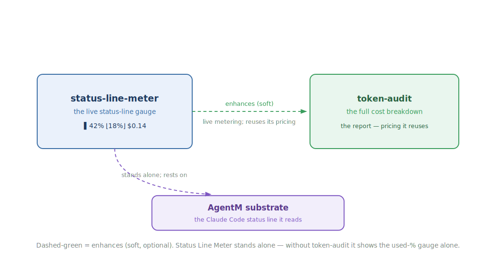

<!-- mode: reference -->
# Status Line Meter

## Architecture

Status Line Meter keeps a small live gauge in the corner of your Claude Code session, so you always have a rough sense of where you stand without pausing to run a report. At a glance you see how much of the context window you have burned through and roughly what the session is costing, updated after every response. It is the ambient, always-on companion to a full cost breakdown: not the detailed report, just the number you want in your peripheral vision while you work. It runs on its own out of the box, and quietly gains its cost readings when Token-Audit is installed alongside it.

### Diagram

How it composes — it stands alone on the Claude Code status line and enhances Token-Audit when both are installed:

### How it works

After each response, Claude Code hands the plugin a quick summary of the session and asks for one line of text back — that line becomes your status bar. The plugin renders up to three small badges into it: how much of the context window you have used, an estimate of what the session has cost so far, and a share showing how much of that cost comes from the fixed overhead loaded into every prompt. To keep up without slowing you down, it only looks at what is new since the last response rather than re-reading the whole conversation, and it starts over cleanly if the conversation is ever trimmed back.

The cost figures lean on Token-Audit's pricing, so the two cost badges appear only when that plugin is installed alongside; on its own, Status Line Meter still shows the context-window gauge. And whenever a number can't be worked out, it simply leaves that badge off rather than showing a broken or stale figure — so the bar stays honest and never gets in your way.

### Composition

| Direction | Plugin | How |
|---|---|---|
| Enhances (soft) | [Token-Audit](Token-Audit) | Adds live, continuous metering in the status line, reusing `token-audit`'s `pricing.py` for the cost and floor-share badges — only when both are installed. |
| Enhanced by (soft) | — | None. |
| Requires (hard) | — | None. Status Line Meter is fully standalone; without `token-audit` it renders the used-percentage alone. |
| Required by (hard) | — | None. |

### Why not

Status Line Meter is opinionated about what belongs in a status line, and it will not suit everyone. Reach for something else if:

- You prefer a quiet, empty status line, or you already run a custom status-line command you would rather not replace.
- You want a full cost breakdown — the per-message curve, the 5-hour window sums, the cache split. That is the `token-audit` skill's job; this plugin is the glanceable live version, not the report.
- Your host is not Claude Code, or it predates the status-line JSON schema the script reads, so the used-percentage field is unavailable.

## Reference

### Commands & skills

Each primitive links to the source that implements it.

| Primitive | Kind | What it does |
|---|---|---|
| [`status_line_meter.py`](https://github.com/alexherrero/crickets/blob/main/src/status-line-meter/scripts/status_line_meter.py) | status-line script | Reads the per-response JSON payload and prints the used-%, floor-share, and cost badges — incrementally, with graceful-skip on any missing field. |

### Configuration

No configuration — the plugin works out of the box. It reads the status-line payload Claude Code hands it and discovers `token-audit`'s `pricing.py` at runtime; there are no environment variables or config keys to set. (`token-audit` unlocks the cost and floor-share badges; without it you still get the used-percentage.)

## See also

- [Token-Audit](Token-Audit) — the full cost-breakdown skill this plugin meters live.

[Reference](Reference) · [Architecture](Architecture) · [Home](Home)